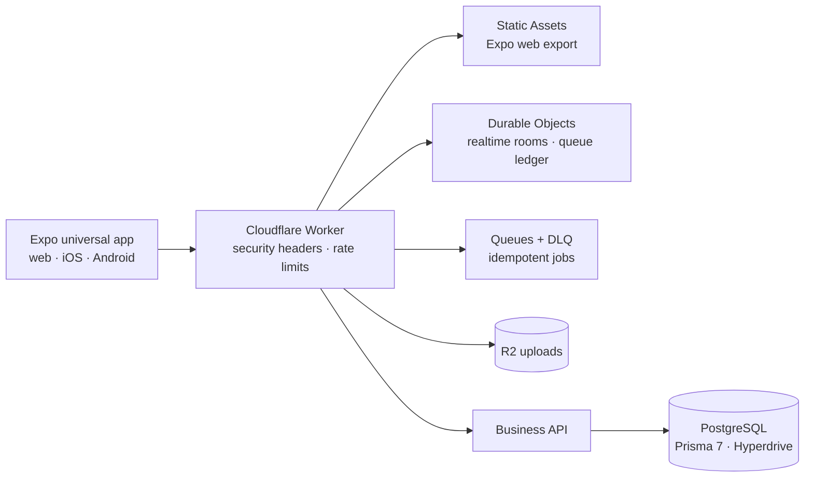

<div align="center">

# Manut

**Employee operations platform — one universal codebase, edge-first delivery.**

[](https://github.com/mygogocash/Manut/actions/workflows/pr-checks.yml)
[](https://github.com/mygogocash/Manut/actions/workflows/deploy.yml)


</div>

Manut is a clean-room employee operations platform. A single Expo Router
route tree ships the same screens, domain services, authentication decisions,
and route policies to **web today** and **iOS/Android later** — no second
frontend rewrite. The public boundary is a Cloudflare Worker that serves the
SPA, enforces security headers, and fails closed on any missing capability.

## Highlights

- **Universal frontend** — one Expo codebase for web, iOS, and Android;
  platform differences live in small `.web.ts` / `.native.ts` adapters.
- **Fail-closed edge** — missing auth, API origin, Hyperdrive, Queue,
  Workflow, Container, or storage capability returns an explicit `503`;
  no silent fallbacks, no direct secret URLs.
- **Server-side authorization** — API permission and ownership checks stay
  authoritative even when a route is guarded in the client; sidebar
  visibility is never authorization.
- **Idempotent async jobs** — Cloudflare Queues with a Durable Object
  ledger (once-only claims), permanent-failure dead-lettering, and
  bounded retries.
- **Realtime at the edge** — Durable Object hibernating WebSockets own
  reconnectable room state.
- **Authoritative Postgres** — Prisma 7 over Cloudflare Hyperdrive with one
  immutable migration baseline; every new migration must pass deploy, direct
  replay, and double `db push` convergence on PostgreSQL 16.
- **Self-provisioning deploys** — queues and R2 buckets named in
  `wrangler.jsonc` are created idempotently at deploy time; resource names
  have a single source of truth.

## Architecture



| Layer               | Responsibility                                                  | Direction                                                               |
| ------------------- | --------------------------------------------------------------- | ----------------------------------------------------------------------- |
| `apps/app`          | Expo Router universal web/native shell                          | Primary frontend                                                        |
| `packages/app-core` | Platform-neutral auth, API, and RBAC contracts                  | Shared by web, Android, and iOS                                         |
| `packages/ui`       | Universal React Native tokens and components                    | Shared by web, Android, and iOS                                         |
| `apps/edge`         | Cloudflare Worker, static assets, security headers, API gateway | Public request boundary                                                 |
| `apps/api`          | Strict TypeScript business API                                  | Runs behind the gateway; Node-only work moves to a Cloudflare Container |
| `apps/web`          | Next.js route-parity reference                                  | Retired route-by-route after Expo acceptance                            |
| `packages/database` | Prisma schema and immutable migration baseline                  | Postgres through Cloudflare Hyperdrive                                  |

Cloudflare R2 is the file-storage target, Durable Objects own reconnectable
state, and Queues/Workflows own asynchronous jobs. D1 may hold edge-local
coordination data only — **PostgreSQL remains the authoritative business
database.**

## Getting started

```bash
corepack enable
pnpm install --frozen-lockfile
cp .env.example .env
pnpm db:generate
pnpm dev
```

Focused commands:

```bash
pnpm dev:app          # Expo universal app
pnpm dev:api          # business API
pnpm dev:edge         # Cloudflare gateway
pnpm --filter @manut/app export:web
pnpm --filter @manut/app export:ios
pnpm --filter @manut/app export:android
```

## Quality gates

Every pull request must pass the aggregated **Validate** check: generated
database types, strict API and root TypeScript, zero-warning lint, unit
tests, Expo web and native exports, Worker tests and build, web bundle
limits, PostgreSQL 16 migration safety, credential/Gitleaks scans, and
serialized authenticated Playwright E2E against the dedicated project.
`any`, `ts-ignore`, blanket non-null assertions, and conditional E2E skips
are rejected.

## Deployment

Branch-mapped surfaces, each fail-closed without its GitHub Environment
secrets:

| Branch    | Surface                                          | Target                        |
| --------- | ------------------------------------------------ | ----------------------------- |
| `main`    | Deploy Production (Environment-gated reviewers)  | service `manut` (production)  |
| `preview` | Deploy Preview (`versions upload`)               | service `manut` (preview)     |
| `staging` | Deploy Staging                                   | Worker `manut-staging`        |

Cloudflare Workers Builds runs the same build (`pnpm run build:cloudflare`)
from the dashboard. Before every wrangler invocation,
`apps/edge/scripts/ensure-cloudflare-resources.mjs` idempotently creates the
queues and R2 buckets named in `wrangler.jsonc`. No workflow mutates DNS or
invents Hyperdrive ids; `hyperdrive: []` stays empty until ops binds a real
config. See [CI/CD Cloudflare](docs/CICD_CLOUDFLARE.md) and
[production deploy readiness](docs/PRODUCTION_DEPLOY.md).

## Security model

- Web sessions use secure HTTP-only cookies; native uses PKCE bearer
  sessions in SecureStore — both resolve the same server-side user, roles,
  and permissions.
- Authenticated state clears only on `401/403`; warm state survives network
  and rate-limit failures.
- Uploads go through R2 with server-owned keys; receipt provenance is
  restricted to trusted storage origins.
- Credential scanning gates every artifact before deploy.

See the [credential boundary](docs/CREDENTIAL_BOUNDARY.md) and
[authentication and RBAC](docs/AUTH_RBAC.md).

## Documentation

| Topic                    | Doc                                            |
| ------------------------ | ---------------------------------------------- |
| Canonical handoff        | [docs/CURSOR_HANDOFF.md](docs/CURSOR_HANDOFF.md) |
| Cloudflare bindings      | [docs/CLOUDFLARE_BINDINGS.md](docs/CLOUDFLARE_BINDINGS.md) |
| CI/CD on Cloudflare      | [docs/CICD_CLOUDFLARE.md](docs/CICD_CLOUDFLARE.md) |
| Production readiness     | [docs/PRODUCTION_DEPLOY.md](docs/PRODUCTION_DEPLOY.md) |
| Auth and RBAC            | [docs/AUTH_RBAC.md](docs/AUTH_RBAC.md)         |
| Repository migration     | [docs/REPOSITORY_MIGRATION.md](docs/REPOSITORY_MIGRATION.md) |
| Dependency upgrade scope | [docs/DEPENDENCY_UPGRADE_SCOPE.md](docs/DEPENDENCY_UPGRADE_SCOPE.md) |

## License

Proprietary. All rights reserved. This repository is source-visible for
collaboration and review; no license is granted for reuse or redistribution.
