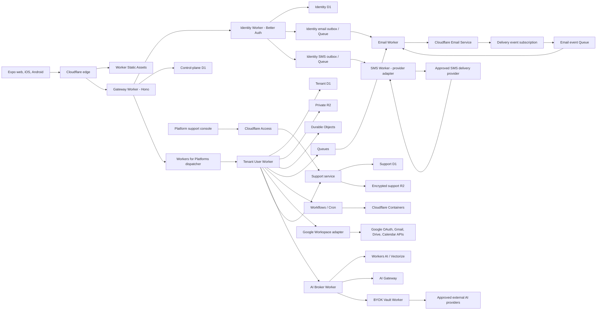
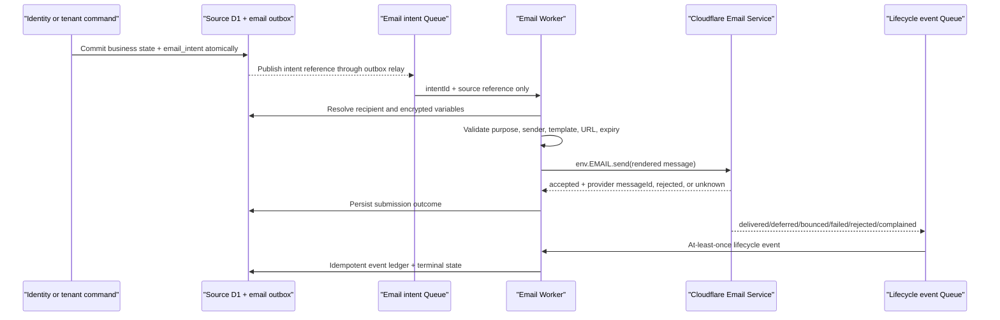
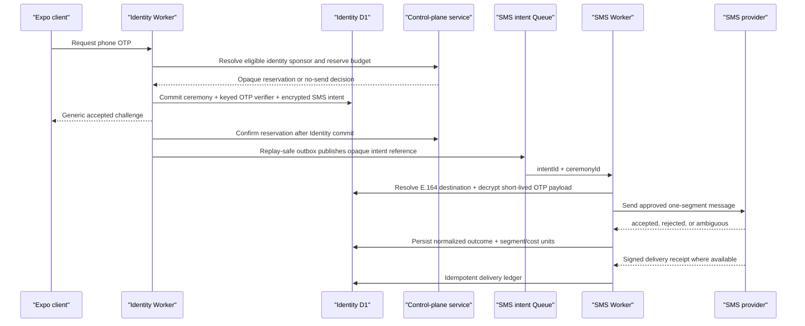

# Intranet Expo + Cloudflare Master Migration Plan

> Status: architecture and delivery plan
>
> Version: 1.4
>
> Last reviewed: 2026-07-19
>
> Product: multi-tenant CRM/ERP intranet for Thai SMEs
>
> Commercial target: 3,000-6,000 THB per organization per year
>
> Target core runtime and primary data plane: Expo clients + project-owned services hosted on Cloudflare; no Next.js, Express, Cloud Run, Prisma, PostgreSQL, Supabase Auth, Supabase Storage, Resend, or related legacy billing in production
>
> Version 1.4 consolidation: one authoritative forward-looking plan, including the Version 1.3 Better Auth passwordless identity amendment and explicit disposition of older planning documents

## 1. Executive decision

This plan replaces the current web-first application with one Expo Router application for web, iOS, and Android, and moves the production platform to Cloudflare.

The final architecture is:

- Expo Router for all user-facing clients.
- Cloudflare Worker Static Assets for Expo web hosting.
- Hono on Cloudflare Workers for HTTP APIs.
- A dedicated Identity Worker using Better Auth behind a provider-neutral application boundary, with the magic-link plugin and a private reviewed phone wrapper/custom plugin for customer passwordless sign-in.
- An Identity D1 database for users, verified contacts, sessions/assurance, authenticators, and recovery state, with no target password credentials.
- A Control-plane D1 database for organizations, memberships, subscriptions, tenant routing, and rollout state.
- Workers for Platforms with one identical tenant User Worker and one tenant D1 database per organization.
- R2 for files and exports.
- Durable Objects for realtime connections and operations that require serialization.
- Queues, Workflows, and Cron Triggers for background and scheduled work.
- Cloudflare Containers for native PDF and Office processing that is unsuitable for ordinary Workers.
- Workers AI, AI Gateway, and Vectorize for platform-funded AI.
- Cloudflare Email Service, an email Worker, Queues, and delivery-event subscriptions for transactional email.
- A provider-neutral SMS Worker and Cloudflare Queue for mobile OTP delivery; the SMS carrier/provider remains replaceable because Cloudflare is not the SMS delivery network.
- An encrypted BYOK vault for customer-supplied OpenAI, Anthropic, Gemini, and approved Chinese-model provider credentials.
- Thai and English human-readable error recovery, sanitized support bundles, and an in-product support workflow.

Supabase is not retained for authentication, PostgreSQL, storage, or staging. It remains only as a temporary source and rollback system during migration, then is deleted after the final recovery window.

### 1.1 Why the Supabase decision changed

Keeping Supabase Auth while moving the rest of the platform would reduce migration risk, but it would leave a permanent provider dependency, duplicate operational tooling, and a minimum paid Supabase line item. The user has now chosen full retirement, so identity becomes an owned Cloudflare workload.

Cloudflare Access is not used as customer identity. Access is an identity proxy and policy layer for protected applications; it is appropriate for the internal support/admin console, not as the full account lifecycle and mobile session system for a public multi-tenant Expo product.

The customer identity solution is therefore an application-owned Identity Worker. Better Auth is the preferred implementation library because it supports Cloudflare D1, Expo native/web clients, database-backed sessions, magic links, passkeys, two-factor authentication, and secret rotation. Target customer and staff authentication is passwordless; it must pass the Phase 1 compatibility and security spike before production adoption.

### 1.2 Non-negotiable principles

1. Tenant routing comes from a verified session and server-side membership lookup, never a client header or URL parameter.
2. Authentication and authorization fail closed.
3. The identity database never becomes the CRM/ERP authorization database.
4. Tenant business data is isolated in a D1 database bound only to that tenant Worker.
5. Files and large logs never live in D1.
6. Money uses integer minor units; floating-point values never represent money.
7. Every write is idempotent or has an explicit unknown-outcome recovery path.
8. Every migration wave is reversible until its rollback window closes.
9. No raw secret, session, payroll value, form payload, file content, prompt, or provider error reaches a user-facing error or copied support report.
10. One deployment system owns production; preview evidence is required before promotion.
11. An email API acceptance is never reported or measured as recipient delivery; delivery state comes from lifecycle events.
12. Each logical email or SMS has one idempotent intent, and ambiguous external-send outcomes are reconciled rather than blindly retried or failed over.
13. Customer identity is resolved or linked only after the user proves control of the email address or phone number; matching unverified text never merges accounts.
14. Email magic link and phone SMS OTP are customer `aal1` primary methods, not sufficient MFA or recovery for finance, payroll, organization-admin, or platform-support actions.
15. The target Identity Worker is passwordless for customers and staff: Better Auth password routes/accounts are disabled, and Supabase hashes never enter the target data plane.
16. A phone can sign in only after a fresh target-authenticated phone-enrollment ceremony; legacy profile and CRM phone fields are never authentication proof.
17. A pre-auth caller never selects the organization charged for SMS; sponsorship is resolved and reserved server-side from authoritative membership/invitation state.

### 1.3 Single-plan authority, navigation, and source disposition

This file is the **only authoritative forward-looking architecture, migration, delivery, cost, testing, cutover, and decommission plan** for the Expo + Cloudflare program. Product specifications and current-state operational references remain useful evidence, but they do not create a second roadmap. If an older planning file conflicts with this file—or contains an unchecked task not carried forward here—this file wins.

How to use this plan:

| Reader need                                                                                          | Authoritative area |
| ---------------------------------------------------------------------------------------------------- | ------------------ |
| Target decisions, trust boundaries, runtime/data placement, and service contracts                    | Sections 1-18      |
| Dependency order, effort range, milestones, epics, tasks, and phase acceptance                       | Sections 19-34     |
| Test strategy, risk, staffing, definition of done, first 30 days, decisions, and verified references | Sections 35-41     |

An epic task is implementation work. A phase acceptance item is an exit gate, not optional documentation. A module cannot advance merely because code exists; its acceptance, migration evidence, rollback, cost, and ownership gates must also pass. Completed checkboxes in historical plans describe the current product and do not waive any target migration gate.

#### Requirement-to-section traceability

| Combined requirement                                                                               | Primary design sections | Delivery and exit sections                                               |
| -------------------------------------------------------------------------------------------------- | ----------------------- | ------------------------------------------------------------------------ |
| Retire Next.js and deliver one Expo Router app for web/iOS/Android                                 | 4, 5, 11                | Phases 5, 12, and 13                                                     |
| Replace Express/Cloud Run safely, including native documents and realtime                          | 10 and 12               | Phases 6, 7, 12, and 13                                                  |
| Retire Supabase Auth/PostgreSQL/Storage completely                                                 | 6, 8, and 9             | Phases 3, 4, 8-10, 12, and 13                                            |
| Redesign 237-model PostgreSQL/Prisma behavior for tenant-isolated D1                               | 7 and 8                 | Phases 2 and 8-10                                                        |
| Retire Resend/legacy email and use Cloudflare Email Service                                        | 12.5                    | Phases 1, 3, 7, and 13                                                   |
| Preserve live Google Gmail, Drive, and Calendar/ARIA integration while retiring Express/PostgreSQL | 12.7                    | Phase 7 integration migration and Phase 12 parity gate                   |
| Use Cloudflare AI while supporting encrypted organization BYOK                                     | 13                      | Phase 11 and Definition of Done                                          |
| Support OpenAI, Anthropic, Gemini, and approved frontier Chinese providers                         | 13.3-13.5               | Phase 11 adapter/evaluation gates                                        |
| Provide human-readable self-help errors and copyable sanitized support evidence                    | 14                      | Phases 6 and 11 plus security-corpus gates                               |
| Use Better Auth email links and enrolled mobile SMS codes with no target passwords                 | 6 and 12.6              | Phases 1, 3-5, 12, and 13                                                |
| Keep the 3,000-6,000 THB/year SME offer economically honest                                        | 3 and 16                | Phase 1 cost spikes, Phase 2 commercial gate, and Phase 14 annual review |
| Optimize for long-term maintenance, safe upgrades, and replaceable providers                       | 5.1, 17, and 18         | Phase 14 and dependency-exit drills                                      |

#### Older document disposition

| Existing document                                                                                 | Retained value                                                                       | Authority after Version 1.4                                                                                                                                                       |
| ------------------------------------------------------------------------------------------------- | ------------------------------------------------------------------------------------ | --------------------------------------------------------------------------------------------------------------------------------------------------------------------------------- |
| `docs/IMPLEMENTATION_PLAN.md`                                                                     | Historical product-gap audit and evidence of shipped/deferred business capabilities  | Historical only. Its three unresolved product items are explicitly disposed below; its old runtime/provider directions do not control migration.                                  |
| `docs/TASK_PLANNING.md`                                                                           | Original build checklist and current-stack implementation history                    | Historical only. Its generic data-migration and monitoring TODOs are replaced by Phase 2, Phase 8, and Sections 16/35 of this plan.                                               |
| `docs/AUTH_RBAC.md`                                                                               | Current Supabase/Express behavior and detailed RBAC permission semantics to preserve | Current-state reference only. Section 6 owns target identity; Sections 7 and 35 own target authorization and parity evidence.                                                     |
| `docs/ops/auth-recovery-fraud-prevention.md`                                                      | Legacy Supabase endpoint/runbook controls during coexistence                         | Temporary legacy runbook only. Password reset is retired; target passwordless recovery, enumeration resistance, rate limits, and support evidence are owned by Sections 6 and 14. |
| Product specifications such as `PROJECT_OVERVIEW`, `MODULES_SPECIFICATION`, and `DATABASE_SCHEMA` | Business terminology, workflows, fields, and current product behavior                | Product/current-state references, not migration schedules. A behavior changes only through an explicit product decision and parity signoff in this plan.                          |

#### Unresolved historical product items carried forward

| Historical open item                                            | Version 1.4 disposition                                                                                                         | Migration impact                                                                                                                                                             |
| --------------------------------------------------------------- | ------------------------------------------------------------------------------------------------------------------------------- | ---------------------------------------------------------------------------------------------------------------------------------------------------------------------------- |
| Employee Document Vault                                         | Active scope under Phase 10 employee documents, using R2 stable file IDs, private access, retention, and owner/HR authorization | Included in HR migration/parity acceptance; no Supabase Storage implementation is added first                                                                                |
| Generic Forms module beyond the shipped survey-form builder     | Explicitly deferred product decision                                                                                            | Not a migration blocker. Add only after a product owner proves a workflow that survey forms cannot satisfy and approves its price/support impact.                            |
| Policy versioning and mandatory acknowledgment                  | Active parity gap in Phase 9 content/reference wave                                                                             | Must preserve immutable published versions, targeted acknowledgment state, reminder/reporting behavior, and dashboard access gates before the policies module exits rollback |
| Demo export/transform/import scripts                            | Replaced by the production-grade D1 migration engine in Phase 8                                                                 | No separate throwaway migration path; use manifests, resumable ETL, reconciliation, and rollback evidence                                                                    |
| Sentry-specific error tracking and generic uptime-monitor TODOs | Replaced by provider-neutral observability requirements in Sections 14 and 16                                                   | Select a concrete adapter during Phase 2; public errors/support bundles remain vendor-neutral                                                                                |

## 2. Current repository baseline

This plan is grounded in the current checkout rather than a generic greenfield design.

| Area                       | Current state observed                                                                                                                                                                                                                       | Migration implication                                                                                                                                                                               |
| -------------------------- | -------------------------------------------------------------------------------------------------------------------------------------------------------------------------------------------------------------------------------------------- | --------------------------------------------------------------------------------------------------------------------------------------------------------------------------------------------------- |
| Web                        | Next.js application with about 749 source files                                                                                                                                                                                              | Expo parity must be route- and workflow-driven, not a single rewrite release                                                                                                                        |
| New universal client       | `apps/app` exists with about 20 source files                                                                                                                                                                                                 | A useful foundation exists, but it is still an early shell                                                                                                                                          |
| Shared client core         | `packages/app-core` has a provider-neutral `AuthGateway` and transport abstractions                                                                                                                                                          | Preserve these boundaries and replace adapters rather than leaking Better Auth into feature code                                                                                                    |
| API                        | Express API with about 92 module directories                                                                                                                                                                                                 | Use a module strangler router and contract tests                                                                                                                                                    |
| Data                       | 237 Prisma models targeting PostgreSQL                                                                                                                                                                                                       | D1 is a deliberate schema and behavior redesign, not generated conversion                                                                                                                           |
| Supabase footprint         | 101 non-document, non-skill, non-lockfile files currently mention Supabase                                                                                                                                                                   | Retirement requires Auth, database, Storage, URL, test, CI, and operational cleanup                                                                                                                 |
| Supabase data APIs         | No direct PostgREST, RPC, Realtime, or Edge Function business-data call was found; application data goes through Prisma/PostgreSQL                                                                                                           | Do not invent a separate Supabase data-API migration wave; replace the actual Auth, Storage, and PostgreSQL-hosting boundaries                                                                      |
| Storage                    | 22 runtime API files import the concrete Supabase Storage adapter                                                                                                                                                                            | Introduce `ObjectStoragePort` before moving files                                                                                                                                                   |
| Auth/admin                 | Six runtime Auth call sites plus service, callback, seed, admin, and test coupling                                                                                                                                                           | Identity lifecycle must be centralized behind `IdentityPort`                                                                                                                                        |
| Auth audit/rate limit      | Current `AuthLog` persists normalized email, IP, and failure text; admin provisioning can mark Supabase email confirmed without a user mailbox ceremony                                                                                      | Separate short-lived abuse counters from long-lived security events; use keyed contact/network fingerprints and verification provenance, never raw OTP/token/provider detail                        |
| Native auth                | `apps/app` signs in directly with `@supabase/supabase-js` and stores its session in SecureStore                                                                                                                                              | Replace with the Better Auth Expo plugin or an equivalent audited session adapter                                                                                                                   |
| Customer passwordless auth | The shared Expo `AuthGateway` and native sign-in screen are email/password-only; web magic-link is a role-gated Supabase flow, while `User.phone` is nullable profile data with no normalization, uniqueness, or verified-identity semantics | Add explicit email-link and phone-OTP contracts; never promote legacy profile phone data to a login identity until normalization, duplicate reconciliation, and OTP proof pass                      |
| Realtime                   | Socket.IO and a process-local message bus                                                                                                                                                                                                    | Replace with Durable Objects and replayable persisted events                                                                                                                                        |
| Documents                  | PDF encryption, Office parsing, file buffering, and native-style packages                                                                                                                                                                    | Keep heavy/native processing behind a Container port                                                                                                                                                |
| Email                      | About 30 runtime module files make roughly 86 `sendEmail` calls through one HTTP adapter using `EMAIL_SERVICE_URL` and `EMAIL_SERVICE_API_KEY`; the API has no direct `resend` package                                                       | Preserve the boundary, replace the remote provider with a Cloudflare email Worker, then remove the legacy URL/key; Gmail compose/sync remains a separate Google integration lane                    |
| Auth email                 | Supabase currently originates forgot-password/magic-link mail outside the central adapter call count                                                                                                                                         | Inventory both; migrate valid magic-link/invitation purposes to the Identity outbox/email Worker, but retire—not recreate—forgot-password and replace it with target passwordless identity recovery |
| Deployment                 | Existing GCP and Supabase references coexist with Cloudflare migration work in a dirty worktree                                                                                                                                              | Implement in isolated branches/worktrees and never overwrite unrelated work                                                                                                                         |

Repository history shows that commit `6eb58f287c` removed the direct Resend SDK, `RESEND_API_KEY`, and direct calls on 2026-06-10. Therefore this program must not “migrate” by reintroducing Resend. It replaces the opaque legacy HTTP email service, verifies whether that remote service still uses Resend operationally, and retires any confirmed underlying Resend account/configuration during final provider shutdown.

### 2.1 Current auth boundary worth preserving

`packages/app-core` already exposes a small contract:

```ts
interface AuthGateway {
  login(email: string, password: string): Promise<AuthSession>;
  getMe(): Promise<AuthSession>;
  logout(): Promise<void>;
}
```

The target customer-facing extension is explicit about the ceremony instead of overloading `login(email, password)`:

```ts
type CustomerSignInRequest =
  | { method: "email_magic_link"; email: string; returnPath?: string }
  | { method: "phone_otp"; phoneNumber: string };

interface PasswordlessChallenge {
  challengeId: string;
  publicStatus: "accepted";
  retryAfterSeconds: number;
  expiresInSeconds: number;
}

interface AuthGateway {
  requestCustomerSignIn(
    input: CustomerSignInRequest,
  ): Promise<PasswordlessChallenge>;
  verifyPhoneOtp(challengeId: string, code: string): Promise<AuthSession>;
  consumeEmailMagicLink(
    ceremonyId: string,
    token: string,
  ): Promise<AuthSession>;
  requestPhoneEnrollment(phoneNumber: string): Promise<PasswordlessChallenge>;
  verifyPhoneEnrollment(
    challengeId: string,
    code: string,
  ): Promise<{ maskedPhoneNumber: string; verifiedAt: number }>;
  requestPhoneReplacement(phoneNumber: string): Promise<PasswordlessChallenge>;
  verifyPhoneReplacement(
    challengeId: string,
    code: string,
  ): Promise<{ maskedPhoneNumber: string; verifiedAt: number }>;
  getMe(): Promise<AuthSession>;
  logout(): Promise<void>;
}
```

`challengeId` is an opaque ceremony reference returned for eligible and ineligible identifiers alike. Legacy Supabase password login remains only inside the time-bounded old-client migration lane; the target `AuthGateway`, Identity Worker, and customer UI expose no password method. Extend the boundary only for user-visible capabilities such as identity recovery, passkey enrollment, contact verification, or session/device management. Do not expose Better Auth request types, database rows, cookies, or plugin types outside the platform adapter.

### 2.2 Scope boundary

This document authorizes planning and a phased implementation. It does not authorize deleting the existing Supabase project, production database, Cloud Run services, or app-store releases before their explicit decommission gates pass.

## 3. Product and commercial constraints

### 3.1 Subscription model

Recommended initial offers:

| Plan    | Annual price | Intended organization         | Platform AI allowance | Guardrails                                                                                                       |
| ------- | -----------: | ----------------------------- | --------------------: | ---------------------------------------------------------------------------------------------------------------- |
| Starter |    3,000 THB | Up to roughly 10 active staff |      25 THB/org/month | Core CRM, people directory, approvals, documents, limited automation, initial 10 SMS OTP segments/month          |
| Growth  |    6,000 THB | Up to roughly 30 active staff |      50 THB/org/month | Broader ERP modules, higher storage/automation limits, BYOK, priority exports, initial 25 SMS OTP segments/month |

The exact seat and feature limits are product decisions. Infrastructure enforcement must use server-side entitlements rather than hiding client navigation.

### 3.2 Economic reality

At this price, the system cannot promise unlimited storage, unlimited email/SMS, unlimited AI, or 24/7 human support. It must use:

- Hard per-tenant AI allowances and optional BYOK.
- Storage and export quotas.
- Email magic link as the default passwordless method plus bounded SMS OTP allowances and abuse budgets.
- Bounded retention for diagnostics and AI semantic logs.
- Automated self-service recovery.
- Asynchronous support with a one-business-day standard target.
- Usage alerts before enforcement.
- B2B web invoicing as the default commercial flow; the mobile apps act as authenticated product clients rather than app-store subscription storefronts.

### 3.3 Updated steady-state cost after full Supabase retirement

Planning exchange rate: **36 THB/USD**. Prices exclude VAT, tax, payment processing, engineering labor, support labor, and unusual overage.

| Fixed item                     | Current planning price | THB/month | Notes                                                                                           |
| ------------------------------ | ---------------------: | --------: | ----------------------------------------------------------------------------------------------- |
| Workers for Platforms          |              $25/month |       900 | Includes 20 million platform requests and 60 million CPU ms before overage                      |
| Workers Paid                   |               $5/month |       180 | Covers ordinary Workers and enables Email Sending to arbitrary recipients                       |
| Cloudflare Email Service fixed |            $0 separate |         0 | Workers Paid includes 3,000 outbound emails/account/month; usage above that is variable         |
| SMS delivery provider          |      $0 fixed baseline |         0 | Direct pay-as-you-go provider is the planning baseline; every SMS remains variable              |
| Expo EAS Starter               |              $19/month |       684 | Includes $45 build credit and 3,000 EAS Update MAU                                              |
| Apple Developer Program        |               $99/year |       297 | Monthly equivalent                                                                              |
| Domain allowance               |     about 600 THB/year |        50 | Registrar price varies                                                                          |
| Supabase and Resend            |                     $0 |         0 | Both fully retired after their observation, rollback, secret-revocation, and billing gates pass |
| **Fixed planning floor**       |                        | **2,111** | **25,332 THB/year**, before variable Cloudflare, AI, and operational reserve                    |

One-time Google Play registration is $25, approximately 900 THB at the planning rate.

Variable-cost assumptions behind the envelopes:

- Workers Paid currently includes 10 million ordinary requests and 30 million CPU ms/month; WfP has its own included platform request/CPU allocation. Enforce CPU/subrequest ceilings rather than treating either allowance as unlimited.
- Containers on Workers Paid currently include 25 GiB-hours of memory, 375 vCPU-minutes, and 200 GB-hours of disk per month. Native document processing is asynchronous, scale-to-zero, quota-limited, and metered because overage and regional egress remain variable.
- Workers AI currently includes 10,000 Neurons/day, then charges $0.011 per 1,000 Neurons on Paid. The product nevertheless reserves the stated 25/50 THB monthly organization allowance because model mix and usage can change.
- Cloudflare Email Service on Workers Paid currently includes 3,000 outbound emails per account per month, then costs $0.35 per 1,000 accepted emails, approximately **12.60 THB per 1,000** at the planning exchange rate. Hard bounces and other accepted messages count; requests rejected at the API boundary, including suppressed recipients, do not. The cost workbook must use `max(0, acceptedMessages - 3,000) / 1,000 * $0.35` and include Queue/event/log usage.
- Cloudflare supplies the Worker, Queue, WAF, rate limiting, and audit boundary for phone OTP, but not the downstream SMS delivery network. The production SMS adapter therefore remains an explicit external dependency with a hard monthly budget and exit test.
- Better Auth's managed SMS infrastructure is the lowest-maintenance candidate but is **not** the commercial baseline: its currently published Pro plan is $20/month plus $0.09/SMS, about 720 THB/month plus **3.24 THB/SMS**. At this product price, adopt it only if the Phase 1 support/deliverability evidence justifies that premium.
- A direct provider is the starting cost benchmark. Twilio currently lists Thailand outbound SMS at $0.0305 per segment, about **1.10 THB/segment**, before possible carrier, registration, tax, failed-message, or optional abuse-protection charges. It is a benchmark, not a provider commitment; compare at least one Thailand-focused gateway and verify sender registration, OTP delivery, DPA, webhook, support, and exit behavior before selection.
- Email magic link is the default customer method. Phone OTP is an included, quota-limited alternative rather than an unlimited promise: start with 10 SMS segments/organization/month on Starter and 25 on Growth, then tune from measured login and support data. When that allowance is exhausted, email sign-in remains available. A standard customer whose verified email is platform-known to be unusable may receive a separately capped `customer_access_recovery` SMS from the guarded platform reserve; this is not available to privileged users and cannot satisfy privileged assurance.
- An organization allowance is charged only when the server can derive one unambiguous sponsor from authoritative invitation/membership state. Multi-organization identities initially use the guarded platform authentication reserve; a pre-auth client never chooses which tenant pays.
- D1, R2, Durable Objects, Queues, Workflows, Vectorize, logs, and email all need measured pilot usage. Hibernating WebSockets and bounded diagnostic retention are cost requirements, not optional optimizations.
- BYOK provider charges belong to the customer's provider account. Platform fallback is off unless the organization explicitly enables it and has allowance.

Suggested operating envelopes:

| Stage                  | Organizations | Estimated monthly infrastructure | Annual infrastructure | Interpretation                                                                                                                                                     |
| ---------------------- | ------------: | -------------------------------: | --------------------: | ------------------------------------------------------------------------------------------------------------------------------------------------------------------ |
| Internal pilot         |           1-3 |                  1,200-1,800 THB |     14,400-21,600 THB | WfP may be deferred until isolation testing; Cloudflare's included email volume and a small direct-provider SMS pilot should cover controlled use                  |
| Early production       |            10 |                  2,800-3,500 THB |     33,600-42,000 THB | Includes a provisional direct-provider Base SMS allowance; fixed platform still dominates                                                                          |
| Sustainable small base |            30 |                  3,900-5,000 THB |     46,800-60,000 THB | Base direct SMS benchmark is about 330 THB/month for 300 segments; Base email usage adds about $4.20/month above the account allowance                             |
| Larger SME base        |           100 |                 8,400-11,500 THB |   100,800-138,000 THB | Base direct SMS benchmark is about 1,100 THB/month for 1,000 segments; Base email usage adds about $16.45/month above allowance before other Queue/log variability |

The commercial gate must use the actual subscribed-plan mix; a blended average must never be assumed silently:

| Thirty-organization mix | Annual recognized subscription revenue | Infrastructure ratio at 46,800-60,000 THB/year | Gate interpretation                                                                                         |
| ----------------------- | -------------------------------------: | ---------------------------------------------: | ----------------------------------------------------------------------------------------------------------- |
| 30 Starter              |                             90,000 THB |                                     52.0-66.7% | Fails the 47% gate; reduce cost/allowances, defer paid services, narrow scope, or change the commercial mix |
| 15 Starter + 15 Growth  |                            135,000 THB |                                     34.7-44.4% | Passes the 47% planning gate, before labor/support                                                          |
| 30 Growth               |                            180,000 THB |                                     26.0-33.3% | Passes the 47% planning gate, before labor/support                                                          |

Therefore “30 organizations is sustainable” is conditional, not universal. A 30-customer all-Starter cohort can spend at most **42,300 THB/year** to meet the 47% infrastructure gate. At 100 organizations, the 30% target must likewise be calculated from the real Starter/Growth mix; the current 100-organization envelope does not pass that target for an all-Starter cohort. Labor, support, tax, payment fees, and desired profit still require a separate contribution-margin gate before sales commitments.

Passwordless SMS delta at the Base assumption of 10 segments/organization/month:

| Organizations | Monthly segments | Direct-provider benchmark at $0.0305 | Better Auth managed benchmark at $20 + $0.09/SMS | Managed premium versus direct |
| ------------- | ---------------: | -----------------------------------: | -----------------------------------------------: | ----------------------------: |
| 10            |              100 |                          ~110 THB/mo |                                    ~1,044 THB/mo |                   ~934 THB/mo |
| 30            |              300 |                          ~329 THB/mo |                                    ~1,692 THB/mo |                 ~1,363 THB/mo |
| 100           |            1,000 |                        ~1,098 THB/mo |                                    ~3,960 THB/mo |                 ~2,862 THB/mo |

These are directional July 2026 list-price comparisons at 36 THB/USD, excluding VAT, carrier/registration/failed-message/optional protection fees, multi-segment drift, and negotiated Thailand-local pricing. The cost workbook—not this snapshot—governs procurement.

Removing a Supabase Pro organization plus a second Micro staging project removes the earlier assumed **$35/month**, approximately **1,260 THB/month or 15,120 THB/year**.

Replacing the planned Resend Pro line with Cloudflare Email Service removes another **$20/month**, approximately **720 THB/month or 8,640 THB/year**, from the fixed floor. This is not a promise that email costs zero: volume above 3,000 accepted messages/month remains variable, and the public-beta maturity gate still applies.

Approximate infrastructure break-even, before labor and taxes:

- At 3,000 THB/year, the fixed floor alone needs 9 customers; a safer target is 12-15.
- At 6,000 THB/year, the fixed floor alone needs 5 customers; a safer target is 7-9.
- At a 4,500 THB/year blended average, the fixed floor alone needs 6 customers; target 8-10 before calling the base sustainable.

### 3.4 Auditable low/base/high workload model

The envelope is a budget, not a quote. Maintain a versioned cost workbook using current provider unit rates and these starting monthly per-organization assumptions; replace estimates with measured pilot percentiles.

The canonical cost-model artifact is `docs/architecture/cost-model/`: `rates.yaml` records dated source URLs, currency, tax/fee treatment, and effective dates; `scenarios.yaml` records Starter/Growth mix and low/base/high usage; a reviewed script generates `report.md` and machine-readable `report.json`. Platform Engineering owns usage formulas, Finance/Product owns price/margin assumptions, and both approve the immutable commit SHA used for each Phase 2, launch, quarterly, and annual gate. Retain generated gate evidence and source-rate snapshots with the release record so procurement decisions remain reproducible after public prices change.

| Driver                             |            Low |            Base |             High |
| ---------------------------------- | -------------: | --------------: | ---------------: |
| Active users / EAS Update MAU      |              5 |              15 |               30 |
| API requests                       |         50,000 |         250,000 |        1,000,000 |
| D1 rows read                       |      5 million |      25 million |      100 million |
| D1 rows written                    |         25,000 |         150,000 |          500,000 |
| Mature R2 stored data              |           2 GB |           10 GB |            30 GB |
| Independent encrypted backup       |           4 GB |           20 GB |            60 GB |
| R2 Class A / Class B operations    | 1,000 / 10,000 | 5,000 / 100,000 | 20,000 / 500,000 |
| Realtime messages                  |         10,000 |         100,000 |          500,000 |
| Workflow steps                     |            500 |           2,000 |           10,000 |
| Container active CPU               |      2 minutes |      10 minutes |       60 minutes |
| Transactional email                |            100 |             500 |            2,000 |
| Customer passwordless SMS segments |              2 |              10 |               30 |
| Sanitized diagnostic/log volume    |          25 MB |          100 MB |           500 MB |
| Platform-funded AI allowance       |          0 THB |          25 THB |           50 THB |
| Support incidents                  |            0.1 |             0.5 |              2.0 |

The workbook calculates fixed plans plus Workers/WfP requests and CPU, D1 reads/writes/storage, R2 storage/operations, Durable Objects, Queues/Workflows, Containers/egress, Vectorize, logs, AI, email, SMS segments/provider fees, EAS, and independent backup. BYOK provider spend is customer-paid but support load remains in the model. Maintain separate direct-provider and Better Auth managed-SMS scenarios so convenience cost cannot disappear inside a generic reserve.

Commercial gates before Phase 2 production commitment:

- Base variable infrastructure plus included AI is at most 75 THB/organization/month at 30 organizations; High is at most 175 THB unless the Growth plan explicitly funds it.
- Total infrastructure is at most 47% of the **actual forecast plan mix's** recognized subscription revenue at 30 organizations and targets at most 30% at 100 organizations, before engineering/support labor. Run all-Starter, approved mix, and all-Growth scenarios separately; a passing blended scenario cannot hide a failing Starter cohort.
- The high-usage scenario is either covered by plan-specific quotas/overage revenue or fails the gate; it is not cross-subsidized through an unspecified reserve.
- P50/P95/P99 usage, not averages alone, fit quota and denial-of-wallet controls.
- If the model fails, reduce included AI/storage/email/SMS/realtime/document quotas, make email link the only platform-funded passwordless method, defer a paid service, or change price/scope. Do not hide the gap in an unspecified “overage reserve.”

### 3.5 Contribution margin, payback, and runway gate

Infrastructure affordability alone does not prove that a 3,000-6,000 THB/year product is maintainable. The canonical cost-model report must calculate, per plan, cohort mix, and low/base/high scenario:

```text
net recognized revenue
  = recognized subscription revenue excluding pass-through VAT/tax
  - refunds, credits, chargebacks, and expected bad debt

CM1
  = net recognized revenue
  - Cloudflare/EAS/domain/backup and other allocated infrastructure
  - email/SMS/AI and other provider usage
  - payment or marketplace fees
  - directly attributable onboarding, customer-success, support, and on-call labor

CM2
  = CM1
  - allocated recurring maintenance, release, security, compliance, and upgrade engineering
```

Engineering treatment cannot be zero by omission: Finance/Product must choose and document loaded hours by role or a funded annual maintenance reserve. One-time migration/product-development investment is tracked separately from CM2, but it remains in the cash-runway model. The generated `contribution-margin.md`/`.json` evidence records plan mix, tax treatment, loaded labor rates, minutes/incidents per tenant, acquisition/onboarding spend, engineering allocation, assumptions, owner approvals, source commit, and sensitivity analysis.

Stop/go thresholds:

- Before Phase 2 production commitment or the first paid external tenant, every offered plan is CM1-positive at Base usage; the approved 12-month cohort mix has CM1 margin at least 20%, CM2 non-negative, and at least 12 months of funded runway including one-time migration spend.
- Before Phase 12 general availability, the trailing-90-day pilot normalized to the approved mix has CM1 margin at least 30%, CM2 margin at least 10%, and customer-acquisition plus onboarding payback at most 12 months. High-usage cohorts are quota/overage funded and cannot make a plan negative.
- At 100 organizations, the operating target is CM1 at least 50% and CM2 at least 20%. Missing the target triggers a dated scope/quota/support/onboarding automation plan before further growth.
- All-Starter, approved-mix, and all-Growth scenarios are separate evidence. A strong Growth mix cannot authorize a loss-making Starter plan.

If a gate fails, pause the affected production commitment or sales offer and reduce included scope, quotas, manual onboarding/support, or acquisition spend. The commercial requirement caps the standard annual offer at 6,000 THB, so the plan must not “solve” a failed gate by silently pricing above that ceiling; changing the ceiling requires an explicit user/product decision.

## 4. Target architecture



### 4.1 Request trust chain

1. Cloudflare creates the public request context and `requestId`.
2. The Gateway strips client-supplied internal routing, user, tenant, role, and tracing headers.
3. The Gateway asks the Identity Worker to validate the database-backed session.
4. The Gateway resolves active organization membership from Control-plane D1.
5. The client-selected organization is treated only as a requested context and must match an active membership.
6. The Gateway resolves an opaque tenant Worker name from Control-plane D1.
7. The Gateway sends a short-lived signed internal context through dynamic dispatch.
8. The tenant Worker verifies that context and loads current roles/permissions from its own D1.
9. Every repository query is tenant-local and every owner-scoped action is checked in the service.

The internal context contains `requestId`, `userId`, `tenantId`, membership version, issued time, expiry, and nonce. It does not trust role or permission claims from the client and should not carry a long-lived authorization snapshot.

### 4.2 Data stores and responsibilities

| Store            | Contains                                                                                                                                                              | Must not contain                                                |
| ---------------- | --------------------------------------------------------------------------------------------------------------------------------------------------------------------- | --------------------------------------------------------------- |
| Identity D1      | Global user ID, normalized verified email/phone contacts, linked providers, sessions/assurance, passwordless/recovery ceremonies, passkeys, MFA, auth security events | CRM/ERP rows, tenant roles, payroll, documents, BYOK plaintext  |
| Control-plane D1 | Organizations, memberships, subscriptions, entitlements, tenant runtime mapping, schema versions, rollouts, provisioning operations                                   | Tenant transactional data, passwords, file bytes                |
| Tenant D1        | One organization's CRM/ERP data, tenant RBAC, audit trail, file metadata, job metadata                                                                                | Other organizations, file bytes, large diagnostic bodies        |
| Support D1       | Incident index, ticket metadata, support access grants, lifecycle state                                                                                               | Raw secrets, full server logs, AI prompts/responses             |
| Private R2       | Files, exports, migration snapshots, encrypted diagnostic bodies, optional analytics archives                                                                         | Passwords, plaintext BYOK credentials, permanent signed URLs    |
| Vectorize        | Embeddings and minimal tenant-filterable retrieval metadata                                                                                                           | Source-of-truth business records, unrestricted sensitive fields |

## 5. Target technology stack

| Layer                   | Selected technology                                                                                                                                     | Maintenance rule                                                                                   |
| ----------------------- | ------------------------------------------------------------------------------------------------------------------------------------------------------- | -------------------------------------------------------------------------------------------------- |
| Universal UI            | Expo Router, React Native, React Native Web                                                                                                             | One route tree; platform files only for genuine capability differences                             |
| Data fetching           | TanStack Query                                                                                                                                          | API contracts remain platform-neutral                                                              |
| Forms                   | React Hook Form + Zod                                                                                                                                   | Shared validation messages and typed input contracts                                               |
| Local secure storage    | Expo SecureStore                                                                                                                                        | Session material only; never use AsyncStorage/localStorage for secrets                             |
| Web hosting             | Worker Static Assets                                                                                                                                    | Immutable hashed assets; HTML no-cache for controlled rollouts                                     |
| API framework           | Hono                                                                                                                                                    | Thin handlers; business logic remains framework-neutral                                            |
| Validation/contracts    | Zod + OpenAPI 3.1 generation                                                                                                                            | Contract is the compatibility boundary during strangling                                           |
| Identity                | Better Auth on a dedicated Worker with magic-link, private reviewed phone wrapper/custom plugin, Expo, passkey, and TOTP capabilities, subject to spike | Pin versions/config; block stock phone routes; wrap behind `IdentityPort` and `AuthGateway`        |
| Identity store          | D1                                                                                                                                                      | Separate from tenant and control-plane data                                                        |
| Tenant compute          | Workers for Platforms                                                                                                                                   | Same signed template per tenant; per-tenant bindings and limits                                    |
| ORM/query               | Drizzle + reviewed SQL                                                                                                                                  | Drizzle types do not cross repository boundaries                                                   |
| Transactional store     | D1 per organization                                                                                                                                     | Capacity alerts and domain split before 10 GB                                                      |
| Object storage          | R2                                                                                                                                                      | Private by default, opaque keys, direct upload/finalize                                            |
| Realtime                | Durable Objects + hibernating WebSockets                                                                                                                | Persist before broadcast; replay by sequence                                                       |
| Async work              | Queues + Workflows + Cron Triggers                                                                                                                      | Idempotent consumers, visible operation status, DLQ                                                |
| Native processing       | Cloudflare Containers                                                                                                                                   | R2 object references across boundary, never giant HTTP buffers                                     |
| AI                      | Workers AI + AI Gateway + Vectorize                                                                                                                     | Workload aliases, evaluation gates, hard tenant allowances                                         |
| Customer AI keys        | Vault Worker + AES-GCM envelope encryption                                                                                                              | Curated providers only; admin-only; fail closed                                                    |
| Email                   | Project-owned email Worker + Cloudflare Email Service binding + Queues/event subscriptions                                                              | Provider types stay in the adapter; API acceptance is not delivery                                 |
| Customer SMS            | Project-owned SMS Worker + Cloudflare Queue + approved external provider adapter                                                                        | Identity private wrapper owns OTP policy; provider only delivers; hard abuse/cost caps             |
| Google Workspace        | Cloudflare-hosted provider-neutral adapter + dedicated Google OAuth project/consent configuration                                                       | Gmail/Drive/Calendar remain external; membership-bound encrypted tokens and tested re-consent/exit |
| Internal support access | Cloudflare Access                                                                                                                                       | Platform staff only, reason-bound, time-limited, audited                                           |
| Mobile delivery         | EAS Build, Submit, Update                                                                                                                               | Native fingerprint controls build vs over-the-air update                                           |
| CI                      | GitHub Actions for validation; Workers Builds recommended as sole Cloudflare production deploy owner                                                    | Never let two systems deploy production independently                                              |

### 5.1 External dependency and exit register

“Cloudflare-hosted core runtime and primary data plane” does not mean there are no external dependencies. Maintain a reviewed register for Better Auth upstream packages and any managed infrastructure, the selected SMS provider, Cloudflare Email Service, Google Workspace OAuth/Gmail/Drive/Calendar APIs and their Google Cloud project/consent screen, Expo EAS, Apple/Google stores, GitHub, domain/registrar, independent backup provider/vault, and each optional external AI provider. The legacy HTTP email service and its underlying provider remain in this register only as a time-bounded migration dependency; record Resend specifically only if operational discovery confirms it.

Every entry records owner, purpose, data classification/location, credentials/scopes, current price/limit, SLA/status source, outage behavior, monitoring, upgrade cadence, export/deletion procedure, and a tested exit/fallback. External provider SDK/types remain inside adapters. A dependency with no owner, outage mode, cost ceiling, or exit path cannot become production-critical.

### 5.2 Cloudflare concentration and cold-exit posture

Cloudflare is intentionally the primary runtime and data plane; this plan does not pay for a permanently hot second cloud. That concentration is accepted only with a reviewed ADR and a feasible cold exit:

- Domain services depend on the ports in Sections 5, 6, 9, 12, 13, and 17, not Cloudflare SDK types. D1, R2, Queue, Workflow, Durable Object, AI, email, and secret-vault adapters remain replaceable at their boundaries even when equivalent semantics require redesign.
- Logical data exports use documented open formats: versioned SQL/CSV or JSONL plus schema/migration manifests for D1, original bytes plus checksummed object manifests for R2, and normalized event/operation ledgers for asynchronous work. Cloudflare-only deployment metadata is exported separately from business data.
- The independently controlled encrypted copy in Section 15.4 must be restorable without credentials from the production Cloudflare account. The annual drill records the measured time, people, tooling, and cost to reconstruct Identity, Control, one representative tenant, files, and a minimal API in an isolated account or non-Cloudflare recovery environment.
- The ADR records accepted non-portable semantics, replacement candidates, data volume/egress assumptions, target cold-exit lead time, customer communication obligations, DNS/domain custody, and which degraded functions may remain unavailable during exit. It is reviewed after a material Cloudflare price/limit/terms change and at least annually.
- If measured exit time, recovery cost, or data portability exceeds the approved business-continuity threshold, Phase 14 creates a funded remediation before further tenant growth.

This is an exit-feasibility control, not a claim of instant provider failover. Normal incidents use Cloudflare restore/forward-fix procedures; provider/account-loss recovery uses the independent copy and the approved cold-exit runbook.

## 6. Project-owned identity hosted on Cloudflare and full Supabase Auth retirement

### 6.1 Identity service boundary

Create `apps/identity-worker` and `packages/identity-contracts`.

Required ports:

```ts
interface IdentityPort {
  authenticate(request: Request): Promise<VerifiedIdentity | null>;
  createInvitedUser(input: CreateInvitedUserInput): Promise<IdentityUser>;
  requestCustomerSignIn(
    input: CustomerSignInRequest,
  ): Promise<PasswordlessChallenge>;
  verifyPhoneOtp(input: VerifyPhoneOtpInput): Promise<IdentitySession>;
  consumeEmailMagicLink(
    input: ConsumeEmailMagicLinkInput,
  ): Promise<IdentitySession>;
  requestPhoneEnrollment(
    input: RequestPhoneEnrollmentInput,
  ): Promise<PasswordlessChallenge>;
  verifyPhoneEnrollment(
    input: VerifyPhoneEnrollmentInput,
  ): Promise<VerifiedPhoneContact>;
  requestPhoneReplacement(
    input: RequestPhoneReplacementInput,
  ): Promise<PasswordlessChallenge>;
  verifyPhoneReplacement(
    input: VerifyPhoneReplacementInput,
  ): Promise<VerifiedPhoneContact>;
  revokeSession(sessionId: string): Promise<void>;
  revokeAllSessions(userId: string): Promise<void>;
  suspendUser(userId: string, reason: string): Promise<void>;
}

interface IdentityAdministrationPort {
  listUsers(input: IdentityUserQuery): Promise<IdentityUserPage>;
  getActivationStatus(userId: string): Promise<ActivationStatus>;
  resendInvitation(userId: string): Promise<void>;
  startIdentityRecovery(userId: string): Promise<void>;
  reactivateUser(userId: string): Promise<void>;
  scheduleDeletion(
    userId: string,
    policy: IdentityDeletionPolicy,
  ): Promise<Operation>;
}

interface VerifiedIdentity {
  userId: string;
  sessionId: string;
  amr: Array<"magic_link" | "phone_otp" | "passkey" | "totp" | "oauth">;
  aal: "aal1" | "aal2" | "aal3";
  acr?: string;
  primaryAuthenticatedAt: number;
  mfaAuthenticatedAt?: number;
  assurancePolicyVersion: string;
  authenticatedByCeremonyId: string;
  freshUntil: number;
  expiresAt: number;
}
```

Better Auth is an adapter behind this boundary. Feature code and tenant Workers never import Better Auth directly.

`totp` is never a standalone primary authentication method. Privileged routes validate the required `aal`/`acr`, the full `amr` combination, current session/membership state, and the correct primary/MFA freshness timestamp; they never infer MFA from one method string.

The Better Auth session and its `session_assurance` extension are created or upgraded in one Identity-D1 primary transaction, or the session remains unusable. Every sensitive request reloads this durable assurance and current policy version from Identity D1 primary through the private service binding; it never trusts client claims, a cookie-cache copy, an asynchronous replica, or a reconstructed `amr` string. If the pinned Better Auth adapter cannot make session creation plus assurance durable and race-safe, the Phase 1 spike must add an application-owned session wrapper or reject the integration.

Administrative recovery sends a purpose-specific email re-verification/passkey recovery ceremony and never sets or transmits a password. “Never activated” reporting comes from target invitation/session/security-event state rather than a Supabase-specific timestamp. Permanent deletion is exposed only as the coordinated retention/anonymization operation described below, never as an immediate provider SDK delete.

### 6.2 Identity D1 schema

Use Better Auth's generated D1 schema as a reviewed input, then add application-owned tables where required.

| Table group                                  | Purpose                                                                                                                                                                                                                                 |
| -------------------------------------------- | --------------------------------------------------------------------------------------------------------------------------------------------------------------------------------------------------------------------------------------- |
| `user`, `account`, `session`, `verification` | Better Auth core identity/session state; active normalized email and phone-plugin fields remain canonical only after review; the schema may contain `account`, but customer identities have no credential-provider/password account row |
| `passkey`                                    | WebAuthn credential public keys and counters                                                                                                                                                                                            |
| `two_factor`, `recovery_code`                | TOTP and one-time recovery state if enabled                                                                                                                                                                                             |
| `identity_invitation`                        | Invitation lifecycle, tenant target, expiry, accepted state                                                                                                                                                                             |
| `auth_security_event`                        | Append-only normalized auth events using keyed contact/network fingerprints, safe risk/outcome codes, and no secret/raw contact/provider material                                                                                       |
| `auth_migration_state`                       | Supabase source ID, source-session exchange status, target activation path, completion time; never a password hash                                                                                                                      |
| `session_device`                             | User-visible device label, last-seen coarse metadata, revocation state                                                                                                                                                                  |
| `session_assurance`                          | One-to-one session extension containing `amr`, `aal`, `acr`, primary/MFA authentication times, policy version, originating ceremony ID, and row version                                                                                 |
| `auth_key_version`                           | Metadata for active/retired secret versions; never the secret value                                                                                                                                                                     |
| `passwordless_ceremony`                      | Opaque request/challenge ID, method, purpose, state, expiry, attempt/cooldown counters, device-binding metadata; no raw token/code                                                                                                      |
| `identity_contact_change`                    | Fresh-authenticated email/phone add/change/remove ceremony and notification state; not a second source of truth for the active contact                                                                                                  |
| `sms_intent`, `sms_submission`               | Idempotent encrypted OTP delivery intent, provider attempt/outcome, expiry, safe correlation, and cost units; never ordinary-log content                                                                                                |

Preserve current user UUIDs. This avoids rewriting user foreign keys across 237 models and maintains audit history.

#### Identity, membership, and employee-profile split

The current PostgreSQL `User` is both an authentication subject and a rich business record with roughly 202 direct schema relations. It must not be copied wholesale into Identity D1.

| Concern                                                                                           | Authoritative destination      | ID rule                                                                                                         |
| ------------------------------------------------------------------------------------------------- | ------------------------------ | --------------------------------------------------------------------------------------------------------------- |
| Login email/phone, verification, passwordless ceremony, session, passkey, MFA, recovery           | Identity D1                    | Preserve the existing user UUID as the global identity ID                                                       |
| Organization membership, subscription relationship, suspended/active membership                   | Control-plane D1               | Reference the global identity UUID; never duplicate identity/session/factor state                               |
| Tenant display profile, employment state, manager, department, local settings, roles, permissions | That organization's tenant D1  | `tenant_user.user_id` preserves the global UUID so existing business relations keep their subject               |
| Historical creator/owner/approver/audit references                                                | Tenant D1 or immutable archive | Preserve the UUID even after access is removed; anonymize display fields only under an approved deletion policy |

User lifecycle is an idempotent Workflow/saga with one operation ID:

1. Reserve a pending Identity D1 subject.
2. Create the pending Control-plane membership.
3. Create the tenant-local user/employee projection and default RBAC state.
4. Send the invitation only after all three durable writes succeed.
5. On invitation acceptance, activate the identity, membership, and tenant projection through replay-safe steps.
6. Login-contact/recovery/passkey changes affect Identity D1 only; profile and role changes affect the tenant projection only.
7. Tenant removal suspends the membership and tenant access without deleting historical foreign-key targets. Global account suspension revokes sessions and blocks every membership.
8. Permanent account deletion is a separately approved retention/anonymization saga. It must not cascade-delete finance, approval, payroll, or audit history through the 202 existing relations.

Every partial state is visible to operators, resumable, and compensatable before an invitation is accepted. No service assumes that an identity row alone means tenant access exists.

### 6.3 Session design

Use database-backed sessions, not stateless-only authentication.

Phase 1 must publish one native-session ADR. The preferred candidate is Better Auth's documented Expo secure-cookie integration: web and native use the same opaque database-backed session, while native keeps the cookie only in SecureStore. This remains a feasibility-gated choice until real-device, revocation, background/foreground, proxy, and deep-link tests pass. If it fails, stop and amend this plan to the alternative OAuth 2.1 public-client architecture before Phase 2; do not ship or permanently maintain both session models.

- Web receives a `Secure`, `HttpOnly`, `SameSite=Lax`, `Path=/` host-only cookie with a `__Host-` prefix where library configuration permits.
- Under the preferred ADR, native uses the official Better Auth Expo client integration to store the session cookie in Expo SecureStore and attach it only to the configured API origin.
- The fallback ADR, if required, must separately specify OAuth client/code tables, asymmetric signing/JWKS, short-lived access tokens, rotating hashed refresh-token families, reuse detection, lifetimes, revocation, PKCE transport, and bearer-token API verification. None of those token semantics are inferred from the cookie design.
- Do not store a bearer token in browser localStorage.
- Enable a session cookie cache only after load testing; cap it at 60 seconds so revocation delay is bounded.
- Sensitive operations bypass the cookie cache and require a fresh database session check.
- Login email/phone, passkey, and MFA changes, finance exports, BYOK changes, and destructive admin actions require authentication within the last five minutes.
- Identity recovery and high-risk login-contact change revoke all existing sessions except the newly proven recovery session where policy permits.
- Users can see and revoke active devices.
- Session limits, idle/absolute lifetime, and administrator policies are configuration, not hardcoded UI assumptions.

Recommended starting policy:

| Policy                                 |      Standard user |   Organization admin/platform support |
| -------------------------------------- | -----------------: | ------------------------------------: |
| Sliding session expiry                 |             7 days |                              12 hours |
| Absolute session expiry                |            30 days |                                7 days |
| Fresh-auth window for sensitive action |          5 minutes |                             5 minutes |
| Maximum active sessions                |                  5 |                                     3 |
| Cookie cache                           | At most 60 seconds | Disabled for support/elevated actions |

### 6.4 Passwordless, passkey, and MFA policy

- Public self-signup is disabled for the initial B2B product; users enter through tenant invitations.
- Set Better Auth `emailAndPassword.enabled: false`; no public password/signup/reset/change/set endpoint, target credential-account row, password hash, temporary password, or password-recovery email exists.
- Legacy Supabase passwords may authenticate only an already-supported old client to Supabase during the bounded transition. The target receives at most a validated one-time legacy session exchange; it never receives or verifies the password/hash.
- Treat Better Auth defaults as untrusted inputs to the threat model: check in and test an explicit production configuration rather than relying on library defaults.
- Explicitly disable public signup, cross-subdomain cookies, automatic email-based account linking, unapproved providers/plugins, and in-memory-only production rate limiting.
- Explicitly require verified email/invitation state, secure host-only cookies, exact trusted origins, approved session lifetimes, generic auth errors, and a durable rate-limit store.
- Keep session cookie caching disabled until the Phase 1 revocation/load test approves the bounded 60-second configuration.
- Any account/provider linking is a fresh-authenticated, user-initiated ceremony that verifies both subjects; matching email text never links accounts automatically.
- Prefer passkeys for new enrollment and require phishing-resistant MFA for organization administrators where platform support allows it.
- TOTP is the fallback privileged factor. Phone SMS OTP is allowed only as a customer `aal1` primary sign-in method; it is not MFA and is not the sole recovery path for organization admins or platform support.
- Recovery codes are single-use and stored hashed.
- Magic-link, invitation, contact-verification, and recovery tokens are random, hashed at rest, atomic single-use, purpose/user/callback-bound, and invalidated on replacement. Starting expiries are 5 minutes for magic login, 15 minutes for recovery/contact proof, and 72 hours for an invitation, subject to the security review.
- Email links contain only the one-time ceremony token; they never contain an access token, refresh token, session cookie, or arbitrary return URL.
- Passkeys use the exact production identity-domain RP ID, require user verification, require fresh authentication to add/remove, and cannot remove the final viable recovery method.
- Login, invitation acceptance, recovery, contact-enrollment, and verification endpoints have per-account and per-IP rate limits.
- Use Turnstile for suspicious browser flows; do not make an unavailable browser widget the only native recovery route.
- Login, invitation, and recovery responses are enumeration-safe and timing-normalized.

### 6.5 Customer passwordless login: email magic link and mobile OTP

#### Product and assurance decision

The customer sign-in screen offers two passwordless methods:

1. **Email link:** Better Auth's magic-link plugin creates a single-use link delivered through the project-owned email intent pipeline and Cloudflare Email Service.
2. **Mobile code:** A reviewed private wrapper/custom plugin around Better Auth's phone-number capability creates a six-digit OTP delivered through the project-owned SMS intent pipeline and a replaceable SMS provider.

Use “Email link” and “SMS code” in Thai/English UI. Do not call the phone flow a magic link: a code has different expiry, resend, autofill, cost, and recovery behavior.

In this plan, **customer** means an invited user/member of a subscribed SME organization who uses the CRM/ERP intranet. A CRM lead, sales contact, investor contact, vendor contact, or other business record is not an authentication subject. If the product later adds an external client/vendor portal, provisioning must create an explicit restricted portal principal/membership and immutable source link after invitation acceptance; it must never authenticate or auto-link the business record by matching its email or phone text.

Public self-signup remains disabled. Both methods may authenticate only a pre-provisioned, active identity with an active or invitation-eligible membership. Configure magic link with `disableSignUp: true`, leave phone `signUpOnVerification` disabled, and reject any deployment that can create a tenant identity or membership merely because an unknown address or phone completed a plugin flow.

Do **not** expose Better Auth's stock `/phone-number/send-otp` or `/phone-number/verify` routes directly to customers. The pinned implementation must be audited in Phase 1; the current public plugin contract accepts the phone number again and may send before the application's pre-provisioned-contact/tenant eligibility policy is applied. The public Identity endpoint instead issues the opaque `challengeId`, performs enumeration-safe eligibility and budget checks inside the trust boundary, and invokes only a private custom plugin/server API that implements the keyed-verifier and identifier-only contract below. If that integration cannot be made safely with the pinned version, use provider-managed verification behind the same public contract or defer phone login; do not weaken the contract.

Better Auth requires an email for every user record. Therefore:

- Every production identity has a real, normalized email owned by the user or organization; the system never fabricates `${phone}@...` placeholder addresses.
- A customer may use phone OTP after that phone has been verified and attached to the pre-provisioned identity.
- A future true phone-only onboarding model requires a separate identity ADR and either a reviewed Better Auth extension or a different library. It is not silently simulated with temporary email data.

Email link and phone OTP produce `aal1`. They can open normal customer CRM/ERP sessions, but payroll, finance exports, BYOK changes, organization administration, support impersonation/access, contact changes, and destructive actions still require the Section 6.4 fresh-auth and passkey/TOTP assurance policy. SMS is never accepted as a second factor for privileged access, because SIM replacement, number recycling, carrier account compromise, and SMS interception are materially weaker than phishing-resistant factors.

#### Canonical contacts and account-linking rules

| Input/source                                                        | Identity treatment                                                                       | Migration rule                                                                                                                                                                                                                 |
| ------------------------------------------------------------------- | ---------------------------------------------------------------------------------------- | ------------------------------------------------------------------------------------------------------------------------------------------------------------------------------------------------------------------------------ |
| Better Auth `user.email` / `emailVerified`                          | Canonical active login email, normalized under one versioned policy and uniquely indexed | Preserve a verified Supabase email only when source evidence is valid; migrated `emailVerified=false` stays pending and uses purpose-specific re-verification, not normal magic sign-in; conflicts enter manual reconciliation |
| Better Auth phone plugin `phoneNumber` / `phoneNumberVerified`      | Canonical active login phone in E.164, uniquely indexed when non-null                    | Existing `User.phone` is profile evidence only until the user proves it by OTP                                                                                                                                                 |
| Tenant `tenant_user.phone` and CRM contact/lead/vendor phone fields | Business/profile contact data, not identity                                              | Never search these tables to authenticate or auto-link a user                                                                                                                                                                  |
| `passwordless_ceremony.challenge_id`                                | Opaque public request reference with method/state/expiry                                 | Exists for eligible and ineligible requests so public behavior is indistinguishable                                                                                                                                            |

Rules:

- Normalize Thai local input such as `08x...` into E.164 `+66...` with a pinned, tested phone-number library. Preserve the user's display formatting only in a non-authoritative profile field. Reject extensions, shared short codes, ambiguous country input, premium destinations, and numbers outside the launched country allowlist.
- Normalize email once at the Identity boundary; keep the exact normalization-version with the migration manifest so future library changes cannot create duplicates.
- Verify control **before** resolving, linking, revealing, or changing an identity. A successful proof may resolve only the one pre-existing identity to which the canonical contact is uniquely assigned.
- Set Better Auth `account.accountLinking.disableImplicitLinking: true`. Matching email, phone, name, employee ID, or CRM contact text never merges two identities.
- Adding or replacing a login contact is a fresh-authenticated ceremony: verify the new channel, enforce uniqueness atomically, notify every old verified channel, record a security event, revoke other sessions for a high-risk change, and provide an audited recovery path.
- Do not let a user remove the last verified recovery/sign-in channel. Organization admins and platform support must retain a passkey/TOTP recovery path independent of SMS.
- Recycled/ported numbers are treated as a security event. Support cannot manually mark a number verified; recovery requires evidence and a reason-bound operator workflow with notification and delayed activation.

#### Phone enrollment before phone sign-in

Legacy `User.phone`, tenant profile phones, and CRM records are candidates for display or prefill only. A phone becomes a login contact through this explicit target-owned flow:

1. The customer first authenticates with a provenance-verified email link, accepts an email invitation, or completes the approved one-time exchange from a currently valid Supabase source session. An administrative `email_confirm: true` flag alone does not satisfy this gate.
2. The Identity Worker requires a fresh target session and an active membership, then `requestPhoneEnrollment()` independently normalizes the user-entered number and starts a `phone_enrollment` ceremony. The browser/app cannot convert a pre-auth phone-sign-in challenge into enrollment.
3. The private phone wrapper creates the same keyed, challenge-bound, five-minute OTP representation used by sign-in and sends it through the identifier-only SMS pipeline. The public response remains generic, but the authenticated screen may safely show the mask derived from the number the user just entered.
4. `verifyPhoneEnrollment()` atomically consumes the code, checks the rolling failure budget, enforces the unique non-null E.164 constraint, and attaches `phoneNumberVerified=true` to exactly one existing identity. A collision stops with an actionable conflict/support path; it never links or merges accounts.
5. Successful enrollment records a security event, notifies the existing verified email and any replaced verified phone, invalidates concurrent enrollment ceremonies, and revokes other sessions when the risk policy or phone replacement requires it.
6. Only after that atomic attach may `requestCustomerSignIn({ method: "phone_otp" })` resolve the phone as eligible. Removing/replacing it immediately prevents future phone sign-in while preserving an independent email/passkey recovery path.

Enrollment, replacement, and pre-auth sign-in have separate purpose values, rate limits, templates, ceremony namespaces, and replay guards. A code issued for one purpose cannot satisfy another.

#### Explicit Better Auth production configuration

Phase 1 must pin and snapshot-test at least these semantics rather than accepting library defaults:

| Plugin/control       | Required starting policy                                                                                                                                                                                                                                                                 |
| -------------------- | ---------------------------------------------------------------------------------------------------------------------------------------------------------------------------------------------------------------------------------------------------------------------------------------- |
| Magic link           | `disableSignUp: true`; `expiresIn: 300`; cryptographically random token; `storeToken: "hashed"`; one atomic redemption attempt                                                                                                                                                           |
| Phone number         | Stock public plugin routes blocked; `signUpOnVerification` absent; private wrapper/custom plugin with `otpLength: 6`, `expiresIn: 300`, challenge-bound keyed verifier, and app-owned atomic maximum of 3 attempts; server-side E.164 validator; pre-provisioned verified phone required |
| Verification storage | Identity D1 primary with reviewed schema/indexes, sequential bookmarks where needed, and atomic consume/attempt/activation updates; no async replica, in-memory lock, or non-atomic secondary store in production                                                                        |
| Account linking      | `disableImplicitLinking: true`; explicit fresh-authenticated linking only                                                                                                                                                                                                                |
| Session              | The single database-backed session selected in the Phase 1 Expo ADR; no separate phone/email token session model                                                                                                                                                                         |
| Delivery callback    | Persist an encrypted email/SMS intent and enqueue an identifier through Cloudflare Queues; never log or synchronously expose the raw token/code                                                                                                                                          |

The generated Better Auth migration is reviewed as source input. CI tests the exact public/private route inventory, request/response shape, plugin fields, indexes, expiry, attempt handling, hashing, signup/linking settings, and selected cookie-only session response against the pinned version. Stock phone routes and raw session-token/bearer responses are unreachable from the public Gateway. An upstream default or generated-schema change fails CI.

#### Email magic-link flow

1. The client submits normalized email plus an allowlisted relative return path. The Identity Worker always returns the same `IDENTITY_SIGN_IN_ACCEPTED` envelope, opaque challenge ID, and cooldown whether the account exists, is disabled, is suppressed, or is ineligible.
2. For an eligible identity, Better Auth creates a random five-minute token stored only as a hash. Identity D1 atomically persists one passwordless ceremony plus one encrypted email intent; Cloudflare Queue receives identifiers only.
3. The email Worker resolves the encrypted variables through a least-privilege service binding, validates the first-party identity origin/template/expiry, sends through Cloudflare Email Service, and deletes the encrypted raw link payload after terminal state plus the approved short support window.
4. Require a scanner-resistant first-party HTTPS landing page: the initial `GET` does not consume the token or create a session; a visible “Continue sign-in” user action performs the same-origin `POST` redemption. Production iOS/Android handoff uses verified HTTPS Universal Links/App Links tied to the correct bundle/package and environment. Custom URL schemes are development-only or a non-sensitive navigation fallback after HTTPS proof; they never receive the raw token. The Phase 1 spike must prove the exact Better Auth manual-verification integration, email-security scanner behavior, malicious-app interception, wrong-environment link, cold start, app-not-installed browser fallback, browser history cleanup, and `Referrer-Policy: no-referrer` before approval.
5. Redemption atomically consumes the token, verifies exact ceremony/purpose/callback/expiry, creates or rotates the normal database session, then redirects only to the server-resolved relative path. The URL never contains a session, access token, refresh token, arbitrary callback, email, or tenant ID.
6. The device that opens the link is the device that signs in. If a user opens it on another device, the original “check your email” screen may learn only that the ceremony completed; it never receives that other device's session. A future cross-device handoff requires a separately bound one-time confirmation ceremony.
7. Link scanner, prefetch, double-click, concurrent redemption, back-button, expired link, replaced link, and response-loss tests must yield at most one session activation and one understandable recovery path.

A migrated user whose target `emailVerified` is false does not enter the normal magic-login route. Use a purpose-specific migration/re-verification ceremony first. The Phase 1 pinned-version test must cover Better Auth's behavior for an existing unverified-email account—including any account/session mutation or revocation—so a library upgrade cannot unexpectedly remove access during migration.

#### Phone SMS OTP flow

1. The client normalizes the entered phone locally for display, while the Identity Worker independently parses it to E.164 and returns the same generic accepted response for every syntactically valid input.
2. For one eligible pre-verified phone identity, the private Identity wrapper/custom plugin creates a six-digit, five-minute code and an opaque ceremony integrated with the Better Auth-backed session model. A newly requested code invalidates the previous active code for that phone/purpose; a transport retry reuses the same intent/code and never creates a second ceremony.
3. A six-digit OTP has too little entropy for an ordinary unsalted hash. Identity D1 stores a challenge/purpose/expiry-bound keyed HMAC or equivalently peppered verifier with the key outside D1, plus a separately encrypted short-lived delivery payload. If the pinned Better Auth plugin cannot supply that representation and atomic app-owned attempt enforcement, the spike must select an audited provider-managed verification adapter or stop the phone launch. The identifier-only Queue invokes the SMS Worker, which selects the approved one-segment Thai/English OTP template and provider adapter.
4. The SMS Worker rejects an expired intent or one with less than the approved minimum useful delivery lifetime before any provider call, including after backlog or DLQ replay. Otherwise it records `accepted`, `rejected`, or `outcome_unknown`, provider message ID where available, segment count, safe normalized error, and cost units. Queue delivery is at-least-once, so intent ID and state prevent duplicate logical sends; an ambiguous possible provider acceptance is reconciled and not blindly retried.
5. The client submits `challengeId + code`, not the phone number again. Verification atomically increments the attempt counter, consumes a valid code, resolves the already-bound identity, and creates the normal session. The public response never reveals whether the number mapped to an identity.
6. If OTP proof succeeded but the response or membership bootstrap failed, the client retries session/bootstrap using the already-created session or a short-lived server-side verified receipt. It must not discard proof and force another paid SMS solely because a downstream response was lost.
7. Successful verification, replacement, expiry, or attempt exhaustion invalidates the code. Codes, phone numbers, provider request bodies, and full SMS text never enter logs, analytics, crash reports, clipboard support details, Queue DLQs in plaintext, or ordinary operator dashboards.

#### Abuse, enumeration, and cost controls

Starting limits are configuration and must be tuned from the Phase 1 abuse/load spike:

| Scope                             | Starting rule                                                                                                                                                                                            | Public behavior                                                                           |
| --------------------------------- | -------------------------------------------------------------------------------------------------------------------------------------------------------------------------------------------------------- | ----------------------------------------------------------------------------------------- |
| Same canonical email/phone        | 60-second resend cooldown; at most 3 sends/15 minutes and 6/24 hours                                                                                                                                     | Generic accepted response with the same countdown                                         |
| OTP attempts                      | 3 attempts/code, then invalidate                                                                                                                                                                         | “That code could not be used. Request a new code.”                                        |
| Rolling OTP failures              | At most 6 failed proofs/30 minutes and 10/24 hours per contact/identity/risk bucket across replacement codes                                                                                             | Generic cooldown/alternate-email guidance; a resend never resets the guessing budget      |
| IP/device/risk bucket             | 10 requests/hour before adaptive challenge; lower under attack                                                                                                                                           | Turnstile on web or a native-safe step-up path; never a browser-only dead end             |
| Server-resolved sponsor allowance | Starter 10 and Growth 25 SMS segments/month initially for an eligible single-organization identity; guarded recovery reserve is at most 2 `customer_access_recovery` segments/identity/30 days initially | Pre-auth response stays generic; authenticated admin sees only its own allowance guidance |
| Platform/provider budget          | 50/75/90/100% alerts and a hard monthly cap                                                                                                                                                              | Shed optional phone requests before identity/security recovery capacity                   |

Rate-limit dimensions include IP prefix, device-install identifier, canonical-contact fingerprint, challenge, identity, tenant where known, ASN/risk, and provider budget. Store counters durably in a D1/Durable Object design that survives Worker isolates. No public response or timing branch reveals which dimension matched an account. Expensive provider calls occur only after server-side limits and risk checks.

Pre-auth SMS spending cannot trust a client-supplied organization, tenant header, purpose, return path, hostname, or post-login organization choice. Before identifier resolution, only platform/contact/device/network/risk counters run. After an eligible identity is resolved privately, the Identity Worker asks the Control-plane service for a deterministic sponsor: the inviting organization for a pending invitation, the sole active subscribed organization for a single-membership user with allowance, or the guarded platform authentication reserve for a user with multiple active memberships. For a single-membership standard customer whose tenant allowance is exhausted, the platform reserve is permitted only when server evidence marks every verified email recovery path hard-bounced/suppressed/unusable or a reason-bound audited recovery decision approved it; the server—not the client—selects `customer_access_recovery`, capped initially at two segments per identity per 30 days. Organization admins, platform support, and identities without an eligible membership cannot use that exception. A future multi-membership chargeback rule requires its own approved product/billing ADR; the client can never choose which customer is charged.

Identity D1 and Control-plane D1 cannot share a transaction, so sponsorship is an idempotent saga rather than a false cross-D1 atomic claim. The sponsor service creates one expiring `pending` reservation under the authentication operation ID; Identity D1 commits the ceremony/outbox plus opaque reservation reference; a replay-safe step confirms the reservation and publishes the outbox. A crash resumes by operation ID, while a reconciler releases an orphaned pending reservation after its safe TTL. The provider cannot be called unless both the Identity intent and confirmed reservation exist. Terminal provider reconciliation commits actual units or releases the unused reservation. Response loss, Queue replay, resend, and ambiguous provider acceptance cannot reserve or charge twice. Sponsor/allowance decisions remain private during pre-auth and are exposed only to an authenticated administrator authorized for that organization.

Use one-segment templates, no clickable URL, no user/company secret, and no request to reply. The message contains only product name, OTP, expiry, and “do not share.” Provider credentials are scoped to transactional OTP use, stored as Worker secrets, rotated, and unavailable to tenant code/support.

#### Customer UX, recovery, and support-safe errors

- The sign-in screen defaults to **Email link** and offers **SMS code** as a peer tab/button, preserving the entered value when switching methods.
- Email state says “If this account can sign in, we’ll send a link.” It explains that the link signs in whichever device opens it and offers a safe resend only after the cooldown.
- Phone state shows the destination masked from the value the user just entered—not from an account lookup—uses platform one-time-code autofill, supports paste, keeps the code after a transient backend error, displays expiry/cooldown, and provides “Change number.”
- After a verified email invitation/link or approved source-session exchange, Security settings offers “Add mobile sign-in.” It clearly separates enrollment/replacement from login, requires fresh authentication, and confirms success through the existing verified email. Organizations may recommend enrollment, but cannot make SMS the only recovery route for privileged users.
- Expired, incorrect, replaced, already-used, ineligible, and exhausted codes use calm generic copy. Authenticated contact-management screens may show more specific verified-channel status because account existence is already established.
- A global SMS channel circuit breaker, evaluated before identifier resolution, says “We could not send a code right now. Use email link or try again after the shown time” identically for every caller. Recipient-specific delay/reject/unknown state remains the generic accepted message. Quota language never blames the customer and never suggests repeated tapping.
- The pre-auth copy-support button includes `supportCode`, `requestId`, opaque `challengeId`, method, generic public state, cooldown timestamp, app/release/platform, and only global channel-health state shown identically for every identifier. It excludes eligibility, intent existence, attempt count, delivery/provider state, email, phone, mask, token, OTP, SMS body, carrier/provider body, IP, and session data.
- Support may search the opaque challenge under reason-bound audited access. It cannot read the OTP, raw link, or plaintext contact from general logs and cannot mark proof successful.

### 6.6 CSRF, origin, and mobile deep-link controls

- Better Auth trusted origins contain exact production/staging web origins and exact app schemes.
- Development wildcards are impossible in production configuration.
- Browser state-changing requests require same-origin cookies plus Origin/Fetch-Metadata validation and a client-owned custom header.
- CORS is an explicit environment-specific allowlist; wildcard credentials are forbidden.
- External/social OAuth callbacks—and the fallback native OAuth session architecture, only if selected—use Authorization Code + PKCE with the system browser. This does not turn the preferred secure-cookie application session into a bearer-token flow.
- Callback state, nonce, provider, and exact redirect target are verified server-side.
- Production authentication links use verified HTTPS iOS Universal Links and Android App Links with environment-specific association files, bundle/package IDs, and certificate fingerprints. Custom schemes are development-only or non-sensitive post-HTTPS navigation fallback and never carry an auth token.
- Malicious competing app, wrong environment, cold start, app-not-installed/browser fallback, association-cache change, and expired/replayed link cases are release-gated on real devices.
- Return paths are same-origin relative paths and are never accepted as arbitrary URLs.

### 6.7 Secrets and key rotation

- Better Auth secret versions and internal context signing keys live in Cloudflare Worker secrets.
- Cloudflare Secrets Store is currently open beta; adopt it for production only after the team accepts its status or it reaches the required maturity. Wrangler secrets remain the stable fallback.
- Configure Better Auth's non-destructive versioned secret rotation.
- Keep current and previous verification keys active during rotation, create new sessions only with the current key, then remove the old key after the maximum token/session window.
- Rotate immediately after suspected compromise and quarterly as an operational drill.
- No key metadata exposes a key suffix, ciphertext, nonce, or recoverable fingerprint to users or support staff.

### 6.8 Supabase Auth account migration

Default low-risk migration:

1. Export `auth.users`, `auth.identities`, required metadata, factor inventory, and source timestamps from Supabase through a controlled administrative job.
2. Back up both the Supabase source and Identity D1 target.
3. Create Identity D1 users with the same UUID, normalized email, provenance-reviewed verification state, disabled/pending status, and migration marker. Supabase `email_confirmed_at` is not sufficient proof by itself because administrative provisioning can set `email_confirm: true`; when the manifest cannot prove user mailbox control, import `emailVerified=false` and require the purpose-specific target re-verification ceremony.
4. Map social identities only for providers that are configured and tested in the new service. Import subject/provider linkage, not legacy access or refresh tokens; users reconnect the provider under the new service.
5. Do not import sessions; all Supabase sessions expire or are revoked at cutover.
6. Send a single-use purpose-specific re-verification link that proves the real email and allows passkey enrollment; no target password is created.
7. Activate the identity only after the migration link succeeds.
8. Revoke every Supabase session and require the project-owned Identity Worker on the next request.

MFA is re-enrolled, not silently copied. A privileged organization-admin/support identity remains `mfa_reenrollment_required` with no privileged membership activation until the user verifies a new phishing-resistant factor or approved TOTP factor and downloads new recovery codes. Reconcile every source factor as re-enrolled, deliberately retired, or blocked; do not revoke the last source recovery path before the new one is proven.

For newly connected social providers, explicitly enable the pinned Better Auth version's `account.encryptOAuthTokens` option or an independently reviewed envelope-encryption adapter, then test key rotation/re-encryption. If a provider is used only for login and persistent provider tokens are unnecessary, omit/delete them after the callback. Plaintext provider access/refresh tokens are forbidden in D1, logs, exports, and support reports.

Password retirement rule:

- Do not export or import Supabase bcrypt hashes into Identity D1, artifacts, queues, or developer workstations.
- Do not create a Better Auth credential-provider account for migrated customers and do not implement a target password verifier.
- Old supported clients may continue password authentication only against Supabase during the bounded coexistence window and may exchange any still-live manifest-backed source session issued before source login/refresh is formally closed. The cutoff cannot precede the approved adoption/customer-cutover gate.
- New Expo clients use email re-verification/magic link, an already-enrolled phone OTP, a passkey, or the one-time source-session exchange. A user with none of those enters the audited recovery workflow; the system does not keep Supabase indefinitely.
- Supabase deletion requires the old-client adoption/zero-traffic gate, all source refresh disabled/drained, and every active user assigned a target passwordless/recovery path—not copied password hashes.

Migration communication must clearly state that users may need to sign in again, but their profile, organization access, and business history are preserved.

### 6.9 Auth cutover and rollback

During a short dual-validation window:

- New sign-in, recovery, invitation, and contact-enrollment ceremonies use the project-owned Identity Worker only.
- The Gateway may validate an existing Supabase access token only at a dedicated one-time exchange endpoint.
- The exchange verifies the exact legacy issuer, audience, algorithm, expiry, user status, and source `session_id` against the still-authoritative legacy session state; signature validation alone is insufficient.
- For a verified active standard user, exchange is an approved logically atomic activation saga, not a cross-D1 transaction. A conditional Identity-D1 migration-state update reserves the one winner; the Workflow activates the Control membership and tenant projection through replay-safe steps; only after every projection is active does one Identity-D1 transaction activate the identity, create the normal session, and permanently deny-list the source session/user migration tuple. Partial state grants no application or privileged access and is visible/resumable.
- A privileged user may receive only a restricted `mfa_reenrollment_required` session; admin/support membership remains blocked until the new factor and recovery codes are verified.
- Migration-link activation and legacy-session exchange compete on one versioned migration-state record. Concurrent attempts yield one durable winner and an idempotent already-completed/recovery result, never two sessions with inconsistent activation.
- The exchange endpoint has a strict expiry, cannot create a user absent from the migration manifest, and cannot change organization membership.
- Define `legacy_issuance_closed_at` only during the final customer-cutover operation: first disable/deny new Supabase password sign-in and refresh issuance, prove synthetic source login/refresh is rejected, then record the confirmed UTC cutoff and configuration evidence. During coexistence there is no earlier token cutoff; every otherwise-valid manifest-backed source session may exchange. After closure, tokens with `iat` later than the recorded cutoff, unresolved/revoked sessions, and disabled users are rejected.
- Legacy browser cookies are overwritten with expired host/path-matching tombstones, and native Supabase SecureStore records are removed only after the new session bootstrap succeeds.
- Sensitive actions require a Cloudflare-native fresh session even during the window.

The exchange response follows the selected Phase 1 ADR:

- Preferred secure-cookie branch: web receives the new host-only HttpOnly cookie; native atomically stores the Better Auth cookie in SecureStore. The source session is deny-listed only in the same durable operation, and the legacy Supabase token/session material is removed only after `/session/bootstrap` succeeds.
- OAuth fallback branch: the updated app supplies a fresh PKCE challenge and exact redirect URI; exchange returns only a short-lived, one-use authorization code bound to both. It never returns access/refresh tokens directly from the legacy exchange endpoint.

Both branches must test simultaneous exchange, concurrent link-versus-exchange activation, replay, response loss before/after durable commit, retry idempotency, app termination, and bootstrap failure without creating two identities or two active migration outcomes.

After legacy refresh is disabled, wait at least the configured maximum Supabase access-token lifetime plus clock skew before removing the exchange verifier and revoking the legacy JWT secret. Monitor legacy issuer traffic throughout that drain window. Rollback must never re-enable an exchanged, revoked, expired, or deny-listed source session.

Auth cutover is deliberately one-way once the first Identity-Worker-only magic-link, phone enrollment/sign-in, passkey, recovery, or contact change is accepted. Before that point, preview/pilot routing can return users to their still-valid Supabase login. After it, do not add a target password bridge or attempt to make Supabase authoritative again: pause risky identity mutations, restore Identity D1/configuration from a tested recovery point, keep bounded legacy exchange only if still within its approved window, and forward-fix. After Supabase secrets and projects are deleted, recovery is exclusively project-owned Identity Worker restore plus forward-fix.

### 6.10 Identity acceptance criteria

- [ ] Better Auth + D1 + Expo compatibility tests pass on production-equivalent Workers.
- [ ] One native-session ADR is approved; downstream schemas, exchange, transport, tests, and runbooks implement only that branch.
- [ ] Current UUIDs remain unchanged.
- [ ] Identity, membership, and every tenant-local user projection reconcile, including partial lifecycle recovery.
- [ ] Web cookies are HttpOnly/Secure/host-only and native session material exists only in SecureStore.
- [ ] Cross-origin, replay, fixation, tampered-cookie, stolen-device, and deep-link tests pass.
- [ ] Completing high-risk identity recovery revokes all prior sessions and requires a new durable assurance record.
- [ ] Recovery, contact-verification, magic-link, and invitation tokens are hashed at rest, atomic single-use under concurrency, purpose/user/exact-callback-bound, and expire under the approved policy; no session/access/refresh token appears in a URL.
- [ ] Email magic link succeeds on Expo web/iOS/Android through same-device and documented cross-device cases; scanner/prefetch, double-click, concurrent redemption, back-button, expiry, replacement, and response-loss tests create at most one valid session outcome.
- [ ] Phone OTP succeeds on real Thai mobile networks and web/iOS/Android; E.164 normalization, one active code, three-attempt exhaustion, resend cooldown, Queue replay, provider response loss, delayed delivery, number replacement, and session-bootstrap retry behave as specified.
- [ ] Concurrent valid email-link and phone-OTP ceremonies for the same pre-provisioned UUID produce one identity/membership/profile activation and coherent sessions, never duplicate identities, links, memberships, or invitation consumption.
- [ ] Resending/replacing phone codes cannot reset the rolling failure budget; backlog/DLQ replay refuses expired or nearly expired SMS intents before provider submission.
- [ ] Public signup, phone `signUpOnVerification`, temporary/fabricated email, and implicit account linking are absent and CI-guarded; an unknown but verified address/number cannot create an identity or membership.
- [ ] Every active login email and phone is canonical and unique; duplicate/ambiguous legacy contacts remain non-login profile data until reconciled and re-verified by the user.
- [ ] A phone becomes login-eligible only through fresh target authentication plus the explicit `phone_enrollment` ceremony; legacy/profile/CRM phones and cross-purpose OTPs cannot activate phone sign-in.
- [ ] Passkeys use the exact production RP ID, require user verification and fresh auth for add/remove, detect invalid counters/ceremonies, and cannot remove the last viable recovery method.
- [ ] Admin fresh-auth and MFA policies cannot be bypassed by direct API calls.
- [ ] Phone OTP or SMS recovery cannot satisfy organization-admin/platform-support MFA or privileged fresh-auth in UI or direct API tests.
- [ ] All passwordless ceremony/attempt/consume/contact-link/activation decisions use Identity D1 primary or the approved sequential bookmark; authorization never depends on an asynchronous replica.
- [ ] Every session has one durable `session_assurance` row with `amr`, `aal`, `acr`, primary/MFA times, policy version, and originating ceremony; missing/stale/non-atomic assurance fails closed, and sensitive routes reload it from Identity D1 primary.
- [ ] The public route/response inventory proves stock phone routes and raw token/bearer responses are absent; both passwordless methods create only the selected cookie-backed session.
- [ ] Migrated unverified-email accounts use purpose-specific re-verification, and pinned Better Auth tests prove ordinary magic sign-in cannot unexpectedly mutate accounts or revoke sessions before migration policy allows it.
- [ ] Auth responses, timing, cooldowns, masks, and support copy do not reveal whether an email or phone exists, is verified, is disabled, is suppressed, or belongs to a tenant.
- [ ] Raw magic links, tokens, OTPs, phone/email values, provider request/response bodies, and SMS/email content are absent from ordinary logs, analytics, crash reporting, Queue/DLQ plaintext, and copyable support details.
- [ ] The selected SMS provider passes Thailand sender-registration, one-segment template, delivery/latency, outage, abuse, DPA, credential-rotation, cost-cap, webhook/reconciliation, and adapter-exit gates; email login remains functional during its outage.
- [ ] Pre-auth SMS never accepts a client-selected tenant/sponsor; the Control plane resolves and atomically reserves the inviting org, sole eligible org, or platform reserve, and duplicate/ambiguous outcomes never charge twice.
- [ ] Session revocation reaches all normal routes within 60 seconds and sensitive routes immediately.
- [ ] No tenant role or permission is trusted from an identity cookie.
- [ ] At least two restore drills recover Identity D1 and signing-key configuration.
- [ ] A target password verifier, password endpoint, password hash, and credential-provider account are never enabled; the source Supabase password verifier is retired only with the legacy issuer shutdown gate.
- [ ] Legacy issuer shutdown waits the full maximum access-token lifetime plus skew, and browser/native legacy session material is tombstoned.

## 7. Tenant isolation and RBAC

### 7.1 Provisioning

Tenant provisioning is a Workflow with a stable operation ID:

1. Reserve organization slug and subscription record.
2. Create tenant D1.
3. Apply immutable schema migrations.
4. Deploy the signed tenant Worker template with only that D1 binding.
5. Configure per-tenant CPU/subrequest limits and service bindings.
6. Seed roles, permissions, entity settings, and default feature flags.
7. Create owner membership in Control-plane D1.
8. Run tenant-isolation and smoke tests.
9. Mark the tenant active only after every step succeeds.

Every step is idempotent and resumable. Failed provisioning leaves an inactive, diagnosable operation.

### 7.2 Authorization

- Identity answers **who the user is**.
- Control plane answers **which active organizations the user belongs to**.
- Tenant D1 answers **which role, permissions, ownership, and workflow decisions apply inside that organization**.

#### SaaS organization versus legal Entity

The SaaS `organization` is the subscription, membership, tenant Worker, and tenant D1 boundary. The existing `Entity` model represents a legal/accounting entity with country, currency, accounting standard, and tax identity; an `Entity.id` is never implicitly a tenant ID.

- Decide and record `organization_entity_map` before ETL. The starting cardinality is one organization to one-or-many legal entities; each legal entity belongs to exactly one organization unless a reviewed shared-services case is modeled explicitly.
- Organization membership is independent from employment/legal-entity assignment. A member may access one, several, or all entities according to tenant RBAC; authentication never selects a tenant from `entityId` alone.
- Rows with no entity may be organization-level only under a named rule. Rows related to several entities must resolve inside the same organization or enter quarantine.
- Cross-entity workflows inside one organization require explicit permission/scope. A relation crossing organizations is rejected.
- The mapping preserves source Entity IDs inside the tenant D1 while Control-plane D1 owns the organization-to-tenant runtime mapping.
- UI checks are hints only; every API route enforces permission and object scope.
- Default is deny.
- `*:read-all` permissions remain explicit and rare.
- Owner-scoped lists force the owner filter server-side.
- `get`, `update`, `delete`, restore, permanent delete, export, and approval actions repeat the object-level check.
- A tenant Worker cannot bind, name, enumerate, or query another tenant D1.
- Cross-tenant platform operations use a separate operator workflow; they never fan out from a customer request.

The target has one canonical effective-permission resolver for bootstrap, route guards, services, background work, and UI capability hints. It preserves the current product semantics, tightens one override-order footgun explicitly, and replaces name-based special cases with stable identifiers:

1. Load the actor's active tenant membership, every assigned active role, the complete permission catalog version, and every per-user `ModuleAccess` override before any service chooses a scope or branch. Missing, stale, or partially loaded authorization state fails closed; an empty permission set is never treated as proof that a user is merely owner-scoped.
2. Build the base set: only the tenant-local role with stable code `system_admin` receives the complete tenant permission catalog; otherwise union permissions from all assigned roles. Other immutable system-role templates do not inherit the Admin bypass, and tenant Admin never receives platform-support, Cloudflare-account, cross-tenant, or vault access.
3. If the actor is `reportingTo` for at least one active employee in the same organization, add the four current de-facto line-manager permissions: `leave:approve`, `expense:approve`, `travel:approve`, and `performance:manager-review`. These are coarse route/UI eligibility only; the service must still prove that the request subject is the actor's direct report and that the workflow step permits the action.
4. Apply the single effective per-user `ModuleAccess` override for each module after both role and implicit-manager grants. A grant adds the module access permission; a deny removes every permission in that module and wins over role, Admin-catalog, and implicit-manager access. This is an intentional tightening of the current guard's implicit-grant-after-deny order so an explicit user deny cannot be silently re-granted. Conflicting or duplicate override rows are a migration error, not last-write-wins input.
5. Store and compare the permission-catalog, reporting-hierarchy, and membership versions used to resolve the request. A role, override, active direct-report, suspension, or membership change invalidates cached authorization before the next protected operation.

Data scope is a separate, ordered contract: `own < team < all`. `own` means records owned by the actor; launch `team` parity means the actor plus **active direct reports only** through validated same-organization `reportingTo` edges; `all` requires the module's explicit elevated/read-all permission. A skip-level/nested report remains denied. Any future recursive scope requires a distinct permission/scope code plus module-by-module product/security ADR, privacy review, UI disclosure, and positive/negative tests; it cannot be inferred from `team`. Leave, expense, and travel list/detail/export/approval paths use the same server-side scope builder. Self-manager cycles, missing managers, cross-organization reporting edges, or stale hierarchy versions fail closed and enter an admin-visible remediation queue. UI filters can narrow this scope but never widen it.

### 7.3 Isolation tests

For every domain adapter, run a matrix covering:

- User A vs User B in the same tenant.
- Member vs manager vs organization admin.
- User with memberships in two tenants.
- Suspended membership and suspended tenant.
- Guessed tenant ID, Worker name, record ID, upload ID, operation ID, incident ID, vector ID, and BYOK credential ID.
- Stale membership and permission versions.
- Cached response after membership removal.
- Queue/Workflow messages with a forged tenant field.

Acceptance is zero foreign data, timing-derived enumeration, cache leakage, or cross-tenant side effect.

## 8. PostgreSQL and Prisma to D1

### 8.1 D1 is a redesign, not a drop-in

D1 uses SQLite semantics, has a 10 GB per-database limit on Workers Paid, and processes each individual database serially. The per-tenant design fits the SME workload only when files, large logs, analytics archives, and AI bodies stay outside D1 and queries are indexed.

### 8.2 Type mapping standard

| PostgreSQL/Prisma concept | D1 representation                                                |
| ------------------------- | ---------------------------------------------------------------- |
| UUID                      | Application-generated UUIDv7 or preserved UUID as `TEXT`         |
| THB/money                 | `INTEGER` satang                                                 |
| Other decimal             | Scaled `INTEGER` with scale documented in schema                 |
| Instant                   | UTC epoch milliseconds as `INTEGER`                              |
| Calendar date             | ISO `YYYY-MM-DD` as `TEXT`                                       |
| Boolean                   | `INTEGER NOT NULL CHECK(value IN (0,1))`                         |
| Enum                      | Validated `TEXT`; add `CHECK` only for truly closed values       |
| JSONB                     | Canonical validated JSON `TEXT`                                  |
| Queried array             | Child/junction table                                             |
| Small display-only array  | Canonical JSON `TEXT`                                            |
| File/blob                 | R2 object ID plus metadata                                       |
| Vector                    | Vectorize ID plus tenant D1 metadata                             |
| PostgreSQL sequence       | Application-generated ID or serialized counter in Durable Object |

### 8.3 Query and transaction rules

- Parameterized queries only.
- Explicit selected columns only; do not return ORM row objects directly.
- Every common relation, filter, owner scope, status, and ordering path has an index justified by a query fixture.
- Use D1 batch atomicity for bounded known statements.
- D1 does not provide the same interactive transaction model as Prisma/PostgreSQL; redesign multi-step services around single statements, batches, command records, idempotency keys, and serialized Durable Object operations.
- Serialize high-contention sequences and money/approval transitions by tenant and aggregate key.
- Acknowledged writes have a durable command/outbox record before external side effects.
- Server-side rollups replace client aggregation.
- Large migrations/backfills run in bounded Workflow batches, never one giant update.

### 8.4 Schema ownership and upgrades

Create domain-oriented Drizzle schemas and checked-in SQL migrations.

Each tenant D1 contains:

```text
schema_migrations(version, checksum, applied_at, release_id)
migration_lock(owner, lease_expires_at)
operation_command(id, type, idempotency_key, state, outcome, created_at)
outbox_event(id, aggregate_type, aggregate_id, type, payload_version, created_at)
```

Migration requirements:

- Immutable and checksummed after merge.
- Clean-install test.
- Upgrade from the prior two production schema versions.
- Idempotent orchestration even when SQL itself is one-time.
- Expand-migrate-contract: add, dual-read/write, backfill, switch, then remove at least two releases later.
- Per-tenant desired/deployed version in Control-plane D1.
- One lease/lock per tenant migration.
- Automatic rollout pause on first unexplained migration failure.

### 8.5 Capacity guardrails

- Alert at 60% of 10 GB.
- Start archive/domain-split execution at 75%.
- Block uncontrolled growth and require operator action at 85%.
- Store audit cold history, exports, analytics facts, diagnostic bodies, and AI logs in R2 with queryable indexes/metadata rather than the transactional tenant D1.
- Use Analytics Engine or R2-based analytical jobs for cross-tenant product metrics.
- Never issue request-time queries across all tenant databases.

### 8.6 Tenant attribution and relation-wave graph

The current schema was not designed as one database per customer, and many rows do not carry a direct `tenantId`/`organizationId`. A table name, creator user ID, email, storage path, or current administrator is not sufficient proof of tenant ownership.

Before exporting any row, build a versioned `tenant_assignment_manifest` containing source table, primary key, assigned tenant, ownership rule/version, evidence path, classification, and review state. Assignment rules follow explicit relations from approved roots such as company/entity, project, membership, employee, account, or owning business record. Each source row is classified as exactly one of:

- Tenant-owned and copied to one tenant D1.
- Intentional platform/global reference data copied to Control-plane D1 or versioned into every tenant.
- Shared historical data requiring an explicit product split/duplication rule.
- Ambiguous/quarantined and therefore blocked from cutover.

Generate a relation DAG for all 579 Prisma relations and every raw-SQL dependency. It defines parent/child import order, cross-wave prerequisites, deletion behavior, deferred-reference handling, and the owner of any relation crossing domain waves. A relation resolving to two tenants is a migration failure, not a warning. User UUID continuity preserves subject references but does not prove the tenant assignment of a business row.

Acceptance for a wave requires 100% assigned or deliberately quarantined rows, zero unexplained cross-tenant edges, and product/security approval for every duplicated global/shared record.

### 8.7 PostgreSQL-to-D1 migration protocol

For each tenant/domain wave:

1. Freeze schema and tenant-assignment rule changes for the selected domain.
2. Lock the approved tenant-assignment manifest and relation-wave DAG version.
3. Add an ordered PostgreSQL outbox/trigger capture for insert, update, and delete.
4. Start a repeatable-read export and record its outbox high-water mark.
5. Export only rows assigned to the selected tenant/domain to encrypted R2 JSONL; fail on an unassigned or cross-tenant relation.
6. Transform types deterministically and validate every rejected row.
7. Import parents before children into a fresh tenant D1 in bounded batches.
8. Replay outbox events after the high-water mark using stable idempotency keys and the same assignment rules.
9. Reach zero lag.
10. Compare row counts, keys, relationships, hashes, rollups, tenant assignments, and business invariants.
11. Enter shadow-read mode while PostgreSQL remains authoritative.
12. Collect at least seven days without unexplained divergence.
13. Put only that module into short read-only mode, drain lag, and switch the server route flag.
14. Start D1-to-PostgreSQL reverse replication for the rollback window.
15. Run API/Expo smoke tests and reopen writes.

### 8.8 Rollback

During the 14-day per-module rollback window:

- PostgreSQL remains queryable.
- D1 writes reverse-replicate to PostgreSQL.
- New R2 objects mirror to Supabase Storage only where the legacy module still needs them.
- Express and Prisma adapters remain deployable.
- Rollback changes a server-side module route flag; no mobile release is required.

Rollback sequence:

1. Set `rollback_pending` and stop new writes for that module.
2. Drain reverse replication.
3. Verify PostgreSQL invariants.
4. Switch to the legacy adapter.
5. Run focused smoke and reconciliation tests.
6. Reopen writes.
7. Preserve failed D1 state and diagnostics.

## 9. Supabase Storage to R2

### 9.1 Storage boundary

Create `ObjectStoragePort` and make every domain use stable application object IDs.

```ts
interface ObjectStoragePort {
  createUpload(input: CreateUploadInput): Promise<PendingUpload>;
  finalizeUpload(input: FinalizeUploadInput): Promise<StoredObject>;
  createDownloadUrl(objectId: string, actor: Actor): Promise<string>;
  deleteObject(objectId: string, actor: Actor): Promise<void>;
}
```

Never persist a provider URL or signed URL as business data.

### 9.2 Upload lifecycle

```text
POST /api/v1/uploads
PUT  <short-lived signed R2 URL>
POST /api/v1/uploads/:id/finalize
GET  /api/v1/uploads/:id/status
GET  /api/v1/files/:id/download
DELETE /api/v1/files/:id
```

1. Authorize the purpose, owning entity, MIME allowlist, and maximum size.
2. Create a pending upload row and opaque tenant-prefixed R2 key.
3. Give Expo a short-lived direct-upload URL.
4. Finalize by verifying tenant prefix, actual size, MIME signature, and checksum.
5. Queue malware/document processing where required.
6. Promote from quarantine only after validation.
7. Generate short-lived authorized downloads on demand.

Workers never buffer a production-sized upload.

#### Stable inline and public delivery

The four currently public Supabase buckets (`article`, `avatars`, `blog`, and `uploads`) are not copied into a public R2 bucket by default. Classify visibility per object and business use, because a historically public bucket may contain material that should become tenant-private.

- Business tables and rich-text documents store a stable `fileId` or structured `intranet-file:<uuid>` reference, never an R2/Supabase URL.
- A private first-party media route such as `GET /api/v1/files/:id/content` validates the current session, tenant membership, entity permission, scan state, and object version before streaming from the R2 binding. Private responses are not stored in a shared cache.
- A short-lived first-party media token may be generated for native image/PDF components that cannot attach the normal session. It is scoped to object, tenant, actor/session, purpose, and expiry and is never persisted.
- Truly public assets use an explicit `visibility=public` decision and an immutable first-party path such as `/media/<opaque-id>/<content-hash>`. A Media Worker serves the R2 object with public cache headers; changing/revoking the version changes the path and purges the known cache entry.
- Expo web and native resolve the same file contract. Rich-text rendering transforms stable file references at read time, so stored content survives provider and hostname changes.
- Avatars, blog/article media, and login-shell assets each receive an explicit authenticated/public policy and broken-image fallback before the old public URL is removed.

### 9.3 Storage migration

- Inventory every discoverable public, private, and signed Supabase URL variant, including scalar fields, JSON arrays, rich text, email templates, seeds, and application-managed messages. Externally copied links in arbitrary email/chat/bookmark history are not fully enumerable.
- Build a source manifest containing bucket/key, byte size, SHA-256, references, legacy visibility, resolved tenant, owning entity, access policy, and destination object ID.
- Resolve tenant and ACL from the authoritative business relation. Legacy keys often begin with a user ID; that is not proof of tenant ownership.
- Block ambiguous/global-key objects in quarantine until a product/security owner approves tenant and visibility. Never guess from email, filename, path prefix, or current administrator.
- Parse canonical bucket/object keys and map them to stable object IDs.
- Copy through a resumable Workflow.
- Compare source/target size and checksum.
- Rewrite business, JSON, rich-text, seed, and template references to object IDs/stable first-party media references.
- Retain a normalized legacy bucket/key/URL-to-`fileId` resolver so a user or support agent can paste a known old Supabase URL into the app and locate the migrated object without contacting Supabase.
- Measure source public-object access during coexistence, publish a deprecation date, and provide customer/admin communication. Because the application cannot redirect a `*.supabase.co` hostname after project deletion, product-owner signoff must explicitly accept that undiscoverable direct external legacy URLs will stop working.
- Validate private/public delivery, inline render, cache/revocation, and broken-reference behavior on web/iOS/Android.
- Read R2 first and Supabase second during shadow mode.
- Mirror new files for the rollback window.
- Represent deletion as a versioned `file_object` tombstone plus an idempotent replication event. Every read checks the tombstone before an R2-to-Supabase fallback so a deleted legacy object cannot reappear.
- Replicate create/update/delete/tombstone events in both directions during the rollback window; physically delete bytes only after both targets acknowledge the tombstone and the retention window closes.
- Run missing-object, unauthorized-download, deleted-object, and lifecycle tests.
- Delete Supabase objects only after final backup and recovery drills.

### 9.4 R2 layout

Use one private bucket per environment with opaque prefixes:

```text
tenant/<opaque-tenant-id>/quarantine/<object-id>
tenant/<opaque-tenant-id>/files/<object-id>
tenant/<opaque-tenant-id>/exports/<operation-id>
platform/migrations/<snapshot-id>
platform/support/<incident-id>
```

Do not put names, emails, record titles, or original filenames in R2 keys.

## 10. Express to Workers runtime migration

### 10.1 Hono shell

The first Worker API supplies:

- Request and operation IDs.
- Auth/session middleware.
- Tenant resolution and signed context.
- Zod validation.
- RBAC and object-scope policy hooks.
- Canonical errors.
- Structured redacted telemetry.
- Rate limits and abuse controls.
- OpenAPI 3.1 contract generation.
- Legacy/D1 route selection.

Keep the existing module organization: handler/controller, service, repository, validation, tests. Replace only the outer framework and concrete adapters first.

### 10.2 Runtime placement rules

| Workload                            | Destination                      |
| ----------------------------------- | -------------------------------- |
| Small JSON APIs                     | Hono tenant Worker               |
| Auth/account lifecycle              | Identity Worker                  |
| Tenant routing/subscription         | Gateway + Control-plane D1       |
| Realtime chat/presence              | Durable Object                   |
| Email/webhook/index job             | Queue consumer                   |
| Multi-step import/export/backfill   | Workflow                         |
| Scheduled trigger                   | Cron Trigger starting a Workflow |
| PDF/Office native or large CPU work | Container                        |
| Direct large file transfer          | Expo to/from R2 signed URL       |
| AI inference/RAG                    | AI Broker Worker                 |

### 10.3 Native document processing

Create `DocumentProcessingPort`. The Worker sends only object IDs and options to a Workflow/Container. The Container reads from R2, processes in an isolated temporary filesystem, writes to quarantine, returns checksum and metadata, and lets the Workflow promote the output.

Golden fixtures must cover:

- PDF encryption/decryption and wrong-password behavior.
- Office password handling.
- Spreadsheet and document parsing fidelity.
- Thai text and fonts.
- Corrupted and decompression-bomb inputs.
- Timeout, memory, crash, retry, and duplicate dispatch.
- Cold-start and Singapore-user latency.

Node compatibility helps ordinary npm packages but does not make native binaries or long-lived Express/Socket.IO process assumptions safe automatically.

## 11. Expo universal application

### 11.1 Route and UI architecture

- One Expo Router route tree is the product source of truth.
- Use universal React Native primitives in shared feature packages.
- Use `.web.tsx`, `.native.tsx`, `.ios.tsx`, or `.android.tsx` only for accessibility, input, file, navigation, or device capabilities that truly differ.
- Feature packages depend on contracts, query keys, domain types, and design tokens—not Cloudflare or Better Auth SDK types.
- Preserve the current information architecture and business workflows before redesigning aesthetics.
- Desktop web must support dense tables, keyboard navigation, bulk action, and printing/export.
- Native must support touch targets, safe areas, offline drafts, camera/file selection, deep links, and interrupted-network recovery.

### 11.2 Web delivery

- `expo export --platform web` creates immutable assets.
- Worker Static Assets hosts the export.
- The asset Worker routes `/api/*` to the Gateway and application paths to Expo web.
- Cache hashed assets for one year as immutable.
- Cache HTML/config briefly or not at all so rollback and forced-update policies apply quickly.
- Generate sitemap/robots only for intentionally public pages; authenticated CRM/ERP routes are not indexed.

### 11.3 Client session replacement

- Replace `@supabase/supabase-js` in `apps/app` with the Identity adapter.
- Keep `AuthGateway` and `SessionTransport` stable.
- Web continues cookie-based `credentials: include` transport.
- Native follows the single Phase 1 ADR. Under the preferred branch it stores the Better Auth cookie/session in SecureStore via the Expo client plugin and attaches it only to the configured API origin; the OAuth fallback is implemented only if the ADR selects it.
- Online logout first revokes the current server session, then expires the browser cookie with matching host/path attributes or clears native SecureStore, tenant-sensitive cache, and bounded unsent diagnostics.
- “Log out all devices” requires connectivity and a confirmed server revoke-all response. Offline native “Remove this account from this device” is clearly labelled local-only, clears all local credentials/data, and warns that the server session must later be revoked from another signed-in device or support flow.
- Preserve unsaved business drafts separately from session material so reauthentication does not lose work.
- Network failure during session verification does not falsely log out a known user; it shows a retryable verification state.
- A `401` triggers at most one permitted session refresh/revalidation; only a still-invalid `401` or an explicit typed `SESSION_REVOKED`/`ACCOUNT_DISABLED` outcome clears authentication.
- A `403` preserves the session and renders the typed permission, suspended-membership, CSRF, or fresh-auth recovery action. Authorization failure is not authentication failure.

### 11.4 Offline policy

Offline support is selective:

- Add explicit `checking`, `authenticated`, `offline-authenticated`, `reauthentication-required`, `update-required`, and `anonymous` client states.
- Record `lastVerifiedAt` after successful server session and membership verification. Allow `offline-authenticated` cached read-only access for at most 24 hours from that time; the limit is centrally configurable only downward for sensitive tenants/modules.
- Allow reading a bounded encrypted, user-and-tenant-keyed cache of explicitly approved non-sensitive data. Exclude payroll, finance, bank/national-ID, BYOK, role administration, private files, AI content, and other high-risk records.
- Allow local drafts for forms where duplicate submission can be controlled.
- Never queue finance approval, payroll, role change, BYOK, destructive delete, or other high-risk mutation blindly.
- If the session reaches its nominal refresh point while offline, retain the credential without a refresh loop or false logout and remain cached-read-only only inside the 24-hour window.
- On reconnect, revalidate the session, global account state, tenant membership, client-version policy, and relevant permission version before refreshing data or releasing any queued mutation.
- Revoked/expired/disabled revalidation clears credentials and user/tenant-sensitive caches; a transient network failure preserves the bounded offline state.
- After 24 hours without verification, lock the workspace behind “Reconnect to verify your session”; drafts remain locally recoverable under their retention policy but no business data is displayed.
- When a mutation outcome is unknown, query operation status before retrying.
- Every offline queue entry has tenant, user, schema, app-version, idempotency, expiry, and conflict metadata.
- Logout and tenant switch clear data that is not safe to carry across contexts.

### 11.5 Next.js retirement gate

Next.js is removed only when:

- Every supported route has an Expo parity record.
- Critical desktop workflows pass keyboard, screen reader, responsive, print/export, and Thai layout tests.
- Web analytics show no supported client on the Next.js origin for 30 days.
- SEO/public pages, if any, have an explicit Expo/static replacement.
- Redirects and deep links resolve correctly.
- The rollback window has closed.
- `next`, Next configuration, Next-specific environment variables, and `apps/web` are removed.
- CI prevents new Next imports or scripts.

## 12. Realtime, jobs, workflows, and schedules

### 12.1 Realtime

- One Durable Object owns each tenant/channel.
- Persist each committed message to tenant D1 before broadcast.
- Assign a durable event ID and monotonic channel sequence.
- Reconnect with last received sequence and replay missing committed events.
- Typing and presence are ephemeral and never business truth.
- Reauthorize every connection, channel join, and message action.
- Use hibernating WebSockets and a private service binding.

### 12.2 Queue contract

Every message includes:

```text
eventId
tenantId
operationId
type
payloadVersion
idempotencyKey
attempt
occurredAt
rootRequestId
```

Consumers reserve the idempotency key before external effects. Exhausted messages move to a DLQ with a redacted failure classification and operator-only replay.

### 12.3 Workflows

Use Workflows for provisioning, offboarding, imports, exports, backfills, storage copy, document processing, reminders, tenant cutover, and recovery drills.

User-visible state:

```text
queued -> running -> awaiting_external -> succeeded
                        |-> failed_retryable
                        |-> failed_terminal
                        |-> cancelled
```

Expose:

```text
GET  /api/v1/operations/:id
POST /api/v1/operations/:id/retry
POST /api/v1/operations/:id/cancel
```

Retries repeat the original idempotency key and permission check.

### 12.4 Cron

Cron Triggers start Workflows. Retire public `/api/cron/*` secret endpoints only after schedule inventory, timezone, idempotency, alerting, and result parity are proven.

### 12.5 Cloudflare Email Service and complete Resend retirement

#### Decision and maturity gate

The final transactional-email path is Cloudflare Email Service. As of this document's review date, Email Sending is a **public beta** on Workers Paid. It supports arbitrary recipients after sending-domain onboarding, native Worker bindings, REST, SMTP, HTML/text, attachments, custom headers, automatic authentication, suppression management, logs, and delivery lifecycle events.

That capability is sufficient for the target architecture, but beta status makes production adoption conditional:

- Phase 1 must prove arbitrary-recipient access, quotas, deliverability, lifecycle events, and supportability in the actual Cloudflare account.
- The legacy HTTP adapter and its underlying managed provider may remain only as a dormant migration rollback until the production observation gate passes. Resend-specific keys/domains/subscriptions are included only if discovery confirms them; none is a permanent hot-path dependency.
- There is no production dual-send. Shadow tests use verified seed inboxes or a non-delivering sink so customers never receive duplicate messages.
- If the Cloudflare gate fails, the email cutover pauses; no team may claim that Resend is retired merely because application code compiled.
- After final retirement there is no automatic third-party fallback. A Cloudflare incident delays email, preserves the underlying business action, and follows the email incident runbook.

#### Provider-neutral boundary

Create separate intent and delivery ports in shared contracts and keep the Cloudflare binding inside a dedicated email Worker. Tenant, Identity, and feature code submit an approved intent; they cannot submit arbitrary MIME, sender identities, headers, or provider options.

```ts
type EmailPurpose =
  | "identity_invitation"
  | "identity_verification"
  | "identity_recovery"
  | "security_alert"
  | "workflow_action"
  | "transaction_receipt"
  | "operational_notice"
  | "digest";

interface EmailIntentCommand {
  intentId: string;
  source: { kind: "identity" | "tenant"; tenantId?: string; recordId: string };
  purpose: EmailPurpose;
  template: { id: string; version: number; locale: "th" | "en" };
  recipientRef: string;
  encryptedVariablesRef: string;
  rootRequestId: string;
  operationId: string;
  notAfter: string;
}

type EmailSubmissionResult =
  | { status: "accepted"; providerMessageId: string }
  | { status: "rejected"; code: string; retryable: boolean }
  | { status: "unknown"; code: "PROVIDER_OUTCOME_UNKNOWN" };

interface EmailIntentPort {
  enqueue(
    command: EmailIntentCommand,
  ): Promise<{ intentId: string; status: "queued" }>;
}

interface EmailDeliveryPort {
  send(message: RenderedTransactionalEmail): Promise<EmailSubmissionResult>;
}
```

Domain and identity services depend only on `EmailIntentPort`; the email Worker depends on `EmailDeliveryPort`. The Cloudflare delivery adapter converts only a validated, rendered internal message into `env.EMAIL.send()`. Cloudflare response types, error codes, bindings, and event schemas cannot cross the adapter boundary. SMTP is not selected for the final Worker architecture because the native binding avoids a separately managed SMTP credential; SMTP is a compatibility option only for a temporary non-Worker component under an approved ADR.

#### Durable delivery flow



Rules:

1. The business command and `email_intent` outbox row commit in the same source-D1 transaction or neither commits.
2. The Queue body carries identifiers and routing metadata only. The recipient and sensitive template variables remain in the source store and are retrieved through a least-privilege service binding.
3. Recovery, invitation, and verification payloads are encrypted with a dedicated rotatable email-payload key, expire quickly, and are deleted after terminal delivery state plus the approved support window. The underlying ceremony token is stored hashed, remains single-use, and is never logged.
4. Templates are a versioned registry owned by the email Worker. Every template produces sanitized HTML and a meaningful plain-text alternative. User-supplied values are escaped before interpolation.
5. The Worker validates a fixed sender allowlist, a purpose-specific Reply-To policy, template-variable schema, first-party action URL allowlist, recipient count, expiry, and tenant/account quota before sending.
6. Cloudflare's returned `messageId` is stored immediately. API acceptance means only `accepted`, never `delivered`.
7. Email lifecycle events are consumed idempotently by `eventId`; duplicate and out-of-order events cannot move a terminal state backward.
8. A fan-out creates one independently tracked intent per recipient by default. Group delivery is allowed only for an explicitly approved purpose; it must prevent To/Cc address disclosure and still preserve per-recipient suppression and lifecycle state. The legacy `string[]` recipient shape cannot pass unchanged into the target adapter.

Minimum durable records:

| Record                  | Required safe fields                                                                                                                                     | Prohibited fields in ordinary logs/support metadata                                 |
| ----------------------- | -------------------------------------------------------------------------------------------------------------------------------------------------------- | ----------------------------------------------------------------------------------- |
| `email_intent`          | intent ID, source/tenant reference, purpose, template/version/locale, recipient internal reference, state, attempts, expiry, correlation IDs, timestamps | Rendered body, recovery/invitation token, plaintext variables, provider credentials |
| `email_submission`      | intent ID, provider name, provider message ID, attempt, start/end, normalized result/error code, unknown-outcome flag                                    | Raw provider response, address, subject, headers                                    |
| `email_delivery_event`  | provider event ID/message ID, normalized lifecycle type, terminal flag, SMTP class/code where safe, event time, processed time                           | Full SMTP response when it contains recipient/server PII, raw event payload         |
| `email_suppression_ref` | tenant/account scope, one-way normalized recipient fingerprint, reason class, source, first/last seen, review state                                      | Publicly reversible email address or a mechanism to bypass a complaint              |

State machine:

```text
created -> queued -> sending -> accepted -> delivered
                         |                     |-> complained
                         |          |-> deferred -> delivered
                         |          |            |-> bounced
                         |          |-> bounced
                         |          |-> complained
                         |          |-> failed
                         |          |-> rejected
                         |-> rejected_pre_acceptance
                         |-> outcome_unknown
created/queued -> expired or cancelled_before_send
```

`delivered` means the recipient mail server accepted the message; it does not prove inbox placement or that a human read it.

#### Retry, idempotency, and fallback rules

- Reserve a stable intent/idempotency key before external effects. Multiple business retries enqueue one logical intent.
- Retry validation-independent, known transient failures only when the provider definitively did **not** accept the message.
- Do not resend a Cloudflare `deferred` message. Cloudflare owns its exponential delivery retries.
- A hard bounce, complaint, suppression rejection, expired intent, or invalid recipient is terminal until the address/recovery path is legitimately changed.
- If the call times out or the response is lost after a possible acceptance, mark `outcome_unknown`; do not auto-send again. Reconcile Cloudflare lifecycle/log evidence or resolve through an audited operator action.
- During the migration window, the dormant legacy HTTP adapter and its underlying managed provider may receive a new intent only after a deterministic pre-acceptance Cloudflare outage and a platform flag enables it. It must never receive an `accepted`, `deferred`, `unknown`, `bounced`, `complained`, or `suppressed` intent. Treat that provider as Resend only if operational discovery confirms it.
- Never use fallback to bypass Cloudflare suppression or a spam complaint.
- Authentication transport retries preserve the same single-use ceremony token. Creating a new user-requested recovery intent invalidates prior policy-defined tokens; transport retry does not.
- Queue retry, event replay, worker crash, and DLQ replay tests must prove no duplicate logical intent. Because an external provider cannot participate in the D1 transaction, ambiguous outcomes are explicitly managed rather than described as mathematically exactly-once.

#### Identity-critical versus ordinary notification behavior

| Class                                                    | Business/auth result                                                       | User-facing behavior                                                                                                        | Operational behavior                                                                                 |
| -------------------------------------------------------- | -------------------------------------------------------------------------- | --------------------------------------------------------------------------------------------------------------------------- | ---------------------------------------------------------------------------------------------------- |
| Invitation, verification, recovery                       | Create a durable ceremony and email intent; never reveal account existence | “If the account is eligible, instructions will be sent.” Allow a rate-limited resend and documented alternate recovery path | Alert on delayed/failed/unknown; bounced/suppressed addresses require verified correction or support |
| Security alert                                           | Security action remains committed                                          | Show the security action in the in-product session/security history; email is an additional channel                         | High-priority queue, short SLO, incident threshold                                                   |
| Approval, leave, expense, project, helpdesk notification | Business write remains committed                                           | “Request saved; notification is delayed.” Link to in-product status                                                         | Retry known transient pre-acceptance failures; DLQ/support for terminal failure                      |
| Receipt or regulated export notice                       | Source record/export state remains authoritative                           | Show downloadable in-product receipt/export and email delivery status                                                       | Preserve audit evidence according to finance/retention policy                                        |
| Digest                                                   | Digest is optional and reconstructable                                     | No blocking error; next scheduled digest can replace an expired one                                                         | Lower priority, quota shed first                                                                     |

The existing “fire-and-forget and swallow” adapter is not the target. Callers may remain non-blocking, but the outbox, operation, and delivery states must be durable and observable. Gmail compose/reply and CRM mailbox synchronization are separate user-authorized Google workflows and are not migrated to Cloudflare transactional Email Sending.

There is no required transactional inbound-email workflow today. Default Reply-To remains a validated human mailbox where a reply is meaningful, or an explicit no-reply address where it is not. Do not enable Cloudflare Email Routing ingestion merely because it is available; inbound helpdesk/email-to-record processing requires a future ADR covering sender authentication, threading, attachment quarantine, abuse, tenant routing, retention, and Gmail overlap.

#### Domain authentication and deliverability

- Use a dedicated transactional sending subdomain such as `notify.<product-domain>` so reputation is isolated from human mail and any future marketing domain.
- Onboard that exact domain in Cloudflare Email Sending. Verify the Cloudflare-managed bounce MX, SPF, DKIM, and DMARC records before enabling arbitrary recipients.
- Start DMARC at `p=none` with aggregate reporting, inspect alignment, then move to `quarantine` and `reject` only after all legitimate senders are inventoried and pass. Never create multiple SPF records; merge approved senders within the lookup limit.
- Restrict the Worker binding with `allowed_sender_addresses`. Feature code cannot choose `From`; Reply-To is either a validated organization support address or a fixed no-reply policy.
- Launch with platform-owned sender addresses on one dedicated transactional domain. Tenant custom `From` domains are out of the 3,000-6,000 THB base plans because each domain adds onboarding, authentication, reputation, abuse, and support burden; any future custom-domain tier requires its own ADR and commercial model.
- Send only transactional messages. Cloudflare Email Service is not the marketing/bulk-campaign system. Consent-based marketing requires a separately approved product/provider design.
- Warm volume gradually and test Gmail, Outlook/Microsoft 365, Yahoo, iCloud, and representative Thai/corporate domains. Track delivery latency, bounces, complaints, suppression, and mailbox placement against the current baseline.
- Enforce per-tenant, account, IP, recipient, domain, and purpose limits. One tenant must not exhaust the account's daily quota or damage shared reputation.
- Authentication messages have no attachment. Other attachments must come from approved R2 objects, pass malware/active-content policy, and fit Cloudflare attachment/message limits; prefer signed in-product downloads for large files.
- Subjects and preview text contain no salary, national ID, bank data, recovery token, confidential record title, or other sensitive value.

Initial go/no-go deliverability thresholds, subject to a stricter measured baseline:

| Signal                               | Gate                                                                                            |
| ------------------------------------ | ----------------------------------------------------------------------------------------------- |
| Accepted-to-mail-server delivery     | At least 95% across the representative seed/canary set                                          |
| Hard bounce rate                     | Below 2%, with invalid-address remediation                                                      |
| Complaint rate                       | Below 0.1%; any pattern triggers investigation                                                  |
| Auth email p95 delivery time         | At most 60 seconds in seed tests; product TTL must leave ample recovery time                    |
| Daily/burst account quota            | At least 2x measured peak or an approved increase before canary                                 |
| Unexplained/unknown terminal outcome | Zero before 100% cutover and zero during the 30-day retirement observation window               |
| Duplicate logical message/token      | Zero across Queue retry, response loss, provider events, rollback, and operator replay fixtures |

#### Lifecycle events, suppression, and observability

Subscribe each sending domain to Cloudflare Email Sending events and route them to a dedicated Queue. Normalize:

| Cloudflare event     | Application action                                                                                 |
| -------------------- | -------------------------------------------------------------------------------------------------- |
| `message.delivered`  | Mark delivered if the state is not already terminal with a stronger later event                    |
| `message.deferred`   | Record nonterminal delay; do not app-resend; surface delayed status after the UX threshold         |
| `message.bounced`    | Mark terminal when final; classify hard/soft exhaustion; update the application suppression mirror |
| `message.failed`     | Mark terminal provider/internal failure; alert and allow only policy-approved recovery             |
| `message.rejected`   | Record validation/policy/suppression reason; never bypass suppression                              |
| `message.complained` | Mark terminal, suppress the recipient for the relevant policy, and trigger reputation review       |

Cloudflare remains authoritative for its account suppression list. The application mirror prevents selection of known ineligible recipients and provides tenant-safe UX; it does not silently unsuppress an address. Complaint removals require the provider's allowed process and a security/compliance review.

Define explicit monotonic event precedence rather than ordering only by arrival time: `complained` may supersede `delivered`, a nonterminal `deferred` event never overwrites a terminal outcome, and duplicate event IDs are no-ops. Conflicting terminal events create a safe reconciliation incident instead of silently choosing one.

Dashboards and alerts include accepted, delivered, deferred, bounced, failed, rejected, complained, suppressed, expired, unknown, Queue age, DLQ depth, delivery p50/p95/p99, daily quota remaining, messages by tenant/purpose, and cost. Alert at 50%, 75%, 90%, and 100% of planned monthly email volume; reserve capacity for identity/security mail and shed digests first.

The intent Queue is identifier-only, but Cloudflare lifecycle events necessarily arrive with recipient, subject, and SMTP details. Configure the raw event Queue and DLQ to the shortest operationally safe retention, restrict access to the email Worker/incident role, normalize immediately into the allowlisted ledger, never log/export the raw payload, and alert before a message can age out. Raw lifecycle events are not copied into ordinary diagnostics or support storage.

Cloudflare Email Preview can retain HTML, text, headers, attachments, and the raw message for about seven days and is enabled automatically for newly onboarded sending domains. It must be disabled for production before any real-user canary. Preview may be enabled only on a synthetic-data test domain under a reason-bound, audited platform role; any production exception requires privacy/security approval, a time limit, and documented deletion evidence.

#### Human-readable errors and support evidence

Normalize provider failures into the public error catalog:

| Internal condition                                          | Public code                   | Safe user action                                                                                   |
| ----------------------------------------------------------- | ----------------------------- | -------------------------------------------------------------------------------------------------- |
| Known transient provider/rate failure; intent safely queued | `NOTIFICATION_DELAYED`        | Continue working; check in-product status; no repeated button tapping required                     |
| Daily account quota reached                                 | `EMAIL_CAPACITY_DELAYED`      | Admin sees estimated retry window; ordinary user sees delayed notification                         |
| Recipient suppressed or hard-bounced                        | `EMAIL_ADDRESS_UNDELIVERABLE` | Verify/correct the address through an authenticated flow or contact the organization administrator |
| Identity request where account existence must remain secret | `IDENTITY_EMAIL_ACCEPTED`     | Always show the same neutral instruction; do not reveal whether an intent/address exists           |
| Outcome cannot be proven after possible provider acceptance | `EMAIL_OUTCOME_UNKNOWN`       | Do not resend automatically; show the in-product action state and a support option                 |
| Invalid template/configuration                              | `EMAIL_CONFIGURATION_ERROR`   | Ordinary user sees delayed notice; organization/platform admin receives the safe escalation path   |

Copyable support details may include support code, intent ID, operation/request IDs, purpose, template ID/version, safe state, normalized provider code, attempt count, Queue timestamps, and app/release/environment. They must not include the recipient address, subject, rendered content, variables, raw provider body/event, SMTP response containing PII, headers, recovery/invitation link, ceremony token, or credentials.

`EMAIL_ADDRESS_UNDELIVERABLE` is available only in an authenticated address-management/admin context. Public invitation, verification, magic-link, and recovery endpoints always return the enumeration-safe `IDENTITY_EMAIL_ACCEPTED` response regardless of whether an intent exists or the address is suppressed.

#### Cutover and final retirement protocol

1. **Discover:** Confirm what the live `EMAIL_SERVICE_URL` actually runs, who owns it, whether it invokes Resend, its billing account, keys, templates, domains, metrics, suppressions, and data-retention/export procedures. Source code alone cannot prove the remote provider.
2. **Inventory:** Classify every current call/template as identity-critical, transactional, digest, marketing, Gmail/user-mail, or obsolete. Reconcile the roughly 41 template builders, 15 external template IDs, hard-coded sender/reply-to behavior, and every recipient source.
3. **Build:** Implement `EmailIntentPort`, `EmailDeliveryPort`, source-D1 outbox, email Worker, versioned templates, binding restrictions, event consumer, delivery ledger, suppression mirror, quotas, dashboards, and support-safe errors.
4. **Preview:** Onboard a nonproduction sending subdomain and send only to verified seed inboxes. Exercise all provider errors, event duplicates/orderings, response loss, Queue/DLQ, and key/DMARC changes.
5. **Canary:** Enable Cloudflare for approved internal users/tenants, then 1%, 10%, 50%, and 100% of new intents. Hold or roll back at each ring using delivery, bounce, complaint, latency, quota, duplicate, and cost signals. Do not dual-send the same production intent.
6. **Observe:** Run Cloudflare at 100% for at least 30 stable days while the legacy HTTP adapter is dormant. Its traffic must remain zero, and every lifecycle state must reconcile.
7. **Retire:** Disable the remote legacy service, revoke its gateway credential and any confirmed underlying Resend key/token, remove `EMAIL_SERVICE_URL`/`EMAIL_SERVICE_API_KEY` where obsolete, cancel any confirmed underlying subscription, delete provider templates/domains/webhooks after the evidence-retention decision, remove provider-specific docs/tests/comments, and confirm the next invoice is zero.
8. **Prevent return:** CI rejects the `resend` package/import, `RESEND_API_KEY`, approved legacy email hostnames, and direct provider SDK calls outside a time-bounded migration archive. It must not reject valid product names such as `resendInvitation` or `/resend-invites`. The only allowed send path is the project-owned email intent/delivery ports and email Worker.

Rollback is valid only before Step 7. It routes **new, definitely unsent** intents to the dormant adapter. It never resends an accepted, deferred, unknown, bounced, complained, or suppressed intent. After Step 7, recovery is forward-fix, queue pause/drain, Cloudflare incident handling, and clear in-product notification state—not recreating Resend silently.

### 12.6 Customer authentication SMS delivery

#### Cloudflare boundary and provider decision

Cloudflare owns the public endpoint, abuse controls, Identity D1 ceremony, encrypted outbox, Queue, SMS Worker, safe telemetry, and support correlation. A downstream SMS provider is still required to reach mobile carriers. Keep that exception narrow: the provider receives one E.164 destination, one approved OTP message, one idempotent intent reference where supported, and no tenant/employee/profile context.

The selected architecture is **Better Auth core/session plus a private reviewed phone wrapper/custom plugin and a provider-neutral delivery adapter**. The stock Better Auth phone endpoints are not routed publicly. The application wrapper creates the opaque challenge, proves a uniquely pre-provisioned phone is eligible without changing public behavior, owns the keyed OTP verifier/attempt budget, and creates the ordinary Better Auth-backed session after successful proof. The provider only transports the message.

Provider-owned OTP verification through Better Auth's `verifyOTP` override is the gated fallback if the pinned self-hosted phone path cannot meet the storage/atomicity contract. It requires a new ADR proving portability, attempt/expiry semantics, signup/lookup behavior, outage recovery, audit, cost, and migration; it must still sit behind the same opaque challenge API rather than expose the phone-number plugin routes.

Phase 1 compares these deployment choices using current written quotes and real Thai delivery tests:

| Choice                                         | Maintenance                                                     | Planning cost signal                                               | Decision                                                             |
| ---------------------------------------------- | --------------------------------------------------------------- | ------------------------------------------------------------------ | -------------------------------------------------------------------- |
| Better Auth managed SMS infrastructure         | Lowest integration burden and one auth-vendor support path      | Published Pro $20/month plus $0.09/SMS                             | Candidate only; too expensive to assume in the base commercial model |
| Direct global SMS API behind `SmsDeliveryPort` | Small adapter/credential/webhook burden; broad documentation    | Twilio Thailand benchmark $0.0305/segment before applicable extras | Current cost baseline, not an approved vendor                        |
| Thailand-focused gateway behind the same port  | Potential local sender support, pricing, and delivery advantage | Quote/contract required                                            | Must pass API, security, DPA, support, webhook, exit, and load gates |

Select one production provider and one dormant, tested exit adapter. Do not hot-fail over the same active code between providers: after `accepted` or `outcome_unknown`, a second provider could duplicate the OTP and cost. A switch creates a new user-requested ceremony, invalidates the old code, and sends only after the old intent is proven terminal or expired.

#### Provider-neutral contract

```ts
type SmsPurpose =
  | "customer_sign_in"
  | "phone_enrollment"
  | "phone_replacement"
  | "customer_access_recovery";

interface SmsIntentCommand {
  intentId: string;
  ceremonyId: string;
  purpose: SmsPurpose;
  recipientRef: string;
  sponsorReservationId: string;
  maximumSegments: 1;
  encryptedVariablesRef: string;
  locale: "th" | "en";
  operationId: string;
  rootRequestId: string;
  notAfter: string;
}

type SmsSubmissionResult =
  | {
      status: "accepted";
      providerMessageId: string;
      segments: number;
      costUnits?: number;
    }
  | { status: "rejected"; code: string; retryable: boolean }
  | { status: "unknown"; code: "PROVIDER_OUTCOME_UNKNOWN" };

interface SmsIntentPort {
  enqueue(command: SmsIntentCommand): Promise<{
    intentId: string;
    status: "queued";
  }>;
}

interface SmsDeliveryPort {
  send(message: RenderedOtpSms): Promise<SmsSubmissionResult>;
}
```

Identity code depends only on `SmsIntentPort`; the SMS Worker depends only on `SmsDeliveryPort`. Provider SDK types, phone-number response shapes, carrier codes, and credentials never cross those adapters. The adapter contract includes timeout, known-pre-acceptance failure, ambiguous outcome, normalized delivery receipt, credential rotation, health, and cost-unit behavior.

#### Durable delivery and state



Rules:

1. The keyed verification record, passwordless ceremony, encrypted SMS payload, SMS outbox row, and opaque cost-reservation reference commit in one Identity-D1 transaction or none do; no target password/credential record is created.
2. The Queue carries opaque IDs only. The SMS Worker retrieves the contact and ciphertext through a least-privilege service binding; no tenant Worker can read the OTP/contact.
3. The raw OTP is encrypted with a dedicated rotatable payload key, purpose/ceremony/expiry-bound as authenticated data, and deleted immediately after confirmed provider acceptance or ceremony expiry. The provider message contains no link or business data.
4. Cloudflare Queues is at-least-once. A stable `intentId`, conditional state transition, and provider idempotency feature where available deduplicate delivery attempts. Duplicate Queue deliveries cannot generate a new OTP.
5. Provider acceptance means only that the provider accepted the request. Delivery receipts, when available, update `delivered`, `undelivered`, or `unknown`; they never mark the phone verified. Only a valid Better Auth OTP proof does that.
6. Verify provider webhook signatures against raw bytes before parsing, enforce timestamp/replay windows, map provider message ID to one intent, store only normalized safe events, and reject unknown destinations/events without logging their bodies.
7. Retry only a documented transient failure that is proven pre-acceptance and still inside OTP usefulness. Timeout/connection loss after a possible send becomes `outcome_unknown` and is not auto-retried.
8. A user-requested resend creates a new ceremony/code only after cooldown and invalidates the old active code. A transport retry of the existing intent does not.

Minimum records and privacy:

| Record                 | Safe durable fields                                                                                                                                           | Never ordinary logs/support                                        |
| ---------------------- | ------------------------------------------------------------------------------------------------------------------------------------------------------------- | ------------------------------------------------------------------ |
| `sms_intent`           | opaque IDs, purpose, recipient internal reference, sponsor-reservation reference, expected segments, locale, state, expiry, attempts, correlation, timestamps | E.164 phone, OTP, ciphertext, message text, client-supplied tenant |
| `sms_submission`       | intent ID, provider alias, opaque provider message ID, attempt, normalized result, segments/cost units, unknown flag                                          | provider credential/body, destination, raw carrier text            |
| `sms_delivery_event`   | event ID/message ID, normalized terminal/nonterminal state, safe carrier class, event/processed time                                                          | raw webhook, destination, provider diagnostic containing PII       |
| `sms_abuse_counter`    | keyed fingerprints/risk bucket, window, count, expiry                                                                                                         | reversible phone, IP in user-facing/support data                   |
| `sms_cost_reservation` | opaque reservation ID, server-resolved sponsor class/org reference, maximum/actual segments, state, expiry, reconciliation timestamps                         | client-selected sponsor, phone, OTP, provider body                 |

Retain OTP/ciphertext no longer than five minutes plus the minimum delivery reconciliation window; delete it sooner after terminal acceptance. Retain normalized cost/security events under the Section 15 policy. Never store SMS content in Support R2 or enable provider message-body retention when it can be disabled.

#### Templates, sender, delivery, and commercial gates

- Maintain one versioned transactional OTP template per locale, each proven to remain one billable segment on the selected provider/carriers. Avoid user-controlled text and URLs.
- Complete Thailand sender-ID/use-case registration before canary. Record who owns the sender, renewal/approval dates, prohibited content, throughput, quiet-hour/exemption rules, and portability.
- Enable only OTP/transactional use. Marketing, bulk alerts, chat, and tenant-composed SMS cannot use this credential or Queue.
- Reserve provider capacity for account recovery/security needs; rate limits and tenant quotas run before the external call.
- Reconcile provider invoices/usage daily by accepted intent and segment, alert on pricing/segment drift, and suspend the affected template/provider route on unexplained spend.

Initial go/no-go gates, tightened after the real pilot baseline:

| Signal                                              | Gate                                                                                                                                 |
| --------------------------------------------------- | ------------------------------------------------------------------------------------------------------------------------------------ |
| Provider API acceptance for valid Thai test numbers | At least 99% outside declared provider incidents                                                                                     |
| OTP SMS p95 delivery receipt/time                   | At most 60 seconds across AIS, True, and dtac representative tests where receipts are available                                      |
| One-segment template rate                           | 100% of approved Thai/English templates                                                                                              |
| Duplicate logical SMS/code                          | Zero across Queue replay, Worker crash, provider response loss, webhook duplicate/order, resend, and adapter-switch fixtures         |
| Public enumeration leakage                          | Zero across existing/unknown/disabled/duplicate/suppressed/quota-exhausted contacts and timing tests                                 |
| Secret/PII leakage                                  | Zero OTP/phone/message/provider-body value in logs, analytics, diagnostics, clipboard, Queue/DLQ plaintext, or general support tools |
| Direct-provider Base cost                           | At or below the cost workbook threshold; any managed-SMS premium has explicit business approval                                      |
| Outage recovery                                     | Email magic link remains usable; no accepted/unknown OTP is duplicated through failover                                              |

#### Failure and support behavior

Normalize provider states into the auth-safe error catalog:

| Internal state                                                             | Public code                   | Customer action                                                                    |
| -------------------------------------------------------------------------- | ----------------------------- | ---------------------------------------------------------------------------------- |
| Request accepted or account ineligible                                     | `IDENTITY_SIGN_IN_ACCEPTED`   | Check the entered phone for a code; request again only after cooldown              |
| Global channel circuit breaker open before identifier resolution           | `SMS_TEMPORARILY_UNAVAILABLE` | Every caller sees the same state; use email link or retry after the displayed time |
| Recipient-specific reject, account ineligible, or provider outcome unknown | `IDENTITY_SIGN_IN_ACCEPTED`   | Wait until cooldown; do not repeatedly tap; email link remains available           |
| Code expired/replaced/already used/wrong                                   | `OTP_NOT_ACCEPTED`            | Check the code or request a new one after cooldown                                 |
| Attempt limit reached                                                      | `OTP_ATTEMPTS_EXHAUSTED`      | Request a new code after cooldown                                                  |
| Authenticated tenant allowance reached                                     | `SMS_ALLOWANCE_REACHED`       | Use email link; organization admin can review allowance                            |

Public pre-auth responses remain generic even if the provider rejected an unknown/unregistered number. Specific `SMS_ALLOWANCE_REACHED`, delivery history, or verified-phone state appears only after an authenticated, authorized context is established. Support can reconcile by opaque intent/challenge/provider message references under audited access but cannot retrieve the OTP or bypass proof.

### 12.7 Google Gmail, Drive, and Calendar integration boundary

Google Workspace is an intentional external integration, not part of transactional Cloudflare Email Service and not a reason to keep Express/PostgreSQL. Domain code uses provider-neutral mail/drive/calendar ports; one Google adapter owns OAuth, Gmail, Drive, and Calendar protocol types. Connection metadata belongs to an explicit organization membership in tenant D1, while envelope-encrypted access/refresh tokens live behind a private Vault Worker reference.

The OAuth ceremony uses short-lived single-use state bound to the authenticated session, membership, exact environment, requested scopes, PKCE verifier where supported, and allowlisted callback/return path. Callback completion revalidates membership before storing the credential. Disconnect revokes the provider credential where possible, deletes the vault secret, stops queued sync, and leaves an audited tombstone; it never exposes a token to Expo or support.

Gmail-to-CRM sync is a Cron Trigger plus idempotent per-connection Workflow/Queue operation. Every run reloads membership and scope, serializes refresh, advances a durable cursor only after tenant writes commit, and handles replay, quota, `invalid_grant`, disconnect, and provider outage without cross-tenant writes. Existing status, Gmail list/labels/read/send/modify/trash/untrash, Drive list, ARIA `lookup_my_calendar`, daily-brief Calendar section, `calendar.readonly` scope/re-consent recovery, and attachment/pagination behavior remain parity requirements. Calendar output is permission-checked, bounded, and redacted through the AI tool contract; raw events are not added to the AI corpus or ordinary logs. Phase 7.6 owns migration and acceptance.

## 13. Cloudflare AI and organization BYOK

### 13.1 AI service boundary

Business modules depend on an application-owned interface:

```ts
interface AiPort {
  execute(input: AiRequest, context: AiExecutionContext): Promise<AiResult>;
  stream(input: AiRequest, context: AiExecutionContext): AsyncIterable<AiEvent>;
}

interface AiExecutionContext {
  tenantId: string;
  userId: string;
  permissions: string[];
  workload: string;
  operationId: string;
  idempotencyKey?: string;
}
```

Feature code selects a workload alias such as `document.summary.v1`, not a provider model ID. The model catalog maps workload, region, language, tool/vision needs, quality gate, and cost ceiling to a current model.

### 13.2 Platform-funded path

- Workers AI is the default low-cost inference path.
- AI Gateway supplies provider routing, usage metadata, rate controls, and normalized provider observability.
- Vectorize stores permission-aware embeddings with mandatory tenant filters.
- Tenant D1 stores the usage reservation ledger and business metadata.
- Platform-wide model changes are catalog promotions, not application releases.
- Included AI is a hard allowance, not an unlimited fair-use promise.

Allowance workflow:

1. Estimate maximum request cost.
2. Atomically reserve tenant allowance.
3. Invoke the selected model.
4. Reconcile actual usage.
5. Release unused reservation.
6. Refuse before inference when allowance is insufficient.

No model-provider dashboard limit is trusted as the only budget control.

### 13.3 BYOK providers

Initial certification order:

1. OpenAI.
2. Anthropic.
3. Google Gemini.
4. OpenRouter as an optional aggregator.
5. DeepSeek.
6. Alibaba Qwen/DashScope.
7. Moonshot Kimi.
8. Zhipu GLM.
9. MiniMax.

The minimum BYOK launch set is **OpenAI, Anthropic, Google Gemini, DeepSeek, and Alibaba Qwen/DashScope**. “Chinese frontier provider support” is therefore a tested commitment to at least DeepSeek and Qwen at launch, not a placeholder category. OpenRouter, Moonshot Kimi, Zhipu GLM, and MiniMax remain follow-on certifications in the adapter backlog. A minimum provider can be removed from the launch set only through a product/security/legal ADR that records the failed gate, customer impact, replacement, and revised acceptance date.

Each provider adapter defines:

- Approved API origins; arbitrary base URLs are forbidden.
- Supported workloads and capabilities.
- Request/stream normalization.
- Timeout and retry classification.
- Usage and cost extraction.
- Safety/content-rejection mapping.
- Regional/data-processing notes.
- A contract and fault-injection test suite.

Provider names in this list are not a promise that every model is active. Activation requires passing the evaluation, security, legal/data-processing, and cost gates.

### 13.4 BYOK vault

The vault is a private Worker reachable only through service bindings.

- Only an organization admin with fresh authentication and MFA can create, verify, rotate, or revoke a credential.
- Encrypt each credential with a random data-encryption key using AES-256-GCM.
- Wrap the data key with a versioned key-encryption key held in Worker secrets.
- Bind ciphertext to tenant ID, provider, credential ID, environment, and key version as authenticated additional data.
- Store ciphertext, wrapped key, nonce, metadata, and lifecycle state in a vault D1 table or private R2 object; never plaintext.
- Decrypt only in memory for the one outbound request.
- Never return a saved credential or recoverable suffix.
- Support staff cannot access vault bindings or decrypt actions.
- Key rotation rewraps data keys where possible and re-encrypts where policy requires.

### 13.5 Routing and failure policy

- Organization administrators choose platform AI or a verified BYOK route per workload.
- BYOK failures fail closed by default.
- Optional platform-funded fallback requires a separate explicit setting and a visible allowance warning.
- Never fall back after the first response token, tool execution, or business write.
- Invalid credential, unsupported capability, content rejection, and policy denial are not retried.
- Respect `Retry-After` and use bounded jitter for transient `429`/`5xx` before streaming begins.
- AI tools re-run ordinary API authorization and idempotency rules; the model is never an authorization principal.

### 13.6 AI data policy

- Platform logs retain full semantic AI content for at most seven days only where the tenant has enabled the required feature and policy.
- Default diagnostics store model alias, provider, normalized status, token counts, latency, tool names, and correlation IDs—not prompts or responses.
- Sensitive HR, payroll, bank, national-ID, and legal data is excluded from embeddings unless a separately approved workload and policy explicitly permits it.
- Vector searches always include tenant, corpus, permission, embedding version, and lifecycle filters.
- Deleting source content queues deletion of its vector and semantic logs.

### 13.7 AI acceptance criteria

- [ ] No service imports provider SDK types.
- [ ] Cross-tenant credential and vector tests return zero foreign data.
- [ ] D1/R2 exports cannot recover a BYOK key.
- [ ] Wrong tenant, AAD, nonce, or key version fails closed.
- [ ] No arbitrary endpoint can be fetched.
- [ ] BYOK failure consumes no platform allowance without explicit fallback consent.
- [ ] No fallback occurs after streaming, tool execution, or a business write.
- [ ] Structured extraction accuracy is at least 90% for certified workloads.
- [ ] Required tool-selection accuracy is at least 95% and unauthorized tool execution is zero.
- [ ] Thai and English evaluations pass.
- [ ] The lowest-cost passing model is selected for each workload.

## 14. Human-readable errors and support diagnostics

### 14.1 Public error contract

Use an RFC 9457-inspired application envelope:

```ts
interface PublicError {
  code: string;
  category:
    | "authentication"
    | "authorization"
    | "validation"
    | "business_rule"
    | "conflict"
    | "connectivity"
    | "availability"
    | "limit"
    | "integration"
    | "unexpected";
  messageKey: string;
  safeParams: Record<string, string | number | boolean>;
  outcome: "not_saved" | "saved" | "queued" | "partial" | "unknown";
  recovery: Array<
    | "retry"
    | "check_status"
    | "sign_in"
    | "use_email_link"
    | "request_new_code"
    | "reload"
    | "contact_admin"
    | "copy_support"
    | "create_ticket"
  >;
  retryAfterSeconds?: number;
  requestId: string;
  operationId?: string;
  incidentId?: string;
  supportCode?: string;
}
```

Rules:

- Services throw a stable code and safe parameters, never free-form public copy.
- Unknown exceptions map to `UNEXPECTED_ERROR`.
- The server returns safe English fallback text; Expo renders Thai or English from the shared ICU catalog.
- `safeParams` may contain counts, limits, and times, but not user-entered values, names, filenames, record contents, or URLs.
- Recovery actions are enumerated client-owned behaviors, not server-provided arbitrary links.
- Every response includes `X-Request-Id`; logical mutations also include `X-Operation-Id`.

### 14.2 Message design

Every blocking message answers:

1. What could not be completed?
2. Was anything saved?
3. What should the user do now?
4. Which support reference can investigate it?

Example:

> **We are checking whether your expense was submitted**
>
> We could not confirm the result, so please do not submit it again yet. Your form is still available.
>
> **Status:** Outcome not yet confirmed
>
> Actions: Check status · Copy support details · Create support ticket

Tone is calm, specific, blame-free, and actionable. Do not show raw provider language, SQL, stack traces, internal service names, or a standalone “Something went wrong.”

### 14.3 Core taxonomy

| Category       | Representative codes                                                                                                             | Recovery                                                       |
| -------------- | -------------------------------------------------------------------------------------------------------------------------------- | -------------------------------------------------------------- |
| Authentication | `SESSION_EXPIRED`, `SIGN_IN_REQUIRED`, `IDENTITY_SIGN_IN_ACCEPTED`, `OTP_NOT_ACCEPTED`, `OTP_ATTEMPTS_EXHAUSTED`, `MFA_REQUIRED` | Preserve draft, sign in, use email link, or request a new code |
| Authorization  | `PERMISSION_REQUIRED`, `OWNER_ONLY`, `APPROVAL_NOT_ASSIGNED`                                                                     | Explain required access and contact admin                      |
| Validation     | `FIELD_REQUIRED`, `INVALID_FORMAT`, `OUT_OF_RANGE`                                                                               | Focus first invalid field and show summary                     |
| Business rule  | `PERIOD_CLOSED`, `ALREADY_APPROVED`, `PAYROLL_LOCKED`                                                                            | Explain allowed next state                                     |
| Conflict       | `RECORD_CHANGED`, `DUPLICATE`, `VERSION_CONFLICT`                                                                                | Preserve draft and review latest                               |
| Connectivity   | `OFFLINE`, `NETWORK_TIMEOUT`, `RESPONSE_UNREADABLE`                                                                              | Reconnect and retry only when safe                             |
| Availability   | `SERVICE_UNAVAILABLE`, `DATABASE_BUSY`, `MIGRATION_IN_PROGRESS`                                                                  | Timed backoff and operation status                             |
| Limit          | `RATE_LIMITED`, `PLAN_LIMIT_REACHED`, `STORAGE_LIMIT_REACHED`                                                                    | Show reset time or admin action                                |
| Upload         | `FILE_TOO_LARGE`, `TYPE_UNSUPPORTED`, `URL_EXPIRED`, `CHECKSUM_MISMATCH`, `SCAN_REJECTED`                                        | Resume, reselect, or support                                   |
| Async          | `JOB_DELAYED`, `JOB_RETRYING`, `JOB_NEEDS_ACTION`, `JOB_FAILED`                                                                  | Persist status and offer safe retry                            |
| Realtime       | `LIVE_UPDATES_PAUSED`, `MESSAGE_UNCONFIRMED`, `SYNC_GAP`                                                                         | Reconnect, replay, refetch                                     |
| AI/BYOK        | `AI_KEY_INVALID`, `AI_ALLOWANCE_EXHAUSTED`, `AI_MODEL_UNAVAILABLE`, `AI_STREAM_INTERRUPTED`                                      | Admin setting, retry time, or partial result                   |
| Integration    | `INTEGRATION_REAUTH_REQUIRED`, `SCOPE_REQUIRED`, `NOTIFICATION_DELAYED`                                                          | Reconnect or explain saved state                               |
| Unknown        | `UNEXPECTED_ERROR`                                                                                                               | Safe retry or support                                          |

Critical invariants:

- If the business write succeeded but email failed: **Request saved; notification is delayed.**
- A public passwordless request always uses the same accepted message for eligible, unknown, disabled, suppressed, duplicate, and recipient-specific provider-failure cases. A channel-wide outage may be shown only when the same circuit-breaker state is returned before identifier resolution.
- A transient failure after correct OTP proof preserves or re-bootstraps the established session; it does not erase the entered code and silently charge another SMS.
- SMS OTP is never presented as MFA or sufficient assurance for privileged actions.
- If a finance or approval outcome is unknown, never auto-retry. Query the operation.
- AI partial content remains visible and marked incomplete.
- If an AI tool write succeeded and the stream failed, show the completed action separately.
- Ordinary users see a safe organization-level BYOK message; admins see the configuration action, never the key.

### 14.4 Correlation

Create and propagate:

- `requestId`: one synchronous request.
- `operationId`: one logical write or async operation across retries.
- `incidentId`: one surfaced failure.
- `supportCode`: short opaque lookup code such as `SUP-7KM2-Q4ZF`.
- W3C trace context internally.

Propagation covers Gateway, Identity, tenant Worker, D1, R2, Durable Object, Queue, Workflow, Container, AI Broker, Vault, and external provider boundaries.

Client-provided internal correlation headers are discarded. Cloudflare Ray IDs, provider request IDs, database IDs, and raw traces stay server-side.

### 14.5 Automatic sanitized diagnostics

Every surfaced failure creates one sanitized incident outside the user-response path.

- Online reports enqueue through a low-priority Queue.
- Offline reports enter a bounded encrypted outbox: maximum 100 incidents or 2 MB.
- Offline reports expire after seven days and unsent session reports are cleared on logout.
- Repeated validation errors are coalesced per submit attempt.
- Diagnostic metadata goes to Support D1.
- The compressed encrypted body goes to private support R2.
- Diagnostic retention is exactly 90 days.
- Access audit metadata is retained 365 days.

Allowed fields include stable codes, exact safe Thai/English text shown, outcome, recovery, correlation IDs, route template, module/action, app/build/runtime version, coarse OS/browser, locale, timezone, connectivity, retry count, service release, duration, normalized dependency state, and operation state.

Prohibited fields include passwords, cookies, bearer/session tokens, BYOK material, form values, salaries, bank/national-ID data, names/emails, full URLs, query strings, R2 keys, signed URLs, SQL, database IDs, internal hostnames, attachment names/content, prompts/responses/retrieved passages, raw provider errors, and copyable stack traces.

Use an allowlist serializer first and secret/PII pattern redaction as defense in depth.

### 14.6 Copy support details

The button works offline and copies only the safe report:

```text
Intranet support report v1

What I saw
Thai: <exact displayed Thai title and message>
English: <canonical English support translation>
Result: Outcome not yet confirmed
Suggested action: Check status before retrying

References
Support code: SUP-7KM2-Q4ZF
Request: req_...
Operation: op_...
Time: 2026-07-19 14:32 Asia/Bangkok
UTC: 2026-07-19T07:32:18Z

App context
Module: Expenses
Route: /expenses/:id
App: 3.8.1 (build 412)
Platform: iOS
Connectivity: Online
Locale: th-TH

Privacy
Passwords, API keys, session tokens, form values, and file contents were excluded.
```

If clipboard access fails, show selectable text and the platform share sheet.

The user asked to copy “all logs,” but copying raw server logs would expose unrelated users, credentials, and infrastructure internals. The safe design copies everything the user saw plus identifiers and sanitized context; support uses those identifiers to retrieve privileged server diagnostics through audited access.

### 14.7 Direct support workflow

```text
POST /api/v1/support/tickets
GET  /api/v1/support/tickets
GET  /api/v1/support/tickets/:id
POST /api/v1/support/tickets/:id/messages
GET  /api/v1/operations/:operationId
```

- Ticket creation references the uploaded incident and does not ask the user to paste logs.
- The user may add a Thai/English description and preferred reply channel.
- The API returns a ticket code immediately.
- Users view their own tickets; tenant admins view only organization-safe incident metadata.
- Platform support uses a Cloudflare Access-protected console.
- Each support search/view/decrypt/export requires a support role, ticket/investigation reason, and a maximum 30-minute grant.
- Every access is audited.
- Vault credentials are unavailable to support roles.

### 14.8 Accessibility

- Inline errors use `aria-describedby`.
- Submit failure focuses an error summary linked to invalid fields.
- Toasts are not the only surface for blocking errors.
- Persistent errors do not auto-dismiss.
- Outcome and severity use text and icon, not color alone.
- Recovery buttons meet 44x44 touch targets.
- Copy/ticket/reconnect progress is announced to screen readers.
- Keyboard focus is trapped and restored correctly in dialogs.
- Reduced-motion preferences apply to reconnect/progress animation.
- Thai line wrapping and long labels are part of visual regression tests.

## 15. Security, privacy, and operational controls

### 15.1 Data classification

| Class        | Examples                                                 | Controls                                                                       |
| ------------ | -------------------------------------------------------- | ------------------------------------------------------------------------------ |
| Public       | Marketing/help content                                   | Integrity and publishing controls                                              |
| Internal     | Directory, ordinary project metadata                     | Tenant membership and RBAC                                                     |
| Confidential | CRM contacts, HR requests, legal documents               | Object scope, private R2, audit, retention                                     |
| Restricted   | Passwords, sessions, BYOK, payroll/bank/national-ID data | Dedicated boundary, fresh auth, encryption, minimal access, no diagnostic body |

### 15.2 Required controls

- TLS only and HSTS.
- Secure response headers and explicit content security policy for Expo web.
- No credentialed wildcard CORS.
- CSRF protection for browser state changes.
- Rate limiting by route, IP, account, tenant, and cost dimension.
- Request/body/file size limits before expensive work.
- SSRF egress allowlists for AI, webhook, import, and document fetch features.
- HTML sanitization and email escaping for user content.
- Append-only audit events for auth, permission, financial, export, BYOK, support, and retention actions.
- No sensitive values in logs or analytics.
- Security alerts for brute force, privilege changes, mass export, unusual support access, migration divergence, and cross-tenant denials.
- Time Travel/export recovery drills for every critical D1.
- Automated secret scanning, dependency scanning, provenance/SBOM, and release signing.

### 15.3 Retention baseline

| Data                          |                                        Default retention |
| ----------------------------- | -------------------------------------------------------: |
| AI semantic content log       |                                                   7 days |
| Sanitized diagnostic body     |                                                  90 days |
| Authentication event detail   |                                                  90 days |
| Platform request diagnostics  |                                    7-30 days by severity |
| Support access audit metadata |                                                 365 days |
| Business audit records        |          Product/legal policy; separate from diagnostics |
| Migration snapshots           | Through rollback/recovery window, then verified deletion |

Thai PDPA retention, processor terms, cross-border transfer, breach response, and customer deletion/export obligations require legal review before launch. Architecture controls do not replace that review.

### 15.4 Independent disaster-recovery copy

D1 Time Travel and R2 copies inside the same Cloudflare account are operational recovery tools, not the only disaster-recovery system. Account compromise and provider-wide/control-plane failure require an independently controlled copy.

- Export Identity, Control, Support, tenant D1, schema/migration manifests, R2 object manifests, and all source-of-truth customer files into an encrypted immutable backup in a separate provider/account or offline vault.
- Keep backup credentials, encryption-key escrow, recovery contacts, and MFA outside the Cloudflare account and outside the ordinary CI/support trust path.
- Use application-level envelope encryption before transfer; the backup provider never receives plaintext restricted data or the decryption key.
- Define measured RPO/RTO and retention by data class. Nightly logical metadata exports and continuous/daily critical-object protection are the starting requirement, refined by the Phase 1 recovery spike.
- Quarterly, decrypt and validate a sample without Cloudflare access, then reconstruct Identity, Control, one tenant D1, and sampled files in an isolated recovery environment/account.
- Independent backup storage/operations are an explicit external dependency and variable cost; a live Supabase/GCP project is not the backup strategy.

## 16. Observability, SLOs, and cost controls

### 16.1 Metrics

Collect by version, environment, route template, and tokenized tenant:

- Request count, status, duration, CPU, and subrequests.
- Identity success/failure, session lookup latency, generic passwordless request/redemption, per-code/rolling lockout, recovery, passkey/MFA events; dashboards use safe keyed/coarse aggregates, not contacts/tokens/codes.
- Email auth accepted/delivered/latency and SMS accepted/delivered/undelivered/unknown/segments/cost/latency/abuse/allowance, with verification tracked separately from transport.
- D1 rows read/written, query duration, overload, size, schema version, and Time Travel status.
- Migration lag, rejection, and divergence.
- R2 upload/finalize/checksum/scan failures and storage volume.
- Queue age, retry, and DLQ depth.
- Workflow duration, stuck step, and terminal failure.
- Durable Object connections, replay count, and disconnect rate.
- Container cold start, processing duration, and failure class.
- AI reservation, actual cost, first-token latency, provider status, and fallback.
- Error code, operation outcome, diagnostic upload, support lookup, and resolution.

### 16.2 Initial objectives

| Area                                       | Objective                                                |
| ------------------------------------------ | -------------------------------------------------------- |
| API availability                           | 99.9% monthly excluding approved provider outages        |
| D1 read p95                                | Under 500 ms for tested tenant workloads                 |
| Mutation p95                               | Under 1 second excluding async/provider processing       |
| Gateway overhead                           | Under 50 ms p95 excluding identity/database network work |
| Auth email p95 delivery in seed/canary     | At most 60 seconds                                       |
| OTP SMS p95 delivery/receipt in Thai pilot | At most 60 seconds where receipts are available          |
| Duplicate logical magic link/SMS/code      | 0                                                        |
| Public auth enumeration leakage            | 0                                                        |
| Unauthorized tool or business action       | 0                                                        |
| Cross-tenant data/credential/vector access | 0                                                        |
| Public error contract coverage             | 100% of surfaced errors                                  |
| Request/operation correlation              | 100%                                                     |
| Online diagnostic upload                   | p95 under 10 seconds                                     |
| Support-code lookup                        | Under 30 seconds                                         |
| Required retention deletion                | 100% by boundary                                         |
| Unknown-outcome automatic write retries    | 0                                                        |

### 16.3 Automatic rollout pause

Pause on:

- Any cross-tenant isolation failure.
- Any auth bypass or session-validation ambiguity.
- Any passwordless enumeration, implicit signup/link, raw-token/OTP/contact leak, duplicate logical SMS/code, or SMS acceptance as privileged assurance.
- Any finance/approval invariant failure.
- Any unexplained reconciliation divergence.
- Migration failure for one tenant.
- HTTP 5xx above 1% for five minutes.
- p95 latency more than 20% above approved baseline.
- Queue oldest-message age above five minutes for critical queues.
- D1 overload beyond threshold.
- Error or cost rate exceeding the release budget.

### 16.4 Cost controls

- Per-tenant WfP CPU and subrequest ceilings.
- D1 query metadata sampled and tied to query templates.
- Indexed query tests fail CI on unexpected scans for hot paths.
- Direct R2 transfers instead of Worker buffering.
- Queue diagnostic writes and cap bodies at 256 KB.
- Deduplicate encrypted diagnostic bodies while retaining incident indexes.
- AI reservations before inference; BYOK and platform cost reported separately.
- Reserve and enforce per-tenant/platform SMS segment, send, verification-failure, and provider budgets before the external call; email fallback remains outside the SMS spend circuit.
- Monthly provider price refresh and stale-price activation block.
- Alert when included AI plus shared infrastructure exceeds 20% of recognized subscription revenue.
- Spend alerts at 50%, 75%, 90%, and 100% of the monthly infrastructure budget.

## 17. Repository and dependency architecture

Target layout:

```text
apps/
  app/                    # Expo Router web/iOS/Android
  gateway-worker/         # public Hono ingress and tenant dispatch
  identity-worker/        # Better Auth adapter and identity endpoints
  tenant-worker/          # Hono business API template
  realtime-worker/        # Durable Object classes
  jobs-worker/            # Queue and scheduled consumers
  email-worker/           # transactional templates, intent/delivery adapters, lifecycle events
  ai-worker/              # AI Broker
  vault-worker/           # private BYOK service
  support-worker/         # incident/ticket APIs and support console backend
  document-container/     # qpdf/Office/native processing
packages/
  app-core/               # universal client state, transport, auth abstractions
  ui/                     # universal primitives and tokens
  contracts/              # public API, error, operation, AI contracts
  domain/                 # pure business policies
  identity-contracts/     # provider-neutral identity interfaces
  database-d1/            # Drizzle schemas, SQL migrations, adapters
  database-legacy/        # temporary Prisma/PostgreSQL adapters
  storage/                # ObjectStoragePort and adapters
  testing/                # contract, tenant-isolation, fixture harnesses
tools/
  migrations/             # snapshot, transform, replay, reconcile tools
  provenance/             # scanners and generated evidence
```

Dependency direction:

```text
Expo features -> contracts/app-core/domain
Hono handlers -> services/domain/ports
services/domain -> ports only
Cloudflare/Drizzle/Better Auth/Prisma/provider SDKs -> adapters only
```

No Cloudflare binding, Email Service event type, Drizzle row, Better Auth type, Prisma type, or provider SDK type crosses a public/domain boundary.

## 18. Deployment and long-term upgrade strategy

### 18.1 Environments

Use fully separate development, preview/staging, and production resources:

- Separate dispatch namespaces.
- Separate Identity, Control, Support, and tenant D1 databases.
- Separate R2 buckets.
- Separate Queues, Workflows, Durable Object namespaces, AI routing, secrets, domains, and app schemes.
- No preview resource can bind production data.

### 18.2 Release ownership

- GitHub Actions validates type checking, lint, tests, contract compatibility, migrations, security scanners, and builds.
- Workers Builds is the recommended sole production Cloudflare deploy owner.
- No second workflow has a production token capable of racing deployment.
- Every production release is first deployed to preview, then internal tenant, then canary rings.
- Native store submission is separate and does not imply backend promotion.

### 18.3 Version policy

- Pin the Expo SDK, React Native, Hono, Better Auth, Drizzle, Wrangler, and critical security libraries.
- Renovate/Dependabot opens grouped monthly upgrade PRs.
- Apply security updates immediately through focused PRs.
- Update Cloudflare compatibility dates monthly in preview, then canary.
- Support the current and previous mobile API version during the app-store rollout window.
- Use additive API and D1 changes first; removal follows telemetry showing old clients are gone.
- EAS Update ships JavaScript-only compatible changes; native dependency/config changes require a new build and fingerprint.
- Maintain a dependency budget and remove unused SDKs rather than carrying duplicate providers.

#### Enforceable client-version policy

Control-plane D1 owns `client_version_policy` by environment/platform/channel with minimum supported version, level, deadline, store URL, reason/message key, and explicitly permitted operations. Identity and Gateway enforce it consistently; Expo screens alone are not enforcement.

Every client sends non-secret `X-Client-Platform`, `X-App-Version`, `X-App-Runtime-Version`, and release ID metadata. These values are spoofable compatibility signals, never an authentication or authorization boundary; the server must enforce every security invariant independently.

| Level         | Server/client behavior                                                                                                                                                                 |
| ------------- | -------------------------------------------------------------------------------------------------------------------------------------------------------------------------------------- |
| `recommended` | Allow normal operation and show a dismissible update notice                                                                                                                            |
| `required`    | Keep session/refresh, logout, support, update metadata, and explicitly compatible reads available; reject incompatible writes with typed HTTP `426 CLIENT_UPDATE_REQUIRED`             |
| `blocked`     | Permit only the declared recovery/logout/support/update paths; Identity may withhold renewal, but the client does not erase credentials or drafts merely because an update is required |

The typed response includes minimum version, deadline, store URL, reason message key, allowed operations, `requestId`, and `supportCode`. Native routes to the correct store and resumes after update. Expo web compares the deployment/release manifest, clears only stale shell assets, and performs a controlled reload; it does not create an update loop.

Existing direct-Supabase native binaries cannot receive this Gateway response after Supabase is deleted. Before customer auth migration, ship a transition release (EAS Update where binary-compatible, otherwise a store build) whose first network action is the first-party bootstrap/version-policy call and which supports both legacy and target sessions.

Legacy shutdown requires all of:

- 100% of devices active in the last 7 days and at least 99% active in the last 30 days are on the transition release or newer.
- Supabase Auth/refresh telemetry shows zero supported-customer traffic from legacy binaries for 30 consecutive days.
- Known blocked/store-review cohorts have an owner and customer-contact plan.
- Product/security explicitly accept the inactive residual cohort, because a never-updated direct-Supabase binary may show only its legacy connection failure after project deletion; the plan must not claim the Gateway can update that binary.

### 18.4 Rollout rings

```text
local -> preview -> internal tenant -> pilot tenants -> 5% -> 25% -> 50% -> 100%
```

Workers for Platforms user Worker gradual deployment is not assumed. Roll out by tenant version assignment and explicit batches because updating one user Worker version affects that tenant immediately.

## 19. Delivery sequence overview

The work can overlap, but dependency gates cannot be skipped. Phase numbers are stable workstream identifiers, not a promise that every lower number closes first. Phase 4 has a preparation/internal-user gate and a customer-cutover gate; the latter cannot close until Phase 5 has shipped and measured the dual-capable Expo session adapter. Phase 3 proves server and delivery behavior through a minimal production-signed Expo auth harness; Phase 5 integrates the same contracts into the complete application shell before any customer auth cutover.

| Phase | Milestone                                                          |            Typical focused effort | Primary dependency                                   |
| ----- | ------------------------------------------------------------------ | --------------------------------: | ---------------------------------------------------- |
| 0     | Baseline, contracts, and controls approved                         |                         2-3 weeks | None                                                 |
| 1     | Cloudflare/identity feasibility proven                             |                         4-6 weeks | Phase 0                                              |
| 2     | Platform and tenant provisioning operational                       |                         4-6 weeks | Phase 1                                              |
| 3     | Project-owned identity and auth delivery production-ready          |                        7-10 weeks | Phases 1-2; Phase 1 delivery spikes must pass        |
| 4     | Supabase Auth users migrated                                       |                         3-5 weeks | Phase 3; Phase 5 client gate before customer cutover |
| 5     | Expo foundation and core web/native flows                          |                        8-12 weeks | Phases 1, 3                                          |
| 6     | Hono strangler and public contracts                                |                         5-8 weeks | Phase 2                                              |
| 7     | R2, jobs, realtime, Google integrations, messaging, and Containers |                        6-10 weeks | Phases 3 and 6                                       |
| 8     | D1 migration engine and pilot domains                              |                        8-12 weeks | Phases 2, 6                                          |
| 9     | CRM/content/project domain waves                                   |                       10-16 weeks | Phase 8                                              |
| 10    | HR/finance/payroll domain waves                                    |                       14-24 weeks | Phase 8                                              |
| 11    | AI/BYOK and support diagnostics                                    |                        6-10 weeks | Phases 6-8                                           |
| 12    | Final Expo, D1, and runtime cutover                                |                        6-10 weeks | Phases 4-11                                          |
| 13    | Supabase/Next/Express/GCP decommission                             | 4-6 weeks plus 30-day observation | Phase 12                                             |
| 14    | Steady-state hardening and upgrade cadence                         |                           Ongoing | Phase 13                                             |

Parallel calendar estimate:

- Three experienced engineers plus part-time product/QA/security: approximately 9-15 months.
- One senior engineer: approximately 18-30 months.
- A promise materially faster than this should reduce product scope, not remove migration/security evidence.

## 20. Phase 0 — Baseline, contracts, and migration controls

**Milestone:** Every route, model, file flow, identity flow, job, and deployment has a named target, owner, test fixture, and rollback boundary.

**Duration:** 2-3 weeks.

### Epic 0.1 — Freeze architectural drift

Tasks:

- [ ] Publish ADRs for Expo-only UI, project-owned identity hosted on Cloudflare, D1-per-tenant, Workers for Platforms, R2, realtime, jobs, Cloudflare Email Service, Containers, AI/BYOK, error contracts, and decommission policy.
- [ ] Publish this file as the sole forward-looking plan, add canonical-pointer banners to historical/current-state planning and auth documents, and require every future architecture/scope decision to update this requirement map plus the decision log rather than creating a competing roadmap.
- [ ] Add a temporary rule: no new direct Supabase, Prisma, Next.js, Express, provider SDK, or process-local bus dependency.
- [ ] Require new features to use ports that have legacy and target adapters.
- [ ] Choose one canonical active implementation worktree/branch and protect unrelated dirty changes.
- [ ] Name an owner and reviewer for identity, data, storage, Expo, operations, security, and product acceptance.

### Epic 0.2 — Complete inventory

Tasks:

- [ ] Export all Express routes, methods, permissions, owner-scope rules, request/response schemas, and consumers.
- [ ] Inventory 237 Prisma models in 18 schema files and 184 PostgreSQL migrations.
- [ ] Classify 579 relations, 488 PostgreSQL UUID annotations, 16 scalar arrays, 62 JSON fields, 144 transactions, and 30 raw SQL calls.
- [ ] Build the row-level tenant-attribution rules and cross-wave relation DAG; identify every global/shared/ambiguous record before selecting D1 waves.
- [ ] Map the current rich `User` lifecycle and roughly 202 direct relations into Identity, Control-plane membership, and tenant-local profile responsibilities.
- [ ] Identify every RLS policy, pgvector query, extension, trigger, view, partial index, lock, and case-insensitive uniqueness assumption.
- [ ] Reconcile RLS from deployed database catalogs and migration SQL; do not trust the stale helper alone (`apply-rls.ts` lists 56 tables while `0000_init` enables RLS on 94).
- [ ] Inventory the six known Storage buckets: `article`, `avatars`, `blog`, `uploads`, `receipts`, and `documents`.
- [ ] Inventory every legacy bucket's 2/10/50 MB size tier, MIME allowlist, public/private behavior, cache/disposition, and active-content rules. HTML and `application/x-zip-compressed` are private-only and SVG is excluded from public buckets; public `application/zip` in `uploads` is policy drift that must be explicitly tightened/quarantined or approved.
- [ ] Inventory 22 runtime Storage importers, 28 web bucket selectors, about 30 upload consumers, and all URL/JSON/rich-text file references.
- [ ] Inventory the six direct runtime Auth call sites plus callback fragments, seeds, user activation logic, tests, environment variables, and old mobile clients.
- [ ] Inventory every current password, forgot-password, Supabase magic-link, invitation, callback/deep-link, and native SecureStore flow; record which users/roles can use each one and whether an email is source-verified.
- [ ] Export and classify all potential login contacts without making them active: normalized email, verification evidence, `User.phone`, country/format, duplicates, shared/recycled-risk numbers, profile visibility, tenant, and last confirmation. CRM lead/contact/vendor phone fields are explicitly excluded from identity matching.
- [ ] Inventory legacy `AuthLog` raw email/IP/error retention, access, exports, and consumers. Design keyed contact/network fingerprints plus short-lived abuse counters and safe security-event codes; do not copy raw legacy auth logs into Identity D1 by default.
- [ ] Measure passwordless request/resend/verification volume and establish realistic SMS Low/Base/High scenarios; obtain written Thailand quotes and sender/OTP requirements from Better Auth managed SMS, one direct global provider, and at least one Thailand-focused gateway.
- [ ] Inventory Socket.IO rooms/events, process-local events, cron endpoints, webhooks, PDF/Office workloads, imports/exports, and AI integrations.
- [ ] Inventory the live Google Workspace dependency end to end: Google Cloud project/organization owner and billing, OAuth consent-screen publishing/verification/test users, authorized/verified domains, client IDs/secrets and callback origins by environment, enabled Gmail/Drive/Calendar APIs and quotas, approved scopes, encryption keys, refresh-token population, Gmail-to-CRM cursor/jobs, ARIA Calendar tool/daily brief, provider alerts, and support/exit ownership.
- [ ] Inventory every email caller, template builder, remote template ID/version, purpose, sender, Reply-To, recipient source, URL, attachment, locale, and required delivery behavior; separate Cloudflare-target transactional mail from Gmail compose/sync and reject/segregate marketing use.
- [ ] Classify all 56 currently observed template keys (about 41 in-repo builders plus 15 hard-coded remote IDs) as migrate, intentionally replace, repair, or obsolete; capture the remote rendered HTML/text/subject because the current HTTP adapter does not transmit its local `subject` or `html` fields.
- [ ] Inventory Supabase-originated forgot-password and magic-link senders, templates, redirect rules, rate limits, and delivery behavior separately; they sit outside the central adapter call count.
- [ ] Measure email accepted/delivered/deferred/bounce/complaint/suppression/latency/peak-volume baselines and inspect current SPF, DKIM, DMARC, sending-domain, quota, log-retention, and provider account ownership.
- [ ] Resolve the live `EMAIL_SERVICE_URL` implementation and billing path. The repo already removed direct `resend` code in favor of an opaque HTTP service, so a source search is not evidence that the remote Resend/legacy service or subscription is gone.
- [ ] Apply immediate legacy containment before waiting for Phase 7: stop logging recipient addresses and raw upstream bodies, log only safe count/fingerprint/template/correlation/normalized codes, add a bounded request timeout, and prove seeded email addresses/tokens/provider bodies do not reach logs or copied diagnostics.
- [ ] Build an environment/secrets ownership matrix for local, preview, staging, EAS, GitHub, Cloudflare, GCP, and Supabase; classify every key as target, migration-only, replaced, or delete.
- [ ] Create the external dependency/SLA/cost/data/exit register for Better Auth and any managed services, the selected/exit SMS adapters, Cloudflare Email Service, Google Workspace OAuth/Gmail/Drive/Calendar plus its Google Cloud project/consent configuration, EAS/stores, the time-bounded legacy HTTP email path and confirmed underlying provider, GitHub, domain, independent backup, and AI providers.
- [ ] Approve the Section 3.5 contribution-margin accounting contract, loaded labor/engineering treatment, CM1/CM2/payback/runway thresholds, and Finance/Product evidence owners before a paid production commitment.
- [ ] Measure live production/staging database size, table row counts, write rate, peak concurrency, storage object count/bytes, email volume, API volume, and active client versions.
- [ ] Verify the actual live GitHub workflows and provider settings; deleted local workflow files are not proof that deployment or secrets are gone.
- [ ] Reconcile every unchecked item in historical planning files to `active`, `deferred`, `replaced`, or `retired` here; an old unchecked box cannot silently become migration scope.

### Epic 0.3 — Golden evidence

Tasks:

- [ ] Capture OpenAPI fixtures and golden API responses for every critical route.
- [ ] Capture representative database rows for each PostgreSQL type pattern with PII-safe fixtures.
- [ ] Capture business invariants for finance totals, approval state, payroll, attendance timezones, owner scope, and soft delete.
- [ ] Capture golden documents, spreadsheets, PDFs, realtime sequences, emails, and AI evaluations.
- [ ] Record current p50/p95/p99 latency, error rate, and user journey timing.
- [ ] Add provenance and secret scans to the baseline artifact.

### Epic 0.4 — Strangler controls

Tasks:

- [ ] Define module route states: `legacy`, `shadow`, `d1_primary`, `rollback_pending`, `retired`.
- [ ] Store route state server-side by environment, tenant, and module.
- [ ] Add emergency read-only, AI-off, upload-off, realtime-off, and tenant-suspend controls.
- [ ] Require every flag change to be audited and reversible.

### Phase 0 acceptance criteria

- [ ] Every API route belongs to exactly one migration wave.
- [ ] This is the only forward-looking plan; every older planning/auth/runbook document has a current-state or historical banner and every previously unchecked item has one explicit Version 1.4 disposition.
- [ ] Every table/model belongs to exactly one D1 schema owner and data wave.
- [ ] Every data-bearing model has an approved row-level tenant assignment rule; every cross-wave relation has one destination/import owner.
- [ ] `organization_entity_map` cardinality and null/cross-entity rules are approved; no Entity ID is treated implicitly as a tenant ID.
- [ ] Identity/membership/profile creation, activation, suspension, recovery, removal, anonymization, and partial-failure behavior are specified.
- [ ] Every candidate login email/phone has a disposition: verified canonical, re-verification required, duplicate/manual reconciliation, profile-only, or rejected; no legacy phone is silently promoted to login identity.
- [ ] Customer email-link and phone-OTP contracts, assurance limits, signup/linking prohibitions, generic public behavior, provider ownership, quotas, and support-safe evidence are approved.
- [ ] Product owner approves the actor taxonomy: subscribed-organization member versus non-authenticating CRM/contact/vendor/investor records; any future external portal principal has an explicit invitation/link/RBAC design.
- [ ] Every external/native dependency has a Worker, R2, Durable Object, Queue, Workflow, Container, or retirement destination.
- [ ] Every email path has one approved purpose, owner, source-of-truth template, sender/reply policy, durability class, rate limit, delivery SLO, and Cloudflare or explicit non-transactional destination.
- [ ] All current transactional call paths, Supabase-owned auth-email paths, and all 56 observed template keys have a signed disposition and captured parity fixture.
- [ ] The retained legacy adapter emits zero plaintext recipient, raw provider body, rendered content, credential, recovery/invitation link, or token in ordinary logs/support details.
- [ ] Golden fixtures cover happy path, authorization denial, conflict, retry, and unknown outcome for critical writes.
- [ ] Live database/storage/client metrics are captured; no topology decision relies only on source counts.
- [ ] No production traffic, schema, credential, or customer behavior changes in this phase.

**Exit artifacts:** inventory CSV/JSON, route matrix, schema classification, source-document disposition register, ADR set, fixture pack, SLO baseline, risk register, ownership map.

## 21. Phase 1 — Feasibility spikes and security gates

**Milestone:** The riskiest Cloudflare claims are proven in production-equivalent preview before full implementation.

**Duration:** 4-6 weeks.

### Epic 1.1 — Better Auth on Workers/D1/Expo

Tasks:

- [ ] Deploy a minimal Identity Worker with pinned Better Auth, D1, exact trusted origins, and the Expo plugin.
- [ ] Enable the pinned magic-link capability and inspect the phone-number plugin behind a private wrapper/custom plugin, with public signup, phone `signUpOnVerification`, and implicit account linking disabled; block the stock phone send/verify routes and snapshot the effective production config/route set in CI.
- [ ] Inspect generated D1 schema, pinned phone-plugin source/behavior, and runtime records for email tokens and phone OTPs. Prove magic tokens are hashed, the public phone wrapper uses a challenge-bound keyed verifier rather than the stock plaintext/unkeyed low-entropy representation, and attempts/consume are atomic under concurrent Workers; choose the provider-managed verification ADR or stop the phone launch if these cannot be guaranteed.
- [ ] Snapshot the pinned magic-link behavior for a pre-existing `emailVerified=false` user, including credential removal/session revocation side effects; keep such migrated users on purpose-specific re-verification until the policy explicitly activates normal magic login.
- [ ] Prove the public Identity route/response inventory exposes neither stock phone endpoints nor raw Better Auth session tokens/bearers and that ceremony/attempt/consume/activation reads use D1 primary/sequential consistency.
- [ ] Extend the Better Auth session with durable `session_assurance`; prove session creation/upgrade plus assurance is atomic or fail-closed, and that sensitive routes reload `amr`/`aal`/`acr`/freshness/policy version from Identity D1 primary rather than client or cookie-cache claims.
- [ ] Exercise email link and phone code through the provider-neutral `AuthGateway` on Expo web/iOS/Android, including SecureStore cookie/session bootstrap and logout/revoke-all.
- [ ] Test the scanner-resistant email landing/manual redemption on Gmail, Outlook, iCloud, representative corporate scanners, and same/cross-device deep links; document the one extra confirmation action and exact fallback if the design is incompatible.
- [ ] Validate invitation, email-link login, phone enrollment/login, identity recovery, logout, revoke-all, session refresh, and web/native storage on real iOS/Android devices and Expo web with `emailAndPassword.enabled: false`.
- [ ] Inspect the generated D1 schema and migration behavior; never auto-apply unreviewed production schema.
- [ ] Snapshot/test every security-relevant Better Auth setting so an upstream default change fails CI rather than silently changing production behavior.
- [ ] Benchmark passwordless ceremony creation/redemption, session/assurance writes, durable rate limits, and concurrent login/recovery load without a target password verifier.
- [ ] Test Better Auth secret version rotation and D1 Time Travel recovery.
- [ ] Test passkey/TOTP plugins separately; do not block base identity on optional factors.
- [ ] Decide whether the official Expo secure-cookie path is sufficient. Use OAuth 2.1 + PKCE only if a documented requirement cannot be met; do not maintain both permanent native session architectures.
- [ ] Publish the chosen native-session ADR and prototype its one-time legacy exchange, response-loss recovery, logout/revocation, background/foreground, offline, and concurrent-request behavior.
- [ ] If OAuth fallback wins, complete and threat-model its client/code/JWKS/access/refresh-family schema and rotation rules before Phase 2; do not leave downstream work written against cookies.

### Epic 1.2 — Legacy password retirement and source-session exchange

Tasks:

- [ ] Prove the migration export, artifacts, Identity schema, logs, and queues contain no Supabase password hash or plaintext password.
- [ ] Threat-model and prototype the one-time source-session exchange with exact issuer/audience/algorithm, live source-session validation, manifest binding, replay denial, response-loss recovery, and bounded expiry.
- [ ] Prove target Better Auth configuration exposes no password signup/sign-in/reset/change/set route and creates no credential-provider account row.
- [ ] Define the activation paths for source-verified email, purpose-specific email re-verification, invitation acceptance, passkey enrollment, and unsupported/expired old clients.
- [ ] Produce the signed password-retirement ADR: old supported clients may authenticate only to Supabase during coexistence; all target clients remain passwordless, and no bcrypt bridge is permitted.

### Epic 1.3 — D1 behavior

Tasks:

- [ ] Prototype indexed reads, bounded writes, batch atomicity, optimistic version updates, and Durable Object serialization.
- [ ] Test D1 overload and retry classification at realistic tenant concurrency.
- [ ] Test D1 Sessions/bookmarks where read replication is considered; do not use asynchronous replicas for authorization or finance read-after-write without sequential consistency.
- [ ] Validate 100-bound-parameter and 2 MB row/value limits against imports and bulk actions.
- [ ] Benchmark Thai search, case normalization, date/time, JSON, and server-side rollups.

### Epic 1.4 — R2 and Containers

Tasks:

- [ ] Prototype direct signed upload, finalize, checksum, quarantine, download, and delete.
- [ ] Verify SHA-256 rather than relying on S3/R2 ETag equality.
- [ ] Run current PDF/Office fixtures in Containers.
- [ ] Measure cold start, CPU, memory, temporary filesystem behavior, R2 transfer, timeout, and retry.
- [ ] Test active-content quarantine and decompression-bomb limits.

### Epic 1.5 — Workers for Platforms

Tasks:

- [ ] Provision a preview dispatch namespace and two user Workers from the same template.
- [ ] Bind each to a different D1 and prove neither can name/query the other.
- [ ] Test tenant version rollout, observability, custom limits, and rollback.
- [ ] Confirm the $25/month fixed fee in the commercial model.
- [ ] Load-test the Section 3.4 Low/Base/High workload and populate the canonical `docs/architecture/cost-model/` inputs and generated report with measured requests, CPU, D1 rows, storage, workflows, Containers, AI, logs, and support signals; preserve the reviewed commit SHA as Phase 2 gate evidence.

### Epic 1.6 — Cloudflare Email Service

Tasks:

- [ ] Enable Email Sending in the preview account and prove arbitrary-recipient sending after domain onboarding; verified Email Routing destinations alone do not satisfy this gate.
- [ ] Onboard a dedicated preview transactional subdomain and verify bounce MX, SPF, DKIM, DMARC alignment, binding sender restrictions, and safe Reply-To behavior.
- [ ] Verify Email Preview is disabled on production sending domains; permit it only for synthetic-data preview testing with restricted/audited access and confirm its approximate seven-day retention/deletion behavior.
- [ ] Prototype the native `send_email` binding behind `EmailDeliveryPort`, including HTML/text, template validation, provider message ID capture, and all documented provider error classes.
- [ ] Subscribe delivery events to a Queue and consume `delivered`, `deferred`, `bounced`, `failed`, `rejected`, and `complained` idempotently under duplicates and out-of-order delivery.
- [ ] Prove the raw lifecycle-event Queue/DLQ uses minimum approved retention/access, is immediately normalized/redacted, never logged/exported, and alerts before expiry.
- [ ] Test rate and daily limits, 5xx/internal failure, response loss after possible acceptance, Queue retry/DLQ, soft/hard bounce, complaint, suppression, event loss/delay, and operator reconciliation.
- [ ] Test Gmail, Microsoft 365/Outlook, Yahoo, iCloud, and representative Thai/corporate mailboxes; compare delivery, latency, spam placement, and authentication with the measured legacy baseline.
- [ ] Confirm the Cloudflare account's daily and burst quotas are at least 2x measured peak or obtain an approved increase before production canary.
- [ ] Validate the Section 12.5 public error/support bundle against real Cloudflare errors without exposing recipients, content, tokens, raw provider events, or SMTP bodies.
- [ ] Populate low/base/high email cost using 3,000 included accepted messages and $0.35/1,000 thereafter, plus Queue/event/log use.
- [ ] Publish the beta-risk ADR with named owner, status source, rollback boundary, exit criteria, and an explicit no-self-hosted-SMTP decision.

### Epic 1.7 — Customer passwordless SMS delivery

Tasks:

- [ ] Prototype `SmsIntentPort` and `SmsDeliveryPort` with an identifier-only Cloudflare Queue, Identity-D1 encrypted outbox, app-owned atomic attempt counter, keyed OTP verifier, one-segment templates, and one direct provider adapter.
- [ ] Prototype explicit fresh-session `phone_enrollment` and replacement before phone sign-in; prove legacy/profile/CRM phone data and a sign-in-purpose code cannot activate a login phone.
- [ ] Compare Better Auth managed SMS, a direct global provider, and at least one Thailand-focused provider using written fixed/unit/failed-message/carrier/tax/registration pricing and a 12-month Low/Base/High cost model.
- [ ] Verify AIS, True, and dtac delivery/latency where test access permits; complete sender/use-case registration discovery, Thai/English segmentation, DPA/subprocessor, data-location, support, quota, webhook-signature, credential-rotation, invoice-export, and exit checks.
- [ ] Test public enumeration/timing across eligible, unknown, disabled, duplicate, unverified, provider-rejected, rate-limited, and allowance-exhausted phones. Pre-auth output/support copy must be identical except for a global circuit-breaker state shown before identifier resolution.
- [ ] Test resend cooldown, one active code, three app-owned attempts, expiry, replacement, Queue duplicate/out-of-order delivery, Worker crash, provider response loss, signed webhook replay, delayed/undelivered receipt, user response loss, and membership-bootstrap retry without duplicate sends or lost proof.
- [ ] Test the rolling failure budget across replacement/resend codes, expired/nearly-expired intent rejection after Queue/DLQ backlog, and simultaneous email-link/phone-OTP completion for one UUID/membership/activation.
- [ ] Prove pre-auth requests cannot select a tenant or SMS sponsor. Resolve the inviting organization, sole active organization, or platform reserve server-side; atomically reserve/reconcile segments and prove replay/ambiguous outcomes cannot double-charge.
- [ ] Test the exhausted single-organization allowance path: only a non-privileged identity with platform-known unusable verified email or a reason-bound audited decision may receive the capped `customer_access_recovery` reserve; client-supplied purpose/evidence is ignored, and every privileged route still rejects the resulting `aal1` session.
- [ ] Prove phone OTP yields customer `aal1` only and cannot satisfy passkey/TOTP MFA, organization-admin/platform-support fresh auth, privileged recovery, or contact-change policy through UI or direct APIs.
- [ ] Publish the SMS provider ADR with primary and dormant exit adapter, explicit no-hot-failover rule, tenant/platform budgets, commercial thresholds, incident behavior, and data-deletion/exit procedure.

### Phase 1 acceptance criteria

- [ ] Identity success, refresh, revocation, recovery, and cross-origin tests pass on web/iOS/Android.
- [ ] Email magic-link, authenticated phone enrollment/replacement, and phone-OTP sign-in success, generic failure, same/cross-device, deep-link/scanner, OTP purpose/attempt/replay, signup/linking prohibition, response-loss/bootstrap, and privileged-assurance tests pass on real clients.
- [ ] Session creation/step-up plus durable assurance is atomic or fail-closed; sensitive routes reject missing/stale assurance and never authorize from cookie/client/replica claims.
- [ ] Exactly one native-session branch is approved and every downstream identity/client/exchange contract is reconciled to it.
- [ ] The password-retirement ADR is approved: no password hashes or credential accounts enter the target, the bounded source-session exchange passes, and every user cohort has a passwordless activation/recovery path.
- [ ] D1 money/approval concurrency fixtures lose or duplicate zero writes.
- [ ] D1 hot queries meet the performance target with measured rows-read metadata.
- [ ] R2 fixture checksums match and unauthorized downloads fail.
- [ ] Container golden files match current output or approved intentional differences.
- [ ] Two preview tenants have zero cross-tenant access.
- [ ] Cloudflare Email Sending meets Section 12.5 delivery/bounce/complaint/latency/duplicate thresholds and every lifecycle/error fixture passes.
- [ ] One SMS provider/adapter passes Section 12.6 Thailand delivery, security, privacy, abuse, deterministic sponsor reservation, cost, exit, and supportability gates; Better Auth managed SMS is adopted only with explicit commercial approval.
- [ ] Normal sign-in, enrollment, replacement, and capped standard-customer access recovery have distinct server-selected SMS purposes, templates, rate/replay budgets, sponsor rules, and cross-purpose rejection tests.
- [ ] Arbitrary-recipient access and required quota are enabled in the production-intended account; a preview-only or verified-recipient demo is not sufficient.
- [ ] The measured Base/High cost model passes the Phase 2 infrastructure and Section 3.5 CM1/CM2/runway thresholds for every offered plan and the approved cohort mix, or the affected offer/production commitment remains blocked.
- [ ] Every failed spike has a documented alternative rather than a hidden assumption.

**Rollback:** Delete only preview resources; production remains unchanged.

## 22. Phase 2 — Cloudflare platform and tenant provisioning

**Milestone:** Preview and production foundations exist, and internal tenants can be provisioned repeatedly without manual database binding.

**Duration:** 4-6 weeks.

### Epic 2.1 — Environment foundation

Tasks:

- [ ] Create separate preview and production zones/resources.
- [ ] Provision Gateway, Identity, Control, Support, tenant template, jobs, email, SMS, realtime, AI, and vault Workers.
- [ ] Provision Identity/Control/Support D1, R2 buckets, Email intent/lifecycle Queues and DLQs, identifier-only SMS intent Queue/DLQ, other Queues, Workflows, Durable Object namespaces, Vectorize, and Container registry/runtime.
- [ ] Onboard separate preview and production transactional sending subdomains, restrict allowed sender addresses, configure staged DMARC/reporting, and create per-domain lifecycle event subscriptions.
- [ ] Disable production Email Preview, set raw lifecycle Queue/DLQ retention to the approved minimum, and restrict message/event inspection to audited incident roles.
- [ ] Define least-privilege service bindings and environment-specific secrets.
- [ ] Isolate preview/production SMS provider credentials, senders, webhook secrets/routes, budgets, and test destinations; preview cannot send with the production sender or consume production receipts.
- [ ] Add explicit custom domains, certificates, security headers, WAF/rate policies, and status endpoints.
- [ ] Protect operator surfaces with Cloudflare Access and validate Access JWT audience at the origin.

### Epic 2.2 — Control plane

Tasks:

- [ ] Implement organizations, memberships, subscriptions, entitlements, runtime mapping, desired/deployed schema, module route state, feature flags, and rollout records.
- [ ] Implement authoritative invitation/membership-based authentication sponsor resolution plus idempotent SMS budget reservations, actual-unit settlement, orphan expiry/reconciliation, and organization-visible aggregate usage without contact disclosure.
- [ ] Implement versioned recommended/required/blocked client policies by environment/platform/channel with store URLs, deadlines, allowed operations, and audit.
- [ ] Build opaque tenant Worker naming; never expose D1 IDs or Worker names publicly.
- [ ] Add tenant suspend/resume and write-freeze controls.
- [ ] Add audit trails for every platform mutation.

### Epic 2.3 — Provisioning Workflow

Tasks:

- [ ] Implement the nine-step tenant provisioning flow in Section 7.1.
- [ ] Make each step idempotent with a stable operation ID.
- [ ] Implement compensation for incomplete D1/Worker creation.
- [ ] Add schema seed, smoke, isolation, and entitlement tests before activation.
- [ ] Add offboarding Workflow with export, retention hold, delayed delete, and cancel window.

### Epic 2.4 — CI/CD

Tasks:

- [ ] Add type, lint, unit, integration, contract, migration, security, provenance, and secret gates.
- [ ] Deploy preview automatically and run smoke/tenant-isolation tests.
- [ ] Configure Workers Builds as the sole production Cloudflare deployment owner unless an ADR selects another single owner.
- [ ] Remove production deployment authority from validation-only workflows.
- [ ] Add release manifest containing commit, Worker versions, D1 schema, Expo runtime, and artifact digests.

### Phase 2 acceptance criteria

- [ ] Preview cannot bind or reach production data/secrets.
- [ ] Provisioning the same operation twice creates one active tenant.
- [ ] Failure at every step leaves a recoverable inactive operation.
- [ ] Tenant suspension blocks customer access without deleting data.
- [ ] Two tenants cannot access, enumerate, cache, or observe each other.
- [ ] Pre-auth SMS sponsor resolution and reservation cannot be influenced by client tenant input, and crash/replay reconciliation yields no orphan charge or provider send without a confirmed reservation.
- [ ] Production can be deployed by exactly one automated owner.
- [ ] Restore of Control-plane D1 and reattachment of tenant mappings is rehearsed.
- [ ] Preview and production email domains, Queues, bindings, events, secrets, suppressions, and dashboards are isolated; preview cannot send as production.
- [ ] Preview and production SMS Queues, bindings, provider projects/credentials, sender IDs, webhook routes, budgets, and dashboards are isolated; no OTP/contact/message body appears in Queue/DLQ inspection.
- [ ] Production Email Preview is off, raw lifecycle-event retention/access is verified, and synthetic preview evidence contains no real user or ceremony data.
- [ ] The current cost workbook passes the 30-/100-organization infrastructure-ratio and per-tenant variable-cost gates before a production WfP commitment.
- [ ] Finance/Product approve immutable `contribution-margin.md`/`.json` evidence proving every offered plan is Base CM1-positive, the approved 12-month mix has CM1 at least 20% and non-negative CM2, and funded runway is at least 12 months before production commitment or the first paid external tenant.

## 23. Phase 3 — Project-owned identity on Cloudflare production foundation

**Milestone:** The project-owned Identity Worker and its production-scoped authentication email/SMS delivery foundation manage new internal users without Supabase and pass email-link/phone-OTP flows through a minimal production-signed Expo auth harness on web/iOS/Android, while legacy customer authentication remains available.

**Duration:** 7-10 weeks.

### Epic 3.0 — Authentication delivery and irreversible-cutover prerequisites

Tasks:

- [ ] Promote the Phase 1 email prototype into the production-scoped `EmailIntentPort`/`EmailDeliveryPort`, Identity-D1 transactional outbox, replay-safe Queue relay, dedicated email Worker, native Cloudflare Email Service binding, lifecycle consumer/suppression mirror, and approved invitation/magic-link/re-verification/recovery/security templates. This exists before any pilot identity email is issued.
- [ ] Promote the Phase 1 SMS prototype into the production-scoped `SmsIntentPort`/`SmsDeliveryPort`, Identity-D1 outbox, identifier-only Queue/DLQ, dedicated SMS Worker, selected provider adapter, signed receipt consumer, keyed verifier/attempt state, four purpose-isolated templates, and Control-plane sponsor-reservation saga. This exists before phone enrollment or sign-in is enabled.
- [ ] Prove preview/production domains, Queues, bindings, provider projects/credentials, senders, webhooks, budgets, events, suppressions, and dashboards are isolated. No pilot uses a preview adapter, synchronous send shortcut, or production dual-send.
- [ ] Prove accepted-versus-delivered-versus-verified state, response-loss reconciliation, Queue replay, expiry, suppression, provider ambiguity, cost settlement, and safe support evidence on the production-scoped foundation.
- [ ] Approve the one-way auth-cutover ADR and communication/incident owner before the first Identity-Worker-only login, enrollment, contact, passkey, or recovery mutation.
- [ ] Create an Identity D1/configuration recovery point and complete the restore plus forward-fix drill before that first target-only mutation. A failed drill blocks the internal/pilot canary.

### Epic 3.1 — Identity Worker

Tasks:

- [ ] Implement `IdentityPort` and Better Auth adapter.
- [ ] Apply reviewed Identity D1 migrations.
- [ ] Implement invitation-only user creation, verified canonical email/phone contacts, Better Auth magic link plus the private reviewed phone wrapper/custom plugin, passwordless recovery, session/device management, suspension, and audit with password routes, stock phone routes, signup, and implicit linking disabled.
- [ ] Implement `passwordless_ceremony`, explicit fresh-session `phone_enrollment`, atomic keyed phone verifier/attempt/cooldown state, explicit contact-change/linking ceremony, and uniqueness/reconciliation guards around the reviewed Better Auth schema.
- [ ] Persist and queue verification/recovery/security email and OTP SMS intents through the Epic 3.0 production foundation without exposing account existence; render/send only through those shared email/SMS Workers and record lifecycle state.
- [ ] Persist `session_assurance` atomically with each session creation/step-up and reject missing, stale-policy, inconsistent, or replica-sourced assurance on sensitive routes.
- [ ] Add rate limits, adaptive throttling, suspicious-flow Turnstile, generic errors, and security alerts.
- [ ] Add exact origins, CSRF, redirect allowlists, and secure headers.
- [ ] Add fresh-auth checks and admin MFA policy.

### Epic 3.2 — Gateway integration

Tasks:

- [ ] Validate sessions through a private Identity service binding.
- [ ] Resolve membership from Control-plane D1.
- [ ] Resolve SMS cost sponsorship server-side from invitation/membership state and reserve/reconcile allowance atomically; strip and ignore every client tenant/sponsor hint during pre-auth.
- [ ] Mint short-lived signed internal tenant context.
- [ ] Strip all client internal headers and reject stale/suspended membership.
- [ ] Add request, operation, release, and membership-version correlation.

### Epic 3.3 — Identity operations

Tasks:

- [ ] Add device/session list and revoke-current/revoke-all.
- [ ] Add user disable/reactivate and tenant membership removal.
- [ ] Implement the idempotent Identity/Control/Tenant user lifecycle saga with explicit partial states and compensation.
- [ ] Preserve historical user foreign-key targets during membership removal and approved anonymization; never cascade-delete business history.
- [ ] Remove legacy plaintext temporary-password provisioning and replace it with single-use email invitations; never create a target password account.
- [ ] Add signing-secret rotation, recovery, and emergency global-revocation runbooks.
- [ ] Add coarse last-seen updates on refresh/time bucket, not every API request.

### Epic 3.4 — Security validation

Tasks:

- [ ] Build a minimal production-signed Expo auth harness against the same generated contracts, secure storage, verified HTTPS app/universal links, and release channels that Phase 5 will adopt; it is test infrastructure for internal identities, not a customer-cutover client or a second app architecture.
- [ ] Run session fixation, CSRF, origin, CORS, replay, stolen-device, deep-link, enumeration, and timing tests.
- [ ] Run magic-link scanner/prefetch/cross-device and phone OTP brute-force/resend/replay/SIM-swap/provider-outage/response-loss tests, including unknown and duplicate identifiers.
- [ ] Directly test every allowed/denied `amr` + `aal`/`acr` + primary/MFA freshness combination for normal, organization-admin, and support routes.
- [ ] Fuzz cookies, verification tokens, redirect paths, and malformed sessions.
- [ ] Confirm no credential/session appears in logs, support copy, analytics, or crash reporting.
- [ ] Perform focused external review/penetration test before customer migration.

### Phase 3 acceptance criteria

- [ ] The production-scoped auth email/SMS ports, outboxes, Workers, Queues/events, selected adapters, templates, sponsor saga, dashboards, and runbooks are implemented and pass smoke/chaos checks before the first pilot; none is deferred to Phase 7 or duplicated there.
- [ ] The one-way auth-cutover ADR is approved and an Identity D1/configuration restore plus forward-fix drill passes before any Identity-Worker-only login/contact/factor/recovery mutation or internal/pilot canary.
- [ ] Internal users complete invitation, passwordless login, logout, identity recovery, revoke-all, and account suspension without Supabase.
- [ ] Production-scoped internal test identities complete email magic-link and phone SMS OTP through the production-signed Expo auth harness on web/iOS/Android with the same database-backed session and no password requirement; no customer is migrated by this acceptance item.
- [ ] Public signup, fabricated temporary emails, implicit contact/account linking, and promotion of unverified legacy phones are impossible in configuration, migration, and direct API tests.
- [ ] Completing high-risk identity recovery revokes every prior session and issues a new session with durable current-policy assurance.
- [ ] Organization admin and platform support require fresh auth and MFA.
- [ ] TOTP alone never satisfies primary authentication, and stale/insufficient assurance fails every privileged direct API test.
- [ ] Current permissions are loaded server-side and never trusted from the identity session.
- [ ] Sensitive routes reload a durable current-policy `session_assurance` record from Identity D1 primary and fail closed on missing/inconsistent state.
- [ ] Identity D1 backup and Time Travel recovery meet the recovery objective.
- [ ] Signing-secret rotation causes no unexpected logout during overlap.
- [ ] Public auth messages do not enumerate users.
- [ ] Public auth response, timing, cooldown, mask, error, and support-copy fixtures do not enumerate eligible/unknown/disabled/suppressed/duplicate email or phone identities; recipient-specific SMS provider state remains private.
- [ ] Phone OTP creates only `aal1`; organization-admin/platform-support routes reject it as MFA/fresh privileged assurance and require the approved passkey/TOTP path.
- [ ] Phone sign-in remains unavailable until a fresh email-link/invitation/exchange-authenticated session completes purpose-bound phone enrollment; raw legacy/profile/CRM phone data never bypasses this gate.
- [ ] Pre-auth callers cannot choose an SMS-billed organization, and sponsor reservation/reconciliation has zero duplicate or cross-tenant charges under concurrency, replay, and provider ambiguity.
- [ ] Correct OTP proof survives response loss or downstream bootstrap failure without generating a second paid message or a second identity/session outcome.
- [ ] Invitation, verification, recovery, and security alerts meet the auth-email delivery SLO on real mailbox providers; suppressed/bounced recovery addresses have an enumeration-safe alternate path.
- [ ] No identity endpoint equates Cloudflare acceptance with delivery, logs the recipient/token/content, or creates duplicate ceremony tokens during transport retries.
- [ ] No identity endpoint equates SMS provider acceptance with delivery or verification, and no Queue retry/resend/provider switch duplicates a logical SMS/code.
- [ ] Identity creation alone grants no tenant access, and every partial user lifecycle state resumes or compensates safely.
- [ ] Open Critical and High identity findings are zero before customer migration; each accepted Medium has a named owner, compensating control, deadline, and business/security signoff.

## 24. Phase 4 — Supabase Auth user and session migration

**Milestone:** Every active user has a project-owned Identity Worker path with the same business UUID, and new authentication no longer starts in Supabase.

**Duration:** 3-5 weeks plus user migration window.

Manifest export, target seeding, and internal-user migration may begin after Phase 3. Customer session cutover, legacy-refresh shutdown, and this phase's final acceptance cannot occur until Phase 5 ships a dual-capable Expo web/iOS/Android session adapter and reaches the approved adoption threshold.

### Epic 4.1 — Migration manifest

Tasks:

- [ ] Export user UUID, normalized email and source verification, raw profile phone plus country/format, disabled/banned state, identities/providers, timestamps, activation metadata, and MFA inventory.
- [ ] Classify email-verification provenance: user-completed link/OTP, trusted provider claim, legacy account with only password/session evidence, administrative `email_confirm: true`, unknown, or conflicting. Password/session possession or administrative confirmation alone imports as unverified for target passwordless login.
- [ ] Reconcile each source MFA factor to target re-enrollment, deliberate retirement, or blocked status; never copy TOTP seeds/recovery codes silently.
- [ ] Reconcile every application `User` to exactly one identity source.
- [ ] Classify duplicate email/phone, missing application user, unverified email, unverified/shared/invalid phone, deleted user, and multiple-provider cases; CRM contact/lead/vendor values never join this identity manifest.
- [ ] Preflight the exact target email normalization against every source: trim, case-fold/domain handling, Unicode/IDNA, plus-address policy, and uniqueness. Resolve collisions before any Identity D1 insert because the legacy Prisma `@unique` behavior and current case-insensitive magic lookup do not prove the same identity semantics.
- [ ] Never merge accounts solely by matching an unverified email.
- [ ] Preserve source-to-target provenance without exporting a password hash or placing contact/session/token evidence in ordinary logs/artifacts.

### Epic 4.2 — Passwordless activation and phone enrollment

Tasks:

- [ ] Activate through source-verified email invitation/magic-link, purpose-specific email re-verification, or the approved one-time source-session exchange; do not import or verify a Supabase password/hash.
- [ ] Create every target identity in pending/disabled migration state before activation.
- [ ] Seed only source-verified unique email as verified. Import legacy `User.phone` as profile-only pending evidence; attach it as a login phone only after a fresh target session completes the explicit `phone_enrollment` OTP ceremony and the unique E.164 constraint succeeds.
- [ ] Treat exchange as a logically atomic, replay-safe cross-D1 activation saga for eligible standard users; issue the normal session only after every projection is active, and keep privileged memberships blocked until new MFA/recovery enrollment passes.
- [ ] Send rate-limited migration invitations in batches.
- [ ] Add user-visible migration state and self-service resend.
- [ ] Remove current plaintext temporary-password behavior without creating a target password fallback.

### Epic 4.3 — Session transition

Tasks:

- [ ] Add a bounded one-time Supabase-token exchange only if it passed the security review.
- [ ] Make exchange single-use, exact issuer/audience/algorithm, source-`session_id`-validated, migration-manifest-bound, deny-listed after use, and short-lived.
- [ ] New passwordless login, invitation, recovery, contact enrollment/change, and passkey/TOTP management use the project-owned Identity Worker only; no target password endpoint exists.
- [ ] Require Cloudflare fresh auth for sensitive actions during coexistence.
- [ ] Release a dual-capable Expo version before disabling legacy refresh.
- [ ] Keep exchange eligibility open for every valid manifest-backed source session throughout coexistence. At final cutoff, disable and synthetically verify rejection of new Supabase password login/refresh before recording `legacy_issuance_closed_at`; only then reject later-issued tokens.
- [ ] Clear legacy Supabase SecureStore records after successful new bootstrap.
- [ ] Tombstone every legacy browser cookie with matching host/path attributes after successful exchange.
- [ ] After disabling legacy refresh, drain the maximum access-token lifetime plus clock skew before removing the verifier/JWT secret.

### Epic 4.4 — Reconciliation and support

Tasks:

- [ ] Dashboard migrated, pending, email-reverification-required, invitation-required, duplicate, failed, and inactive counts.
- [ ] Dashboard verified-email, phone-reverification, invalid/duplicate/shared-phone, contact-conflict, and manual-reconciliation counts without showing full contact values to general support.
- [ ] Provide generic self-service recovery with support codes.
- [ ] Alert on duplicate activation, exchange replay, unusual recovery/re-verification volume, and legacy traffic from unsupported clients.
- [ ] Reconcile UUID, membership, user state, and last-activation reporting daily.
- [ ] Reconcile privileged factor/recovery enrollment and concurrent link/exchange outcomes daily.

### Phase 4 acceptance criteria

- [ ] 100% of active application users have exactly one project-owned identity mapping with the same UUID.
- [ ] Every active login email/phone maps to exactly one UUID; zero CRM/profile-only or unverified legacy phone is accepted for login without target proof.
- [ ] Every user has an approved target passwordless activation and recovery route; no target password credential is created.
- [ ] New identities, passwordless login, recovery, invitations, contact changes, and factor changes make no Supabase Auth write.
- [ ] An exchanged legacy session cannot be reused.
- [ ] Concurrent link/exchange produces one consistent identity/membership/profile activation state.
- [ ] Every login phone was independently verified through the target phone-enrollment ceremony after target authentication; legacy/profile/CRM phones remain non-login evidence until then.
- [ ] Every privileged user has a verified new factor and recovery codes before privileged activation or Supabase-factor revocation.
- [ ] Revoked/disabled/unresolvable source sessions cannot exchange, and shutdown telemetry covers the full legacy-token drain window.
- [ ] All bootstrap-capable old clients receive the typed update response; direct-Supabase binaries satisfy the 7-day/30-day adoption, zero-traffic, communication, and residual-risk gates before retirement.
- [ ] User/membership/ownership history is unchanged.
- [ ] The Phase 5 dual-capable client is deployed and measured before any customer loses legacy refresh.
- [ ] The Phase 3 one-way auth boundary remains enforced, and the Identity D1/configuration restore plus forward-fix drill is repeated successfully before stopping legacy refresh.

## 25. Phase 5 — Expo universal foundation and feature parity system

**Milestone:** Expo is the only implementation used for new UI work, and core journeys run on web, iOS, and Android.

**Duration:** 8-12 weeks for foundation/core; business parity continues with domain waves.

### Epic 5.1 — Universal shell

Tasks:

- [ ] Establish design tokens, typography, spacing, responsive breakpoints, navigation, safe areas, focus, and accessibility primitives.
- [ ] Implement web desktop shell, native tab/drawer patterns, deep-link routing, not-found, and update-required screens.
- [ ] Implement recommended/required/blocked client-version states and the typed `426 CLIENT_UPDATE_REQUIRED` recovery contract.
- [ ] Keep product branding user-visible as Intranet while internal package names remain implementation details.
- [ ] Add Thai/English ICU catalogs and date/number/currency/timezone utilities.

### Epic 5.2 — Identity adapter

Tasks:

- [ ] Replace native Supabase gateway/transport with the approved Identity adapter.
- [ ] Keep Better Auth types inside `apps/app/src/platform`.
- [ ] Replace `login(email, password)` coupling with `requestCustomerSignIn`, `consumeEmailMagicLink`, and `verifyPhoneOtp`; the target adapter exposes no password method, including for staff.
- [ ] Add invitation, identity recovery, explicit authenticated phone enrollment/replacement, verified contact management, session/device, fresh-auth, and passkey/TOTP MFA flows.
- [ ] Display session assurance/security state only from the server-authenticated bootstrap response; clients may use it for UX but never authorize locally from cached `amr`/`aal`/freshness values.
- [ ] Build accessible Thai/English Email link/SMS code selection, masked user-entered destination, one-time-code autofill/paste, cooldown/expiry, scanner-resistant link confirmation, same/cross-device explanation, method fallback, and generic enumeration-safe states.
- [ ] Add startup/foreground/offline/update-required states and single-flight refresh where applicable.
- [ ] Preserve credentials and drafts across update-required responses; re-bootstrap session/membership/version state after the update.
- [ ] Add safe return paths and clear tenant data on account/tenant switch.

### Epic 5.3 — API and state foundation

Tasks:

- [ ] Implement generated contract client, TanStack Query keys, typed errors, operations, upload, and realtime adapters.
- [ ] Add bounded encrypted cache/drafts with explicit allowlist.
- [ ] Add idempotency keys and unknown-outcome handling for writes.
- [ ] Add app/build/runtime/platform metadata headers.

### Epic 5.4 — Parity matrix

Tasks:

- [ ] Create one record per Next route: audience, permissions, desktop behavior, native behavior, API calls, uploads, printing/export, accessibility, analytics, and owner signoff.
- [ ] Migrate authentication, dashboard, profile, directory, settings, notification, and reference flows first.
- [ ] Build universal table, virtual list, kanban, dialog/sheet, form, date/file picker, rich-text viewing/editing, and chart primitives.
- [ ] Record intentional non-parity instead of silently dropping features.

### Epic 5.5 — Delivery

Tasks:

- [ ] Host Expo web through Worker Static Assets.
- [ ] Configure EAS preview, staging, production builds and update channels.
- [ ] Add application fingerprints so native changes build and JS-only compatible changes update.
- [ ] Add store metadata, privacy declarations, signing ownership, and recovery access.

### Phase 5 acceptance criteria

- [ ] Core journeys pass web/iOS/Android E2E.
- [ ] Email magic link and phone OTP pass real web/iOS/Android E2E for success, resend, expiry, wrong/replaced/replayed code/link, deep-link/app-not-installed, other-device open, provider outage, offline/reconnect, response loss, and authenticated bootstrap retry.
- [ ] Switching email/phone methods preserves user input safely, never reveals a stored contact, never creates duplicate sends, and always leaves an accessible non-SMS route during provider outage or allowance exhaustion.
- [ ] No auth token exists in browser storage or non-secure native storage.
- [ ] Online logout revokes the server session before local clearing; offline local-only removal is accurately labelled and clears all local user/tenant data.
- [ ] Network failure does not erase a valid cached session/draft.
- [ ] Offline cached access expires at the approved `lastVerifiedAt` boundary and reconnect revalidates session/membership before any queued work.
- [ ] Desktop keyboard/screen-reader and native touch/screen-reader tests pass.
- [ ] Thai layout has no blocking overflow/truncation.
- [ ] Expo web rollback and native update rollback are rehearsed independently.
- [ ] New feature PRs no longer add Next.js UI.
- [ ] Recommended/required/blocked policies behave consistently across web/iOS/Android, and no update response is mistaken for invalid authentication.

## 26. Phase 6 — Hono API strangler and shared contracts

**Milestone:** `/api/v1` serves foundational routes on Workers, while every unmigrated business module remains safely routed to Express.

**Duration:** 5-8 weeks.

### Epic 6.1 — Public contract

Tasks:

- [ ] Define versioned Zod/OpenAPI schemas and canonical success/error/operation envelopes.
- [ ] Preserve stable IDs and business semantics; allow intentional representation changes only through versioning.
- [ ] Generate Expo client types and contract fixtures.
- [ ] Add compatibility tests against Express and Hono.

### Epic 6.2 — Hono middleware

Tasks:

- [ ] Implement identity, membership, tenant dispatch, RBAC hooks, request limits, security headers, CORS/CSRF, telemetry, and canonical errors.
- [ ] Add exact route templates and redact path/query values from diagnostics.
- [ ] Add idempotency reservation and operation lookup.
- [ ] Map Cloudflare/proxy non-JSON errors into the public catalog.

### Epic 6.3 — Ports and adapters

Tasks:

- [ ] Add repository, unit-of-work/command, object storage, job, realtime, document, email-intent, email-delivery, AI, and audit ports.
- [ ] Wrap current Prisma, Supabase Storage, Express, Socket.IO, Cloud Scheduler, and Cloud Run behavior as temporary legacy adapters.
- [ ] Prevent concrete adapter types from crossing services.

### Epic 6.4 — Foundation routes

Tasks:

- [ ] Migrate health/readiness, session/me, profile, permissions, organizations, settings/reference, operations, uploads metadata, and support intake.
- [ ] Add module route flags and per-tenant version selection.
- [ ] Preserve `/api` for supported old clients until telemetry says it can retire.

### Phase 6 acceptance criteria

- [ ] Express and Hono pass identical approved fixtures for strangled routes.
- [ ] A route can switch legacy/Worker without a client release.
- [ ] Validation, auth, authorization, conflict, rate-limit, and unexpected errors use the catalog.
- [ ] No raw exception/provider/proxy body reaches Expo.
- [ ] Tenant context cannot be forged.
- [ ] Worker read/mutation latency meets initial targets under representative concurrency.

## 27. Phase 7 — R2, realtime, jobs, transactional messaging expansion, and Containers

**Milestone:** Large files, realtime, scheduled work, all remaining transactional-email callers, production-scale identity-delivery operations, and native processing no longer rely on Express process memory or unmanaged fire-and-forget calls. Phase 7 extends the Phase 3 authentication delivery foundation; it does not implement a second stack.

**Duration:** 6-10 weeks.

### Epic 7.1 — R2 platform

Tasks:

- [ ] Implement `ObjectStoragePort`, stable `file_objects`, direct upload/finalize/download/delete, quarantine, and lifecycle.
- [ ] Replace hardcoded bucket selection with purpose-based policy.
- [ ] Translate every legacy size/MIME/visibility/cache/disposition rule into a named purpose policy that is no weaker than the source.
- [ ] Replace provider URLs in API contracts with file IDs.
- [ ] Build source-to-target Storage manifest and resumable copy Workflow.
- [ ] Resolve and review tenant, owning entity, ACL, and public/private policy for every object; never infer tenant from a user-prefixed legacy key.
- [ ] Rewrite persisted absolute/signed URLs only when proven to be managed objects; preserve classified external links.
- [ ] Add authenticated first-party inline media and immutable public-media routes; rewrite rich text, avatars, blogs, and articles to stable file references.
- [ ] Add versioned deletion tombstones and bidirectional create/update/delete replication for the rollback window.
- [ ] Replace Storage usage snapshots and cron with R2 metrics.

### Epic 7.2 — Durable Object realtime

Tasks:

- [ ] Implement channel ownership, signed join context, persist-before-broadcast, sequence, replay, and hibernation.
- [ ] Replace Socket.IO and process-local message bus.
- [ ] Add reconnect gaps, duplicate suppression, and tenant/room authorization tests.

### Epic 7.3 — Queues/Workflows/Cron

Tasks:

- [ ] Move email intent references, webhook, indexing, notifications, diagnostics, and audit export to Queues.
- [ ] Move imports, exports, backfills, provisioning, reminders, storage migration, and cutovers to Workflows.
- [ ] Replace public cron endpoints with Cron Triggers after parity.
- [ ] Add operation UI, DLQ, alerts, and operator replay with fresh permission checks.

### Epic 7.4 — Transactional email expansion and legacy call-path migration

Tasks:

- [ ] Extend the production `EmailIntentPort`/`EmailDeliveryPort`, relay, dedicated Email Worker, native Cloudflare Email Service binding, and lifecycle pipeline already launched in Epic 3.0 to tenant/source-D1 transactional outboxes; do not create a second auth or business-email stack.
- [ ] Move all transactional callers to approved purpose/template commands; keep Gmail compose/reply/CRM sync outside this path and block marketing/bulk use.
- [ ] Reconcile the existing template builders and remote template catalog into versioned Thai/English HTML plus plain-text templates with escaped user content and allowlisted action URLs.
- [ ] Persist provider message IDs, submission outcomes, lifecycle event IDs, normalized delivery state, expiry, attempts, and safe correlation without logging address/content/provider bodies.
- [ ] Replace misleading `emailsSent` and channel `ok` counters with explicit queued, accepted, delivered, failed, and unknown states; awaited callers must receive a durable intent result rather than a swallowed provider failure.
- [ ] Expand the Epic 3.0 lifecycle consumers, suppression mirror, capacity reservation, DLQ/replay policy, dashboards, and alerts to business tenant/purpose quotas without weakening the authentication lane.
- [ ] Extend the existing immediate raw-event normalization/redaction and minimum Queue/DLQ retention/access controls to every migrated business purpose; keep production Email Preview disabled.
- [ ] Apply and load/chaos-test the existing response-loss/unknown-outcome reconciliation for all new purposes; prove no automatic resend/fallback after possible acceptance.
- [ ] Run internal and tenant canary rings with no production dual-send; compare delivery, latency, bounce, complaint, suppression, duplicate, quota, and cost signals at every hold point.
- [ ] Document the dormant legacy-provider rollback for new definitely-unsent intents and drill it before 100% Cloudflare routing.

### Epic 7.5 — Customer OTP SMS scale hardening

Tasks:

- [ ] Scale and harden the Section 12.6 `SmsIntentPort`/`SmsDeliveryPort`, Identity-D1 outbox, keyed verifier, attempt/cooldown counters, identifier-only Queue/DLQ, dedicated SMS Worker, provider adapter, and signed receipt consumer already launched in Epic 3.0; do not fork or reimplement them.
- [ ] Continuously verify the Epic 3.0 stock-route block and opaque challenge API under rollout load; unknown identifiers still cause no provider send and response/timing behavior remains generic.
- [ ] Revalidate the already-launched, purpose-isolated phone-enrollment/replacement ceremonies across client upgrades and rollout rings; legacy/profile/CRM phone data alone never becomes eligible.
- [ ] Load- and operations-harden the existing one-segment Thai/English templates, sender registration, destination allowlist, provider credentials, timeout/unknown-outcome handling, cost/segment ledger, server-resolved sponsor/platform quotas, abuse counters, dashboards, and alerts.
- [ ] Chaos- and reconciliation-test the existing cross-D1 sponsor-reservation saga under operation resume, pending TTL, confirm-before-send, actual-segment settlement, client tenant spoofing, and duplicate-charge pressure.
- [ ] Exercise Queue at-least-once delivery, duplicate worker invocation, crash before/after provider acceptance, webhook duplicate/replay/order, response loss, resend invalidation, adapter switch, and outage without duplicate logical SMS/code.
- [ ] Replay backlogged/DLQ intents at expiry boundaries and prove the SMS Worker rejects expired or below-minimum-useful-lifetime messages before any provider call.
- [ ] Canary on representative AIS/True/dtac test numbers and real Expo clients; hold each ring on delivery, latency, enumeration, PII/OTP leakage, duplicate, provider budget, and privileged-assurance signals.
- [ ] Drill provider credential rotation and the dormant exit adapter. A provider switch handles only a new user-requested ceremony after the old one is terminal/expired; it never hot-fails over an accepted/unknown OTP.

### Epic 7.6 — Google Workspace integration migration

Google Gmail, Drive, and Calendar remain external user-authorized product integrations; Cloudflare hosts their secure control plane and adapters but does not replace the Google APIs.

Tasks:

- [ ] Introduce provider-neutral `ExternalConnectionPort`, `MailIntegrationPort`, `DriveIntegrationPort`, and `CalendarIntegrationPort`; keep Google OAuth/API request and response types inside one adapter.
- [ ] Decide and execute the Google Cloud project disposition before GCP runtime teardown. Preferred target is a dedicated integration-only project with named organization/owner/billing/recovery admins, verified domains, published/verified consent screen, environment-specific OAuth clients/secrets/callbacks, only required Gmail/Drive/Calendar APIs, approved quotas/alerts, and no Cloud Run/runtime workload.
- [ ] Treat OAuth project/client change as a re-consent migration unless Google explicitly proves token portability for the exact configuration. Keep the old consent/client available only for the bounded rollback window, route users through a human-readable incremental/full re-consent ceremony, and revoke old clients/secrets only after target connection parity plus 30 days of zero use.
- [ ] Record an ADR for connection ownership before ETL. The target default is an explicit organization membership connection, because Gmail-to-CRM sync writes tenant data; a legacy globally unique user connection with multiple memberships requires user-selected ownership and fresh consent, never silent token duplication across tenants.
- [ ] Store connection metadata, scopes, status, cursor, tenant/membership owner, and safe provider subject in the assigned tenant D1; store access/refresh tokens only as envelope-encrypted Vault Worker secrets referenced by opaque credential ID. Tokens never enter ordinary D1, R2, Queue/DLQ payloads, logs, analytics, support copy, or Expo storage.
- [ ] Rebuild OAuth start/callback/disconnect with PKCE where supported, single-use short-lived state bound to session, membership, exact environment, redirect, and requested scope; use exact callback/return allowlists and revoke provider tokens on disconnect/deprovisioning.
- [ ] Preserve status, Gmail list/labels/read/send/modify/trash/untrash, Drive list, ARIA `lookup_my_calendar`, daily-brief Calendar section, attachment limits, pagination, `calendar.readonly`, and current least-privilege/incremental-scope behavior through Expo web/iOS/Android.
- [ ] Move periodic Gmail-to-Sales-CRM synchronization from the public cron endpoint to Cron Trigger plus a per-connection Workflow/Queue operation with cursor, idempotency, tenant context revalidation, rate-limit backoff, and dead-letter remediation.
- [ ] Build a resumable legacy connection migration that decrypts each source token only inside the migration boundary, verifies provider subject/client/scopes, re-encrypts into the Vault Worker only when valid for the approved target client, and reconciles counts/status. New-client, missing-Calendar-scope, expired, revoked, ambiguous-owner, or undecryptable records require safe re-consent and are never copied as apparently healthy.
- [ ] Add token refresh serialization, refresh-token rotation, incremental consent, scope downgrade, `invalid_grant`, provider outage/quota, webhook/job replay, disconnect-during-sync, and credential-rotation tests.

### Epic 7.7 — Containers

Tasks:

- [ ] Implement document-processing contract and R2 quarantine exchange.
- [ ] Port qpdf, Office encryption/parsing, and large conversions.
- [ ] Add CPU/memory/input/time limits and non-root/readonly container hardening.
- [ ] Keep the legacy Cloud Run document adapter until compatibility and rollback pass.

### Phase 7 acceptance criteria

- [ ] All six Storage bucket manifests reconcile by count, bytes, and SHA-256.
- [ ] Every source object has an approved tenant/global assignment and ACL, with zero ambiguous active object.
- [ ] Public and authenticated inline media render on web/iOS/Android without a persisted provider or expiring URL.
- [ ] A tombstoned object never reappears through legacy fallback, rollback, cache, retry, or out-of-order replication.
- [ ] No ordinary Worker buffers a production-sized upload.
- [ ] Private download authorization and expiry match or improve legacy behavior.
- [ ] Purpose policies preserve or tighten all legacy 2/10/50 MB, MIME, active-content, cache, and disposition controls.
- [ ] Realtime reconnect loses no committed message and duplicates no event.
- [ ] Queue retry creates no duplicate logical email/webhook/business effect; ambiguous external email outcomes are quarantined/reconciled rather than blindly resent.
- [ ] Cloudflare lifecycle events reconcile under duplicates/out-of-order delivery, and accepted/deferred mail is never retried by the application.
- [ ] All remaining business transactional-email call paths use the shared Phase 3 delivery foundation; authentication and business purposes remain isolated by command/template/quotas while sharing one provider boundary.
- [ ] Email deliverability, quota, suppression, cost, safe-error, and support-copy gates in Section 12.5 pass at 100% canary.
- [ ] Phone OTP delivery, latency, keyed-verifier/attempt, generic-response, signup/linking prohibition, Queue/provider idempotency, SIM-swap assurance, cost, outage, and support-copy gates in Section 12.6 pass at 100% canary.
- [ ] Stock Better Auth phone send/verify routes are not publicly reachable; public requests contain an opaque challenge ID and never require the phone again during verification.
- [ ] Multi-recipient fan-out has per-recipient state with no address disclosure; temporary-password email and raw recipient/provider-body logging are zero.
- [ ] Production stores no Cloudflare message preview, and raw lifecycle-event Queue/DLQ data cannot outlive the approved minimum or enter support/ordinary logging.
- [ ] Google connection status/connect/disconnect, Gmail list/labels/read/send/modify/trash/untrash, Drive list, ARIA Calendar lookup/daily brief, and Gmail-to-CRM sync meet current product parity on Expo web/iOS/Android with least-privilege scopes.
- [ ] The target Google OAuth project/consent screen/verified domains/APIs/clients/secrets/quotas/alerts have named owners and production approval; old-client and missing-`calendar.readonly` users complete safe re-consent, and the legacy client reaches 30 days of zero use before revocation.
- [ ] Every legacy Google connection is reconciled to one explicit target membership or a safe re-consent state; zero OAuth token appears in ordinary D1/R2/Queue/log/support/client storage, and cross-tenant sync/write count is zero.
- [ ] OAuth state replay, callback mix-up, token refresh races, disconnect-during-sync, provider outage/quota, and revoked/expired credentials fail safely with human-readable recovery.
- [ ] Failed async work is visible and recoverable by operation ID.
- [ ] Cron timezone/idempotency parity passes.
- [ ] Container golden files and security tests pass.

## 28. Phase 8 — D1 migration engine and pilot domains

**Milestone:** Identity-adjacent profile, RBAC, directory, settings, and audit metadata are D1-authoritative for internal tenants, with proven rollback.

**Duration:** 8-12 weeks.

### Epic 8.1 — D1 schema system

Tasks:

- [ ] Create domain Drizzle schemas and fresh D1 baseline; do not replay 184 PostgreSQL migrations.
- [ ] Add migration checksum ledger, desired/deployed version, lock/lease, clean install, N-1, and N-2 upgrade tests.
- [ ] Implement UUID, money, time/date, boolean, enum, JSON, array, vector, and file mapping standards.
- [ ] Generate and version the row-level tenant-assignment manifest and 579-relation import/wave DAG.
- [ ] Implement the approved organization-to-legal-Entity mapping and entity-scoped RBAC/query helpers; never substitute `entityId` for tenant context.
- [ ] Add query-plan/index fixtures and capacity telemetry.

### Epic 8.2 — ETL and replication

Tasks:

- [ ] Implement PostgreSQL snapshot export, ordered transactional outbox, deterministic transformer, D1 importer, replay, rejection store, and reconciliation.
- [ ] Add stable idempotency per source change.
- [ ] Enforce the same tenant-assignment rule on snapshot and outbox events; quarantine unassigned or cross-tenant edges.
- [ ] Add encrypted R2 snapshot retention and verified cleanup.
- [ ] Add D1 reverse outbox for rollback.

### Epic 8.3 — Pilot domains

Tasks:

- [ ] Migrate profile projections while preserving identity UUID.
- [ ] Exercise create/invite/activate/suspend/remove/anonymize lifecycle across Identity, Control, and tenant D1, including failure after each step.
- [ ] Migrate tenant RBAC, multi-role permission unions, the four active-direct-report implicit manager grants, per-user ModuleAccess grant/deny overrides, immutable system-role templates, the stable tenant-local `system_admin` catalog bypass, and service-side `own < team < all` scoping.
- [ ] Centralize bootstrap/route/service/job capability resolution and preserve direct-manager coarse eligibility while keeping direct-report/workflow authorization in each service; apply ModuleAccess deny last as the explicitly approved security tightening.
- [ ] Replace the legacy role-name Admin bypass with the stable role code while proving identical tenant permission results and proving that no tenant role gains platform-support or cross-tenant authority.
- [ ] Require the effective-permission resolver to load complete, versioned authorization state before service branching; remove every path where absent/empty permissions silently select an owner-only fallback.
- [ ] Migrate directory, entities, system/user settings, feature flags, and audit metadata.
- [ ] Migrate foundational file metadata and operation records.
- [ ] Keep auth credentials/sessions in Identity D1, not tenant D1.

### Epic 8.4 — Shadow and recovery

Tasks:

- [ ] Compare normalized legacy and D1 reads asynchronously.
- [ ] Capture divergence without delaying the user request or logging business payloads.
- [ ] Exercise per-module switch, reverse replication, rollback, D1 Time Travel, export/import restore, and tenant reconstruction.

### Phase 8 acceptance criteria

- [ ] Row counts, deterministic hashes, relationships, and deletion actions match.
- [ ] Every imported row is assigned by the approved manifest, and unexplained cross-tenant relation count is zero.
- [ ] Organization-level, single-entity, multi-entity, null-entity, and conflicting-entity fixtures route to the correct tenant or quarantine.
- [ ] Golden fixtures prove multi-role union, all four active-direct-report implicit grants, removal when the last report becomes inactive/reassigned, direct-report service enforcement, grant-after-base, deny-wins over role/Admin/implicit access, immutable system roles, exact `system_admin` tenant-catalog access, and zero platform/cross-tenant privilege expansion.
- [ ] Positive and negative `own < team < all` fixtures pass against D1, including direct-report access, skip-level/nested-report denial, unrelated users, cross-organization edges, self-manager cycles, stale hierarchy versions, and permission-cache invalidation.
- [ ] Every service branch receives fully resolved effective permissions; a missing, partial, stale, or empty authorization load fails closed and never silently falls back to owner scope.
- [ ] Replication replays safely and reaches zero lag.
- [ ] Seven days show no unexplained divergence.
- [ ] Rollback loses no acknowledged write.
- [ ] Clean/N-1/N-2 schema upgrades pass.
- [ ] Identity, tenant, and Control D1 restore drills pass separately.

## 29. Phase 9 — Content, CRM, project, and helpdesk waves

**Milestone:** Customer-facing content and CRM/project operations are D1-authoritative and delivered through Expo.

**Duration:** 10-16 weeks.

### Epic 9.1 — Content/reference wave

Modules include wall, news, blogs, articles, documents, policies, legal announcements, surveys/forms, company dates, configurable lists, and related notifications.

Tasks:

- [ ] Translate schema, indexes, rich-text/file references, targeting, and notification projections.
- [ ] Sanitize rich content consistently across web/native/email.
- [ ] Migrate server-side counts and dashboard notification read models.
- [ ] Complete policy versioning and acknowledgment parity: immutable published versions, target/audience snapshot, one acknowledgment per user/version, mandatory-access gate, reminder/reporting state, and audited republish/retire behavior.
- [ ] Keep the shipped survey-form builder as the forms scope; a generic arbitrary workflow/form engine requires a separate approved product ADR and cannot appear implicitly during migration.
- [ ] Migrate Expo list/detail/create/edit/publish/announce/export workflows.
- [ ] Run snapshot, replay, shadow, cutover, reverse replication, and rollback.

### Epic 9.2 — Sales and Investor CRM wave

Modules include leads, accounts, contacts, opportunities, CRM tasks/activities/settings, sources/lost reasons, investors, investor leads/accounts/contacts/tasks/activities/types/stages/updates, data room, deals, partners, and revenue CRM.

Tasks:

- [ ] Preserve tabbed workspace contracts and configurable-stage semantics.
- [ ] Rebuild pipeline rollups server-side.
- [ ] Preserve bulk explicit IDs vs `allMatching` through the same scoped where-builder behavior.
- [ ] Migrate tenant-safe search, imports, exports, attachments, emails, and AI tools.
- [ ] Validate money/probability conversions and open-string configuration keys.

### Epic 9.3 — Projects/team CRM/helpdesk wave

Modules include projects, IT/legal/product/QA/voucher CRMs, helpdesk, tasks, boards, GitHub intake, validator monitoring, and team workspaces.

Tasks:

- [ ] Preserve board/task ordering and server-side dashboards.
- [ ] Replace any native/shared-table mirror behavior with one explicit D1 source per aggregate.
- [ ] Serialize conflicting reorder/move operations where optimistic versioning is insufficient.
- [ ] Migrate GitHub/webhook intake through idempotent Queue processing.
- [ ] Migrate helpdesk SLA transition timestamps and metrics exactly.

### Repeated module-wave checklist

Every module must include:

- [ ] Product owner behavior map.
- [ ] Contract and error catalog.
- [ ] Drizzle schema and reviewed SQL migration.
- [ ] Legacy and D1 repository adapters.
- [ ] Snapshot/transform/outbox/reconcile logic.
- [ ] RBAC and object-scope negative tests.
- [ ] Server-side aggregate tests.
- [ ] Expo web/iOS/Android journey.
- [ ] Upload/job/realtime/AI conversion where applicable.
- [ ] Seven stable shadow days.
- [ ] Cutover and tested rollback.
- [ ] Fourteen stable D1-primary days before closing rollback.

### Phase 9 acceptance criteria

- [ ] CRM pipeline totals and filtered bulk actions match legacy results.
- [ ] Rich-text and file access leak no cross-tenant content.
- [ ] Helpdesk/project ordering and lifecycle metrics match.
- [ ] Policy acknowledgments remain attached to the exact immutable version and required users cannot bypass the mandatory-access gate through web, native, or direct API calls.
- [ ] No generic Forms scope is added without the product/cost/support ADR required by Section 1.3.
- [ ] Expo parity is signed off for each migrated route.
- [ ] No migrated module makes a production PostgreSQL or Supabase Storage call after its rollback window.
- [ ] Every module passes the repeated checklist.

## 30. Phase 10 — HR, approvals, finance, payroll, and accounting waves

**Milestone:** High-risk employee and money workflows are D1-authoritative with exact concurrency, audit, and rollback evidence.

**Duration:** 14-24 weeks.

### Epic 10.1 — HR operations wave

Modules include HRMS, office/assets, attendance, leave, travel, visa/ninety-day, benefits, performance, learning, career/applications, holidays, employee documents, directory, and soft-delete administration.

Tasks:

- [ ] Preserve owner-vs-HR service checks on detail/update/delete/restore/permanent delete.
- [ ] Preserve timezone-correct attendance using stored IANA zones and UTC instants.
- [ ] Preserve approval-step configuration and per-request decision snapshots.
- [ ] Deliver Employee Document Vault parity—categories, expiry, retention, upload/finalize, owner-versus-HR access, audit, and offboarding behavior—through R2 stable file IDs and authorized short-lived downloads.
- [ ] Migrate reminders and final notifications through idempotent Queues/Workflows.
- [ ] Validate employee offboarding, data retention, and restore behavior.

### Epic 10.2 — Expenses and cash advances

Tasks:

- [ ] Represent all THB amounts in satang and define currency/rounding for every import/export.
- [ ] Serialize submit/approve/reject/revert/finalize transitions with command/idempotency records.
- [ ] Preserve conditional approval snapshots and current-step authorization.
- [ ] Separate committed business outcome from delayed notification outcome.
- [ ] Prevent blind retry after network timeout; query operation status.
- [ ] Reconcile claims, allowances, attachments, approval decisions, and totals exactly.

### Epic 10.3 — Accounting, revenue, vendors, payroll, and ESOP

Tasks:

- [ ] Classify every decimal and replace it with a documented scaled integer.
- [ ] Preserve unique numbering and period-close rules through Durable Object serialization or atomic conditional writes.
- [ ] Preserve append-only audit and export evidence.
- [ ] Validate payroll calculations, payslip generation, bulk imports/exports, and restricted access.
- [ ] Preserve ESOP rollup definitions exactly and test them independently.
- [ ] Migrate large reports to Workflow-generated R2 exports.

### Epic 10.4 — High-risk assurance

Tasks:

- [ ] Run concurrency, double-submit, retry, crash, out-of-order event, and reverse-replication tests.
- [ ] Compare aggregate totals across full tenant datasets, not samples only.
- [ ] Require two-person review for finance/payroll schema and cutover.
- [ ] Run restore and rollback during a simulated open approval/finance operation.
- [ ] Conduct focused security/privacy review of payroll, bank, national-ID, and document flows.

### Phase 10 acceptance criteria

- [ ] Money totals match exactly in minor units across database, API, UI, PDF, and spreadsheet.
- [ ] Duplicate submit/approve/payroll/import produces one business effect.
- [ ] Approval snapshots and actor authorization match.
- [ ] Timezone/date and period-close behavior match.
- [ ] Owner, direct-report, skip-level/nested-report denial, unrelated-manager, HR/read-all, tenant Admin, and platform-support scope tests pass for leave, expense, travel, payroll, and employee documents on list, detail, export, approval, restore, and permanent-delete paths as applicable.
- [ ] Employee Document Vault categories, expiry/reminders, retention, owner/HR authorization, download audit, and R2 checksum/access controls pass on Expo web/iOS/Android.
- [ ] Unknown outcomes cannot be blindly retried.
- [ ] Full-dataset reconciliation has zero unexplained difference.
- [ ] Fourteen stable D1-primary days pass per high-risk module before rollback closes.

## 31. Phase 11 — AI/BYOK, error recovery, and support operations

**Milestone:** Cloudflare AI and customer BYOK are production-ready, and every surfaced failure is actionable and supportable without leaking secrets.

**Duration:** 6-10 weeks; can overlap late domain waves.

### Epic 11.1 — AI Broker

Tasks:

- [ ] Inventory and wrap all Anthropic/Gemini/current ARIA call sites.
- [ ] Implement workload aliases, Workers AI adapters, AI Gateway metadata, streaming events, usage reservation, and provider circuit breakers.
- [ ] Reindex approved knowledge into Vectorize with tenant/permission/source/version filters.
- [ ] Run existing and new Thai/English evaluation gates.

### Epic 11.2 — BYOK

Tasks:

- [ ] Implement the private Vault Worker and AES-GCM envelope encryption.
- [ ] Implement admin-only create/verify/rotate/revoke and provider health.
- [ ] Certify the minimum launch set—OpenAI, Anthropic, Google Gemini, DeepSeek, and Alibaba Qwen/DashScope—against one shared adapter contract and the approved Thai/English workload corpus; certify OpenRouter, Moonshot Kimi, Zhipu GLM, and MiniMax incrementally afterward.
- [ ] Add explicit fail-closed and opt-in platform fallback.
- [ ] Add credential compromise and KEK rotation runbooks.

### Epic 11.3 — Error UX

Tasks:

- [ ] Implement shared catalog, Thai/English messages, outcome labels, recovery actions, inline/banner/modal/fatal presenters, and accessible summaries.
- [ ] Map auth, validation, business, conflict, offline, D1, R2, Queue, Workflow, Container, realtime, AI, BYOK, and integration failures.
- [ ] Preserve drafts and partial AI results.
- [ ] Replace toast-only blocking failures.

### Epic 11.4 — Diagnostics and support

Tasks:

- [ ] Implement correlation, allowlist serializer, redaction defense, Queue upload, offline outbox, Support D1, encrypted R2, lifecycle deletion, and access audit.
- [ ] Add copy/share support details and in-product ticket creation/status/messages.
- [ ] Build Access-protected support console with reason-bound 30-minute grants.
- [ ] Link privileged server diagnostics by incident ID without copying raw logs to users.

### Phase 11 acceptance criteria

- [ ] Existing ARIA retrieval/citation evaluation remains at least 80%.
- [ ] OpenAI, Anthropic, Google Gemini, DeepSeek, and Alibaba Qwen/DashScope each pass credential validation, non-streaming/streaming normalization, usage extraction, timeout/retry/unknown-outcome, content rejection, revocation, fault-injection, Thai/English quality, security, legal/data-processing, and cost gates for every capability advertised at launch.
- [ ] Unauthorized AI tool execution and cross-tenant vectors/credentials are zero.
- [ ] Hard AI allowance cannot be exceeded under concurrency.
- [ ] Every error tells what happened, what was saved, and the next action.
- [ ] Every surfaced error creates one sanitized diagnostic when policy/connectivity allows.
- [ ] Copy works offline on all three platforms.
- [ ] Support finds an incident in under 30 seconds.
- [ ] At least 10,000 fuzzed reports leak zero seeded secrets/PII.
- [ ] Seven-day AI and 90-day diagnostic deletion are verified.

## 32. Phase 12 — Final Expo, D1, and Cloudflare cutover

**Milestone:** Supported customers use Expo and Cloudflare for all production UI, identity, API, data, files, realtime, jobs, documents, AI, and support.

**Duration:** 6-10 weeks including observation.

### Epic 12.1 — Readiness review

Tasks:

- [ ] Verify every route/module/file/identity/job in the inventory has a completed destination.
- [ ] Close all unexplained reconciliation, migration, security, privacy, accessibility, and app-store blockers.
- [ ] Validate cost forecast against real preview/pilot usage.
- [ ] Reconfirm email magic-link and SMS provider/sender/quota/cost/exit readiness, public route inventory, generic auth behavior, and zero unresolved passwordless Critical/High findings.
- [ ] Validate operator runbooks, on-call ownership, status communication, and customer notice.
- [ ] Create production recovery points for Identity, Control, Support, every tenant D1, R2 manifests, PostgreSQL, and Supabase Storage.

### Epic 12.2 — Client cutover

Tasks:

- [ ] Ship final dual-capable iOS/Android version and wait for adoption threshold.
- [ ] Verify 100% 7-day and at least 99% 30-day active-device transition adoption plus 30 days of zero supported legacy-binary Auth/refresh traffic.
- [ ] Enforce minimum version for incompatible legacy clients.
- [ ] Route web domain to Expo Worker Static Assets.
- [ ] Validate verified HTTPS Universal/App Links, scanner-resistant callbacks, wrong-environment/malicious-app/app-not-installed paths, stored bookmarks, print/export, and browser caching.
- [ ] Keep Next origin isolated for rollback only.

### Epic 12.3 — Tenant rollout

Tasks:

- [ ] Canary internal tenant.
- [ ] Roll out pilot, 5%, 25%, 50%, and 100% tenant batches.
- [ ] Pause automatically on the conditions in Section 16.3.
- [ ] Compare errors, latency, D1 scans/overload, Queue age, email/SMS auth delivery, OTP abuse/segment cost, support volume, AI cost, and business invariants per ring.
- [ ] Exercise real tenant rollback before the 100% ring.

### Epic 12.4 — Legacy traffic stop

Tasks:

- [ ] Stop new Supabase Auth login/refresh/exchange in order.
- [ ] Stop D1 reverse replication only after each module window closes.
- [ ] Stop Supabase Storage fallback after manifest/traffic gate.
- [ ] Stop Express/Cloud Run route fallback after all module gates.
- [ ] Keep legacy infrastructure read-only and isolated during final observation.

### Phase 12 acceptance criteria

- [ ] 100% of supported production traffic uses Expo and Cloudflare targets.
- [ ] No unsupported client can silently mutate through a legacy route.
- [ ] Thirty days complete with no unexplained legacy traffic or data divergence.
- [ ] Tenant rollback, Identity recovery, D1 restore, R2 restore/sample, and client rollback drills pass.
- [ ] SLOs and budget remain within approved thresholds.
- [ ] Trailing-90-day normalized commercial evidence meets Section 3.5 general-availability gates: CM1 at least 30%, CM2 at least 10%, acquisition/onboarding payback at most 12 months, and no negative High-usage plan without funded quota/overage.
- [ ] Customer email/phone passwordless sign-in, authenticated phone enrollment, SMS-outage email fallback, deterministic SMS sponsorship, rolling attempt budget, and privileged assurance hold across every production ring with zero enumeration/duplicate identity/duplicate SMS/double-charge signal.
- [ ] Google OAuth connect/status/disconnect, Gmail/Drive user journeys, ARIA Calendar lookup/daily brief, and Gmail-to-CRM synchronization pass production parity with every live connection migrated or explicitly placed in safe re-consent; the target OAuth project is production-approved, the legacy client has 30 days of zero use, and cross-tenant writes/exposed OAuth tokens remain zero.
- [ ] Product, security, operations, and business owners sign decommission readiness.

## 33. Phase 13 — Supabase, Resend/legacy email, Next.js, Express, Prisma, PostgreSQL, and GCP decommission

**Milestone:** Legacy providers and frameworks have zero production traffic, zero secrets, zero runtime dependency, and zero recurring bill.

**Duration:** 4-6 weeks after the 30-day stable observation window.

### Epic 13.1 — Supabase final retirement

Tasks:

- [ ] Confirm every current Prisma user maps exactly to one project-owned identity with the same UUID.
- [ ] Confirm all users completed an approved target passwordless activation/re-verification path and retain a viable recovery method.
- [ ] Confirm Identity/Control/tenant D1, migration artifacts, and retained backups contain zero imported password hashes; target password routes/verifier dependencies are absent, and 30 days show zero supported source-password traffic.
- [ ] Confirm privileged users re-enrolled target MFA/recovery and every retained social-provider token is encrypted/rotatable or removed.
- [ ] Revoke remaining Supabase sessions, verification links, refresh tokens, anon keys, service-role keys, JWT secrets, and database credentials.
- [ ] Confirm every D1 wave passes count/hash/invariant reconciliation.
- [ ] Confirm all six Storage buckets reconcile by object count, bytes, and SHA-256.
- [ ] Confirm every source row/object has an approved tenant/global assignment and every object has a destination ACL/visibility decision.
- [ ] Confirm avatars, blogs/articles, stored rich text, managed templates/messages, seeds, in-app legacy-URL paste, and private downloads resolve through stable first-party file/media contracts.
- [ ] Classify/rewrite every managed `*.supabase.co` URL and expired signed URL; do not rewrite legitimate external links.
- [ ] Complete the legacy public-URL observation/communication window and obtain product-owner signoff that undiscoverable external links will break when the Supabase hostname is deleted.
- [ ] Confirm production and staging emit no Supabase DNS/HTTP/database traffic for 30 days.
- [ ] Confirm every legacy `UserGoogleConnection` is migrated to one explicit membership or revoked/re-consent, then delete source OAuth ciphertext/state/cursors and retire the legacy token-encryption key only after target parity and rollback close.
- [ ] Export final encrypted Auth/PostgreSQL/Storage evidence under a named retention and deletion date.
- [ ] Create and restore-test the encrypted immutable independent recovery copy with keys and credentials escrowed outside Cloudflare.
- [ ] Delete production and staging Supabase projects only after legal/business approval.
- [ ] Verify the next invoice contains no Supabase recurring charge.

### Epic 13.2 — Runtime and repository cleanup

Tasks:

- [ ] Remove `@supabase/supabase-js`, unused `@supabase/ssr`, Prisma runtime, Express, Socket.IO server, Next.js, GCP SDK/build/deploy dependencies, and legacy document adapters.
- [ ] Remove PostgreSQL clients/drivers, connection-pool/proxy configuration, and database TLS certificates that have no migration-archive purpose.
- [ ] Remove `apps/web`, legacy API runtime, Prisma generated client/schema scripts, Cloud Run Dockerfiles, Cloud Build, and obsolete workflows only after archive/recovery policy permits.
- [ ] Reconcile the environment/secrets ownership matrix and remove every legacy/migration-only key from `.env` examples, Turbo, Docker, EAS, GitHub, Cloudflare, GCP Secret Manager, Supabase, and local setup.
- [ ] Classify and remove or explicitly replace unwired `JWT_SECRET`/`JWT_REFRESH_SECRET`, `NEXT_PUBLIC_SOCKET_URL`, legacy host/origin variables, and every staging-prefixed legacy key.
- [ ] Remove Supabase image host allowlists, bucket UI, storage snapshots, seed calls, callback fragments, and user-visible provider text.
- [ ] Replace legacy tests/mocks with target contract fixtures.
- [ ] Keep migration evidence in a non-runtime archive with no credentials or executable production token.

### Epic 13.3 — Provider shutdown

Tasks:

- [ ] Confirm Cloudflare Email Service has carried 100% of new transactional intents for at least 30 stable days with zero legacy email traffic, unexplained terminal state, duplicate logical message, or unresolved deliverability/cost breach.
- [ ] Export only approved legacy email delivery/suppression evidence under a named deletion date, then disable the legacy email gateway and any underlying provider sending domain, webhook, remote template, and API access; include Resend only if discovery confirms it.
- [ ] Revoke the legacy `EMAIL_SERVICE_API_KEY` and any confirmed underlying Resend key, remove obsolete `EMAIL_SERVICE_URL`, cancel the confirmed legacy-provider subscription, and verify the next invoice is zero.
- [ ] Before deleting any GCP project, prove it does not own the active Google Workspace consent screen, OAuth clients/secrets, verified domains, API enablement/quotas, or provider alerts. Move those controls to the approved dedicated integration project and re-consent affected users, or retain the project explicitly as a register-owned Google API control plane with every Cloud Run/build/scheduler/runtime resource removed.
- [ ] Observe 30 days of zero legacy OAuth-client callback/refresh/API use, then revoke old client secrets/tokens and remove obsolete callback origins. Never delete a project/client to “test” cutover or strand a valid refresh-token cohort.
- [ ] Disable Cloud Run ingress, watch for legitimate traffic, then delete services/revisions and Artifact Registry images per retention.
- [ ] Disable Cloud Scheduler jobs after Cron parity, then delete.
- [ ] Revoke GCP workload identity/service accounts and GitHub production secrets.
- [ ] Remove DNS/routes for legacy origins after redirects/observation.
- [ ] Cancel paid services and confirm billing stops.

### Epic 13.4 — Anti-regression gates

Tasks:

- [ ] Fail CI on runtime imports/packages for Supabase, Resend, Next.js, Express, Prisma, Socket.IO server, and GCP deployment.
- [ ] Generate a per-environment target variable allowlist from service manifests and fail CI on any undeclared runtime/build/deploy secret or variable.
- [ ] Fail CI on every variable name containing `SUPABASE` (including `STAGING_*` variants), old hosts, or production legacy URL patterns outside the migration archive.
- [ ] Fail CI on runtime `DATABASE_URL`, `DIRECT_URL`, any `*_DATABASE_URL`/`*_DIRECT_URL`, PostgreSQL DSNs (`postgres://`/`postgresql://`), PostgreSQL drivers/clients, and legacy database proxy hosts outside the isolated migration archive.
- [ ] Fail CI on retired `JWT_SECRET`, `JWT_REFRESH_SECRET`, `NEXT_PUBLIC_SOCKET_URL`, and legacy origin/host variables after their replacement decisions are complete.
- [ ] Fail CI on `RESEND_API_KEY`, `resend` package/imports, retired email-gateway hostnames, arbitrary direct `env.EMAIL.send()` outside the Cloudflare email adapter, and `EMAIL_SERVICE_URL`/`EMAIL_SERVICE_API_KEY` after cutover.
- [ ] Remove unused `EMAIL_FROM`, old deployment email secrets, stale Resend-selection documentation, and provider-specific schema comments after their target replacements are verified.
- [ ] Fail CI on persisted signed URLs and provider URLs in new schema/contracts.
- [ ] Add quarterly provider/secret/billing inventory review.

### Phase 13 acceptance criteria

- [ ] Repository runtime/dependency/config search finds zero prohibited legacy dependency.
- [ ] Provider logs show zero production/staging legacy traffic for 30 days.
- [ ] All email call paths use the new ports; 56/56 legacy template keys are migrated/replaced/repaired/retired, Supabase auth-email parity passes, and no temporary-password mail remains.
- [ ] Bootstrap-capable transition clients receive a clear update requirement; the never-updated direct-Supabase residual cohort has passed the adoption/zero-traffic gate and has explicit product/security risk acceptance.
- [ ] Final encrypted exports have an owner, restore test, retention date, and deletion job.
- [ ] Supabase production/staging projects, legacy email/Resend service, and GCP runtime/build/scheduler services are deleted/disabled as applicable; a dedicated Google Workspace OAuth/API control-plane project may remain only as a named external dependency with no Cloud Run/runtime workload, and any legal hold exists only as an encrypted inert export with an owner and deletion date.
- [ ] Supabase, Resend/legacy email, Cloud Run, and related recurring invoices are zero.
- [ ] CI prevents reintroduction.
- [ ] Core data-plane recovery uses tested Cloudflare restore paths plus the independently controlled encrypted immutable copy; it does not depend on a live legacy Supabase or GCP runtime/build project. The separately registered Google Workspace OAuth/API control plane is an external integration dependency, not a recovery store.

After this phase, “rollback to Supabase” is not an available plan. Recovery is forward-fix plus Cloudflare restore, with the independent encrypted copy protecting against Cloudflare account/provider failure.

## 34. Phase 14 — Steady-state maintenance and upgrade program

**Milestone:** The platform can be operated and upgraded by a small team without recurring migration emergencies.

**Cadence:** Ongoing.

### Epic 14.1 — Monthly maintenance

Tasks:

- [ ] Apply grouped dependency/compatibility-date upgrades in preview.
- [ ] Review D1 query scans, size, overload, migration drift, Queue/DLQ, Workflow, Container, R2, and AI costs.
- [ ] Review email delivery/deferred/bounce/complaint/suppression/unknown rates, DMARC reports, sender reputation, Queue/DLQ age, quota headroom, and cost by tenant/purpose.
- [ ] Review SMS accepted/delivered/undelivered/unknown/duplicate rates, OTP latency/attempt/resend abuse, sender status, provider health, segment drift, Queue/DLQ age, tenant/platform quota, and cost by tenant/purpose without exposing phone/OTP data.
- [ ] Verify error catalog completeness and top self-service failures.
- [ ] Review active mobile versions and API compatibility.
- [ ] Refresh model/provider price/capability catalog.
- [ ] Review secrets expiring/rotating in the next 60 days.

### Epic 14.2 — Quarterly assurance

Tasks:

- [ ] Restore Identity, Control, Support, and sampled tenant D1.
- [ ] Restore sampled R2 files and verify checksum/authorization.
- [ ] Rotate identity/internal/BYOK wrapping keys in a drill.
- [ ] Exercise user revoke-all, compromised BYOK, forced mobile update, tenant suspend, rollback, and support access expiry.
- [ ] Exercise email binding/configuration failure, quota exhaustion, lifecycle-event delay, unknown outcome, suppression, Queue pause/drain, and incident communication without recreating Resend.
- [ ] Exercise SMS provider outage/credential rotation, Queue pause/drain, signed-webhook replay, unknown outcome, cost-cap exhaustion, email fallback, and dormant adapter exit without hot-failing over an active OTP.
- [ ] Run cross-tenant, IDOR, secret/PII redaction, and dependency security suites.
- [ ] Review PDPA retention and deletion evidence.

### Epic 14.3 — Annual review

Tasks:

- [ ] Reprice subscription against real support and infrastructure cost.
- [ ] Review Cloudflare, including Email Service pricing/limits/beta status, Expo, and app-store pricing and platform maturity.
- [ ] Rebid/review the SMS provider, sender registration, Thailand delivery evidence, DPA/subprocessors, fixed/unit/carrier fees, Better Auth managed-SMS pricing, and tested exit adapter.
- [ ] Re-evaluate D1 capacity and split/archive plans before any tenant reaches 75%.
- [ ] Revalidate the Section 5.2 Cloudflare concentration ADR: export all open-format manifests, restore the independent copy without the production account, measure the cold-exit lead time/cost for Identity, Control, one tenant, files, and a minimal API, and fund remediation if the approved threshold is missed.
- [ ] Review threat model, penetration test, DPA/subprocessors, incident plan, and business continuity.
- [ ] Revalidate the decision to operate owned identity rather than a managed CIAM provider.

### Phase 14 acceptance criteria

- [ ] No supported dependency is more than one approved minor/major policy window behind without an exception.
- [ ] Recovery and key-rotation objectives are met every quarter.
- [ ] The annual cold-exit feasibility drill can reconstruct the defined minimal service from the independently controlled copy within the approved lead-time/cost threshold, or a funded and dated remediation is active.
- [ ] No tenant exceeds capacity or cost thresholds without a remediation plan.
- [ ] Support self-service rate improves and raw-log access remains exceptional/audited.
- [ ] Annual unit economics remain compatible with the 3,000-6,000 THB price; at 100 organizations CM1 is at least 50% and CM2 at least 20%, or a dated scope/quota/support/onboarding remediation is approved before further growth.

## 35. Cross-cutting test strategy

### 35.1 Unit and property tests

- Pure domain transitions and invariants.
- Money scaling/rounding and date/timezone conversion.
- Tenant/owner scope policy.
- Error catalog completeness and safe parameter enforcement.
- Idempotency and operation outcomes.
- Storage key and URL classification.
- AI usage reservation/reconciliation.
- Diagnostic allowlist/redaction with generated secret/PII corpus.

### 35.2 Adapter contract tests

Run the same fixtures against:

- Prisma/PostgreSQL and Drizzle/D1 repositories.
- Supabase Storage and R2 storage adapters during migration.
- Express and Hono APIs.
- Socket.IO legacy and Durable Object realtime where temporary parity is required.
- Cloud Run and Container document processors.
- Legacy HTTP email plus Cloudflare `EmailIntentPort`/`EmailDeliveryPort` adapters during the bounded migration window.
- The selected and dormant-exit `SmsDeliveryPort` adapters against the same acceptance, rejection, timeout, response-loss, receipt, credential-rotation, and cost fixtures.
- Each certified AI provider.

### 35.3 Integration tests

- Identity Worker + D1 + email outbox/Queue + email Worker + Cloudflare Email Service lifecycle-event Queue.
- Identity Worker + Better Auth magic link/private phone wrapper + D1 keyed verifier/attempt state + identifier-only SMS Queue + SMS Worker/provider receipts.
- Gateway + Control plane + WfP dispatch + tenant D1.
- D1 batch/command/outbox under concurrency.
- R2 direct upload/finalize/quarantine/download/delete.
- Queue retry/DLQ and Workflow resume/cancel.
- Email accepted-versus-delivered state, event duplicate/order/loss, response-loss unknown outcome, suppression, complaint, hard/soft bounce, quota, and non-duplicate rollback.
- SMS accepted-versus-delivered-versus-verified separation, one active code, per-code plus rolling atomic attempts, expired/backlogged intent rejection, Queue/webhook duplicate/order/replay, response-loss unknown outcome, resend invalidation, outage, cost cap, and non-duplicate provider exit.
- Durable Object reconnect/replay.
- Container crash/retry/output promotion.
- AI Gateway/BYOK failover and no-fallback boundaries.
- Incident creation, copy, ticket, support grant, audit, and retention deletion.

### 35.4 End-to-end matrix

Every critical journey runs on:

- Expo web: Chromium, WebKit, Firefox where supported.
- iOS current and previous supported major version on real/simulator devices.
- Android representative low/mid device and current/previous supported major version.
- Thai and English.
- Member, manager/approver, organization admin, and denied user.
- Online, slow, intermittent, offline, and reconnect states.
- Email-link and phone-OTP sign-in, including global SMS outage/email fallback; privileged journeys additionally prove SMS cannot satisfy MFA/fresh-auth policy.
- Concurrent email-link and phone-OTP completion for one invited UUID, including response loss and activation retries, must create one identity/membership/profile activation with no implicit link or duplicate session outcome.

### 35.5 Security corpus

Fuzz at least 10,000 diagnostic/error cases containing:

- JWTs, cookies, sessions, authorization codes, PKCE values, and recovery links.
- Magic-link tokens, phone OTPs, OTP ciphertext/keyed-verifier fixtures, E.164 numbers, SMS bodies, provider message IDs, and raw delivery webhooks.
- OpenAI, Anthropic, Gemini, DeepSeek, OpenRouter, Qwen, Kimi, GLM, MiniMax, and Cloudflare key formats.
- Thai national IDs, phone numbers, addresses, emails, bank/card-like values, payroll values.
- Signed R2/Supabase URLs, SQL, stack traces, internal hosts, and provider bodies.

Acceptance is zero seeded value leaked to public responses, clipboard reports, ordinary logs, analytics, or support metadata.

### 35.6 Migration tests

- Clean, N-1, and N-2 D1 upgrade.
- Snapshot interruption/resume.
- Duplicate/out-of-order outbox replay.
- Rejected-row remediation and resume.
- Shadow-read normalization and divergence alert.
- Module cutover with in-flight requests/jobs/webhooks.
- Reverse replication and rollback.
- D1 Time Travel and export/import restore.
- R2 missing/orphan/dangling reference and checksum recovery.
- Auth UUID/duplicate email/duplicate or unverified phone/contact normalization/session exchange/invitation/passwordless re-verification cases.

## 36. Risk register

| Risk                                                               | Impact        | Mitigation                                                                                                                                   | Go/no-go signal                                                                                    |
| ------------------------------------------------------------------ | ------------- | -------------------------------------------------------------------------------------------------------------------------------------------- | -------------------------------------------------------------------------------------------------- |
| Owned identity becomes a permanent security burden                 | Critical      | Better Auth behind ports, separate security program, MFA/recovery/rate limits, external review, quarterly drills                             | No customer migration with unresolved Critical or High; Medium requires named acceptance           |
| Stock phone plugin leaks policy or stores weak OTP state           | Critical      | Keep stock routes private; custom opaque-challenge wrapper with pre-provisioned lookup, keyed verifier, atomic attempts, source/config tests | No phone launch unless pinned source/runtime proves the Section 6.5 contract                       |
| Session assurance is missing, stale, or trusted from the client    | Critical      | Atomic session-assurance extension, policy version, D1-primary reload, fail-closed sensitive-route tests                                     | Zero privileged route accepts missing/stale/client/replica assurance                               |
| Phone enumeration or SMS pumping inflates cost                     | Critical/High | Generic/timing-normalized wrapper, no unknown-contact send, multidimensional durable limits, Turnstile/risk, tenant/platform caps            | Zero enumeration fixture; budget circuit breaker and abuse drill pass                              |
| Pre-auth caller charges the wrong tenant for SMS                   | High          | Server-only Control-plane sponsor resolution, opaque atomic reservation, platform reserve for multiple memberships, no client sponsor field  | Zero cross-tenant/double charge in concurrency, replay, and ambiguous-provider tests               |
| SIM swap, recycled/shared number, or SMS interception              | High          | Phone OTP is customer AAL1 only; re-verify contact, notify old channels, passkey/TOTP for privileged access/recovery                         | Direct APIs reject SMS as MFA/fresh privileged assurance                                           |
| SMS provider outage, delayed receipt, or ambiguous acceptance      | High          | Email-link default/fallback, durable intent, no hot failover, selected plus dormant exit adapter, provider/cost monitoring                   | Email sign-in remains usable; zero duplicate logical SMS/code under chaos                          |
| SMS unit/segment cost breaks the annual subscription               | High          | One-segment templates, direct-provider baseline, quotas, cost ledger/caps, annual rebid, managed-SMS premium approval                        | Base/High workbook gates pass before launch and monthly thereafter                                 |
| Legacy source-session exchange is replayed or outlives coexistence | Critical      | Exact issuer/audience/algorithm, live source-session validation, manifest binding, single-use denial, short expiry, drain deadline           | Zero replay fixture; exchange removed after the approved legacy-token window                       |
| User lockout during auth cutover                                   | Critical      | Preserve UUID, staged invites/exchange, dual-capable clients, self-service recovery, support codes                                           | 100% active users have a recovery path                                                             |
| D1 cannot reproduce a PostgreSQL invariant                         | Critical      | Redesign around commands/batches/DO; keep legacy adapter                                                                                     | Module stays legacy until executable parity                                                        |
| D1 single-writer overload                                          | High          | Index, bounded writes, per-tenant isolation, DO serialization, load tests                                                                    | Overload/error threshold blocks cutover                                                            |
| Tenant approaches 10 GB                                            | High          | Files/logs outside D1, 60/75/85% controls, archive/split                                                                                     | No tenant may cross 85% uncontrolled                                                               |
| Asynchronous read replica returns stale auth/finance state         | Critical      | Primary/session bookmark and sensitive-route policy                                                                                          | No replica for sensitive read-after-write without proof                                            |
| Stored Supabase URLs break after deletion                          | Critical      | Full locator manifest, stable file IDs, rewrite/classify, 30-day zero traffic                                                                | Zero unresolved managed URL                                                                        |
| Storage copy appears correct but bytes differ                      | High          | Independent SHA-256 and sample render/open                                                                                                   | 100% checksum manifest match                                                                       |
| Old mobile app cannot authenticate                                 | High          | Dual-capable release first, adoption telemetry, minimum version gate                                                                         | Unsupported traffic below approved threshold                                                       |
| App-store review delays client cutover                             | High          | Backward-compatible APIs and long observation                                                                                                | Backend retirement waits for adoption                                                              |
| Container cold start/compatibility is poor                         | Medium/High   | Async operation UX, prewarming where justified, legacy adapter                                                                               | Fixture/SLO gate                                                                                   |
| BYOK secret leaks through logs/support                             | Critical      | Vault isolation, envelope encryption, allowlist diagnostics, fuzzing                                                                         | Zero leak; any leak stops launch                                                                   |
| AI fallback bills platform unexpectedly                            | High          | Fail closed, explicit opt-in, reservation ledger                                                                                             | No silent fallback in chaos tests                                                                  |
| Two deployment systems race production                             | High          | One owner and token, validation-only CI                                                                                                      | Exactly one production deploy authority                                                            |
| Low subscription cannot fund support                               | High          | Self-service, quotas, realistic SLA, annual unit economics review                                                                            | Price/scope change if margin target fails                                                          |
| Cloudflare service beta changes                                    | Medium/High   | Stable adapter, pinned versions, preview compatibility tests, fallback secrets                                                               | No critical beta without accepted ADR                                                              |
| Cloudflare Email Sending beta, quota, or deliverability fails      | High          | Dedicated adapter, domain/authentication proof, lifecycle ledger, seed/canary rings, dormant migration rollback                              | No production canary until Section 12.5 thresholds and beta-risk ADR pass                          |
| Email send outcome is ambiguous and retry duplicates mail          | High          | Durable intent, provider message ID, unknown state, event reconciliation, no blind resend/failover                                           | Zero duplicate logical messages/tokens in response-loss and rollback fixtures                      |
| Bounce/complaint harms shared sender reputation                    | High          | Transactional subdomain, Cloudflare suppression, application mirror, tenant/purpose quotas, monthly hygiene                                  | Bounce/complaint threshold breach pauses the rollout and triggers investigation                    |
| Cloudflare account/provider recovery fails                         | Critical      | Independent encrypted immutable backup, external key escrow, isolated restore drills                                                         | No Supabase deletion before independent restore passes                                             |
| GCP teardown deletes live Google OAuth/Workspace control plane     | Critical      | Dedicated integration project, consent/client/quota inventory, re-consent migration, 30-day old-client zero-use gate                         | No project/client deletion while any supported callback, refresh, Gmail/Drive/Calendar use remains |
| Thailand data residency is assumed                                 | High          | Do not claim residency from location hints; legal verification                                                                               | Marketing/legal claim blocked without evidence                                                     |

## 37. Staffing and responsibility model

Minimum responsibilities, even when one person holds several roles:

| Responsibility                 | Accountable for                                                                                                 |
| ------------------------------ | --------------------------------------------------------------------------------------------------------------- |
| Product owner                  | Module parity, scope, pricing, customer communication, acceptance                                               |
| Finance/commercial owner       | Revenue/tax treatment, loaded labor, CM1/CM2, payback, runway, plan-mix and sales stop/go evidence              |
| Platform architect             | Trust boundaries, ports, sequencing, ADRs, technical signoff                                                    |
| Identity/security owner        | Auth design, recovery, abuse, keys, audit, incident response                                                    |
| Cloudflare/backend owner       | Gateway, tenant Worker, D1, R2, DO, Queue, Workflow, Container                                                  |
| Messaging/deliverability owner | Email domains/templates/lifecycle/suppression plus SMS provider/sender/templates/receipts/abuse/quota/cost/exit |
| Expo owner                     | Universal UI, platform behavior, app links, EAS/store delivery                                                  |
| Data migration owner           | Mapping, ETL, outbox, reconciliation, rollback, restore                                                         |
| QA/accessibility owner         | Contract/E2E/performance/a11y/localization evidence                                                             |
| Operations/support owner       | SLOs, alerts, tickets, runbooks, retention, billing                                                             |

Identity and finance/payroll cutovers require a second reviewer who did not author the migration.

## 38. Definition of done

The entire program is complete only when all are true:

### Product

- [ ] Supported CRM/ERP workflows have product-owner parity signoff.
- [ ] Expo web/iOS/Android support Thai/English and required accessibility.
- [ ] Subscription entitlements, quotas, and self-service recovery work.

### Identity and security

- [ ] Supabase Auth is deleted and the project-owned Identity Worker hosted on Cloudflare is authoritative.
- [ ] Session, email magic-link, private-wrapper phone OTP, authenticated phone enrollment, invitation, identity/contact recovery, MFA/passkey, admin recovery, key rotation, and revocation drills pass.
- [ ] Every session/step-up has durable current-policy assurance loaded from Identity D1 primary; no target password route, verifier, hash, or credential-provider account exists.
- [ ] Public signup/implicit linking/stock phone routes are blocked; customer passwordless auth is enumeration-safe and SMS never satisfies privileged assurance.
- [ ] SMS sponsorship is server-resolved and atomically reconciled with zero client-selected, duplicate, or cross-tenant charge.
- [ ] Cross-tenant and unauthorized business/AI actions are zero.
- [ ] Public/copyable data leaks zero secrets/PII in the security corpus.

### Data and files

- [ ] All tenant transactional domains are D1-authoritative.
- [ ] Finance/payroll/approval invariants and full totals match.
- [ ] R2 contains every managed object with verified SHA-256 and correct access.
- [ ] D1/R2 restore and tenant reconstruction drills pass.
- [ ] The independently controlled encrypted backup can reconstruct Identity, Control, one tenant, and sampled files without relying on the production Cloudflare account.

### Runtime and clients

- [ ] Expo replaces Next.js.
- [ ] Hono Workers replace Express.
- [ ] Durable Objects replace Socket.IO/process memory.
- [ ] Queues/Workflows/Cron replace fire-and-forget/public scheduler endpoints.
- [ ] Cloudflare Email Service and the email Worker replace the legacy HTTP/Resend path; every intent has durable accepted-versus-delivered state.
- [ ] The SMS Worker and selected provider adapter deliver quota-limited customer OTPs with durable accepted/delivered/verified separation, keyed verification, bounded attempts, and a tested exit adapter.
- [ ] The Cloudflare-hosted Google Workspace adapter preserves Gmail, Drive, ARIA Calendar, and CRM-sync parity; the dedicated OAuth/API control plane is owned, verified, quota-monitored, re-consent tested, and contains no GCP runtime workload.
- [ ] Containers replace Cloud Run/native API workloads.
- [ ] Cloudflare AI/BYOK replaces direct provider coupling, and the certified launch set includes OpenAI, Anthropic, Google Gemini, DeepSeek, and Alibaba Qwen/DashScope behind the same provider-neutral contract.

### Operations and cost

- [ ] Thirty stable days show zero legacy traffic and no unexplained divergence.
- [ ] SLOs, alerts, support lookup, retention deletion, and runbooks are operational.
- [ ] Supabase, Resend/legacy email, and GCP runtime/build/scheduler recurring bills are zero; any dedicated Google Workspace OAuth/API control-plane cost remains explicit in the dependency and cost registers.
- [ ] Real cost and support effort fit the commercial model or price/scope has been changed.
- [ ] CI prevents legacy dependency reintroduction.

## 39. Immediate next 30 days

Do these before building more migration surface:

1. Approve this plan and create the Phase 0 ADR/inventory backlog.
2. Measure live database size/rows/write rate, Storage objects/bytes, current traffic, client versions, and the complete Google OAuth project/consent/client/scope/quota/connection inventory.
3. Run the Better Auth + D1 + Expo feasibility spike, including secure-cookie native integration, durable session assurance, email magic link, scanner-resistant redemption, authenticated phone enrollment, the private opaque-challenge phone wrapper, keyed OTP verification, signup/linking prohibitions, and passwordless concurrency/load.
4. Run the Cloudflare Email Service spike: resolve the live legacy provider, onboard a preview sending subdomain, test lifecycle events/deliverability/quotas, and publish the beta-risk ADR.
5. Run the SMS spike: compare Better Auth managed SMS, a direct global provider, and one Thailand-focused provider; test Thai networks, sender registration, Queue idempotency, enumeration, provider outage, and the full 12-month cost.
6. Approve the no-hash password-retirement ADR and prove the bounded one-time source-session exchange plus passwordless activation/re-verification paths.
7. Create preview-only Identity, Control, two tenant D1s, R2, email/lifecycle Queues, identifier-only SMS Queue, and WfP dispatch.
8. Introduce `IdentityPort`, `ObjectStoragePort`, `EmailIntentPort`, `EmailDeliveryPort`, `SmsIntentPort`, and `SmsDeliveryPort` around current implementations without changing production behavior.
9. Create the public error/outcome/correlation contract and integrate it into the Expo/API foundations.
10. Capture golden finance, approval, document, storage, realtime, Auth/passwordless, email, and SMS fixtures.
11. Confirm one production deployment owner and remove competing authority.
12. Recalculate the business model using actual early-pilot email, SMS, storage, support, and AI usage.

## 40. Decision log

| Decision                                        | Status                                 | Rationale                                                                                                                                          |
| ----------------------------------------------- | -------------------------------------- | -------------------------------------------------------------------------------------------------------------------------------------------------- |
| One Expo Router app replaces Next.js            | Approved direction                     | One product surface and upgrade path across web/native                                                                                             |
| Hono replaces Express                           | Approved direction                     | Fetch-native, small, typed, Worker-friendly boundary                                                                                               |
| Full Supabase retirement                        | Approved direction                     | User requirement; removes permanent dependency and recurring line item                                                                             |
| Better Auth on project-owned Identity Worker    | Preferred, Phase 1 gate                | Avoid inventing identity protocols while keeping the identity runtime/data project-owned on Cloudflare                                             |
| Customer passwordless login                     | Approved direction                     | Email magic link is default; verified mobile SMS OTP is a quota-limited alternative for pre-provisioned users                                      |
| Better Auth magic-link plugin                   | Preferred, Phase 1 gate                | Five-minute hashed single-use link, signup disabled, scanner-resistant first-party redemption                                                      |
| Stock Better Auth phone send/verify routes      | Rejected for public exposure           | Phone-in-request and current storage/eligibility semantics do not meet opaque challenge, keyed OTP, or no-unknown-send policy                      |
| Private Better Auth phone wrapper/custom plugin | Preferred, Phase 1 gate                | Keeps Better Auth session integration while enforcing pre-provisioned contacts, keyed verifier, attempts, and provider-neutral delivery            |
| Fabricated temporary email for phone signup     | Rejected                               | Better Auth requires email; fake addresses damage identity integrity, recovery, uniqueness, and support                                            |
| SMS as MFA or privileged recovery               | Rejected                               | SIM swap/recycling/interception make SMS suitable only for customer `aal1` primary sign-in                                                         |
| Better Auth managed SMS                         | Conditional commercial option          | Lowest maintenance, but published $20/month plus $0.09/SMS must beat direct-provider cost/support evidence                                         |
| Direct SMS provider behind project ports        | Planning baseline, Phase 1 vendor gate | Lower provisional unit cost; provider/sender/Thailand delivery/DPA/exit must pass without SDK coupling                                             |
| Native secure-cookie session                    | Preferred, Phase 1 ADR gate            | One revocable database session model; amend the plan before using OAuth fallback                                                                   |
| Auth cutover rollback                           | One-way after target identity mutation | Session/contact/passkey/recovery state cannot be safely dual-written back to Supabase                                                              |
| Cloudflare Access for customer auth             | Rejected                               | Access is for protected/operator applications, not full Expo customer lifecycle                                                                    |
| Access for support/operator console             | Approved direction                     | Strong staff boundary, reason/time-limited policies, audit                                                                                         |
| D1 per organization                             | Approved direction, capacity gate      | Strong isolation and horizontal fit for SME tenants                                                                                                |
| Workers for Platforms                           | Approved direction, commercial gate    | Dynamic per-tenant Worker/D1 binding and limits; $25/month floor                                                                                   |
| Drizzle + reviewed SQL                          | Approved direction                     | Explicit D1 semantics and controlled migrations                                                                                                    |
| Line-manager implicit permissions               | Preserve with explicit-deny tightening | Keep the four active-direct-report coarse grants, retain service object checks, and apply per-user ModuleAccess deny last                          |
| Manager `team` data scope                       | Direct reports only                    | Preserve live parity; skip-level/recursive visibility requires a separate permission and product/security ADR                                      |
| Import or verify Supabase passwords/hashes      | Rejected                               | The target customer/staff realm is passwordless; hashes never enter D1, artifacts, queues, or target runtime                                       |
| Default identity activation                     | Approved direction                     | Preserve UUID and use source-verified email, purpose-specific re-verification/invitation, approved source-session exchange, and passkey enrollment |
| R2 stable file IDs                              | Approved direction                     | Removes provider URL coupling and enables authorization                                                                                            |
| Containers for native docs                      | Approved direction, compatibility gate | Ordinary Workers are not the correct native binary boundary                                                                                        |
| Cloudflare Email Service replaces legacy email  | Preferred, Phase 1 and canary gates    | Removes the planned Resend line and opaque gateway while keeping delivery state behind project-owned ports                                         |
| Resend final state, if operationally present    | Retire after 30-day zero-traffic gate  | No permanent SDK, key, domain, subscription, or host; current source already has no direct Resend runtime                                          |
| Self-hosted SMTP                                | Rejected                               | Deliverability, abuse, reputation, security, and maintenance cost conflict with the product economics                                              |
| Google Workspace OAuth/Gmail/Drive/Calendar     | Retained external integration          | Cloudflare hosts the adapter; a dedicated registered Google API control plane remains without GCP runtime workloads                                |
| Platform AI + BYOK                              | Approved direction                     | Low-cost default plus customer-funded frontier choice                                                                                              |
| Arbitrary BYOK endpoint                         | Rejected                               | SSRF/data-exfiltration and support risk                                                                                                            |
| Raw logs in clipboard report                    | Rejected                               | Privacy/security risk; use safe context plus correlation                                                                                           |
| Single production deployment owner              | Approved direction                     | Prevent race and credential drift                                                                                                                  |
| Independent encrypted backup                    | Required                               | Protect recovery from Cloudflare account/provider failure                                                                                          |

## 41. Official references verified for this version

Platform capabilities and prices change. Recheck these links before procurement or production cutover.

- [Cloudflare Workers for Platforms pricing](https://developers.cloudflare.com/cloudflare-for-platforms/workers-for-platforms/reference/pricing/)
- [Cloudflare Workers for Platforms overview](https://developers.cloudflare.com/cloudflare-for-platforms/workers-for-platforms/)
- [Cloudflare D1 limits](https://developers.cloudflare.com/d1/platform/limits/)
- [Cloudflare D1 pricing](https://developers.cloudflare.com/d1/platform/pricing/)
- [Cloudflare D1 migrations](https://developers.cloudflare.com/d1/reference/migrations/)
- [Cloudflare D1 read replication and Sessions](https://developers.cloudflare.com/d1/best-practices/read-replication/)
- [Cloudflare Workers pricing](https://developers.cloudflare.com/workers/platform/pricing/)
- [Cloudflare Containers pricing](https://developers.cloudflare.com/containers/pricing/)
- [Cloudflare Durable Objects pricing](https://developers.cloudflare.com/durable-objects/platform/pricing/)
- [Cloudflare Workers AI pricing](https://developers.cloudflare.com/workers-ai/platform/pricing/)
- [Cloudflare R2 pricing](https://developers.cloudflare.com/r2/pricing/)
- [Cloudflare Web Crypto](https://developers.cloudflare.com/workers/runtime-apis/web-crypto/)
- [Cloudflare Node.js compatibility](https://developers.cloudflare.com/workers/runtime-apis/nodejs/)
- [Cloudflare Secrets Store](https://developers.cloudflare.com/secrets-store/)
- [Cloudflare Turnstile](https://developers.cloudflare.com/turnstile/get-started/)
- [Cloudflare Access for protected applications](https://developers.cloudflare.com/cloudflare-one/setup/secure-private-apps/private-web-app/)
- [Cloudflare Email Sending public beta changelog](https://developers.cloudflare.com/changelog/post/2026-04-16-email-sending-public-beta/)
- [Cloudflare Email Service Workers API](https://developers.cloudflare.com/email-service/api/send-emails/workers-api/)
- [Cloudflare Email Service pricing](https://developers.cloudflare.com/email-service/platform/pricing/)
- [Cloudflare Email Service limits](https://developers.cloudflare.com/email-service/platform/limits/)
- [Cloudflare Email Service sending domains and DNS authentication](https://developers.cloudflare.com/email-service/configuration/domains/)
- [Cloudflare Email Service binding restrictions](https://developers.cloudflare.com/email-service/configuration/send-bindings/)
- [Cloudflare Email Service lifecycle](https://developers.cloudflare.com/email-service/concepts/email-lifecycle/)
- [Cloudflare Email Service event subscriptions](https://developers.cloudflare.com/email-service/platform/event-subscriptions/)
- [Cloudflare Email Service logs](https://developers.cloudflare.com/email-service/observability/logs/)
- [Cloudflare Email Preview retention and default-on changelog](https://developers.cloudflare.com/changelog/post/2026-07-17-email-message-preview/)
- [Cloudflare Email Service suppressions](https://developers.cloudflare.com/email-service/concepts/suppressions/)
- [Cloudflare Email Service deliverability](https://developers.cloudflare.com/email-service/concepts/deliverability/)
- [Cloudflare Queues overview](https://developers.cloudflare.com/queues/)
- [Cloudflare Queues at-least-once delivery and idempotency](https://developers.cloudflare.com/queues/reference/delivery-guarantees/)
- [Better Auth Expo integration](https://better-auth.com/docs/integrations/expo)
- [Better Auth magic-link plugin](https://better-auth.com/docs/plugins/magic-link)
- [Better Auth phone-number plugin](https://better-auth.com/docs/plugins/phone-number)
- [Better Auth email requirement](https://better-auth.com/docs/concepts/email)
- [Better Auth users, accounts, and implicit linking](https://better-auth.com/docs/concepts/users-accounts)
- [Better Auth account-linking options](https://better-auth.com/docs/reference/options)
- [Better Auth managed SMS service](https://better-auth.com/docs/infrastructure/services/sms)
- [Better Auth infrastructure pricing](https://better-auth.com/pricing)
- [Better Auth v1.6.23 phone plugin routes reviewed for this plan](https://github.com/better-auth/better-auth/blob/v1.6.23/packages/better-auth/src/plugins/phone-number/routes.ts)
- [Better Auth v1.6.23 magic-link behavior reviewed for migrated unverified users](https://github.com/better-auth/better-auth/blob/v1.6.23/packages/better-auth/src/plugins/magic-link/index.ts)
- [Better Auth D1 announcement and adapter guidance](https://better-auth.com/blog/1-5)
- [Better Auth session management](https://better-auth.com/docs/concepts/session-management)
- [Better Auth security](https://better-auth.com/docs/reference/security)
- [Better Auth Supabase migration guide](https://better-auth.com/docs/guides/supabase-migration-guide)
- [Supabase Auth user/hash migration facts](https://supabase.com/docs/guides/troubleshooting/migrating-auth-users-between-projects)
- [Expo EAS plans](https://docs.expo.dev/billing/plans/)
- [Expo EAS usage pricing](https://docs.expo.dev/billing/usage-based-pricing/)
- [Expo linking, Universal Links, and Android App Links](https://docs.expo.dev/linking/overview/)
- [NIST SP 800-63B authentication and restricted PSTN out-of-band guidance](https://pages.nist.gov/800-63-4/sp800-63b.html)
- [Apple Developer Program membership](https://developer.apple.com/support/compare-memberships/)
- [Google Play Console registration](https://support.google.com/googleplay/android-developer/answer/6112435)
- [Twilio Thailand SMS pricing benchmark](https://www.twilio.com/en-us/sms/pricing/th)

---

Version 1.4 is the sole canonical forward-looking plan. Older planning/auth/recovery documents are retained only as labeled current-state or historical evidence; their open checkboxes and legacy Next.js, Express, Supabase, PostgreSQL, GCP, password, or Resend directions do not create parallel scope and cannot override this file.
