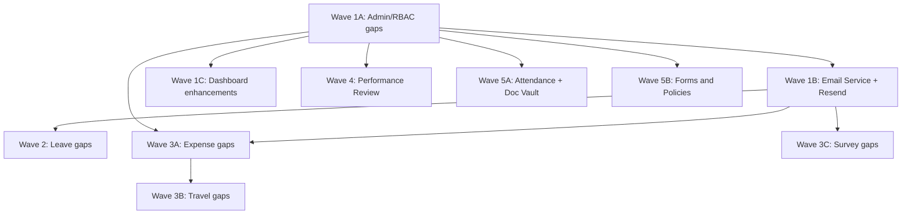

# Intranet CRM — Full Gap Implementation Plan

> **Created:** 2026-04-28  
> **Target repo:** `new-tbh-intranet` (Turborepo monorepo)  
> **Source:** Audit against 13 planning docs from `crm.manut.xyz/docs/features-planning/`  
> **Total gaps:** ~42 features across 5 waves

---

## Audit Summary

After auditing `new-tbh-intranet` against all 13 planning documents, the following modules are **already fully implemented** and require no work:

- **Sales CRM** — deals, partners, revenue (doc 11)
- **Projects Hub** — PM, kanban, team members (doc 12)
- **Investor CRM** — pipeline, dataroom, updates (doc 13)
- **Employee Directory + Org Chart** (doc 09 partial)
- **Onboarding Checklists** (doc 09 partial)
- **Leave overlap detection** (doc 04.2)
- **Travel budget estimate** (doc 06.2)
- **Survey favorable/unfavorable KPIs + eNPS** (doc 07.2, 07.3)
- **Expense rejection must have comment** (doc 05.8)

**Excluded from scope:**

- In-app notification module (replaced by email notifications)
- ARAI AI Assistant, Chat System, eSign, Recruitment ATS (deferred)

---

## Wave 1 — Foundation

### 1A. Admin / RBAC Gaps

| #   | Gap                            | Priority | Description                                                                                                                                 |
| --- | ------------------------------ | -------- | ------------------------------------------------------------------------------------------------------------------------------------------- |
| 1   | Role cloning                   | P1       | `POST /api/roles/:id/clone` — clone role + all RolePermission records. "Clone" button in admin role management UI.                          |
| 2   | Module visibility admin UI     | P1       | `ModuleAccess` model exists in schema + auth guard. Build API `GET/PUT /api/admin/module-access` + admin UI tab to toggle modules per user. |
| 3   | Default landing per role       | P2       | Add `defaultRoute` field to `Role` model. Update login redirect in `auth-provider.tsx` to use it.                                           |
| 4   | Data scope (manager sees team) | P2       | Scope util filtering by `reportingTo` hierarchy. Apply to leave, expense, travel list endpoints for managers.                               |
| 5   | Centralized audit log WRITE    | P2       | `auditLogService.log()` helper. Integrate into admin CRUD actions. Read API + UI already exists.                                            |
| 6   | User groups                    | P3       | `UserGroup` + `UserGroupMember` models. API CRUD. Admin UI tab.                                                                             |

**Key files:**

- `packages/database/prisma/schema/rbac.prisma`
- `apps/api/src/modules/roles/`
- `apps/api/src/modules/admin/`
- `apps/web/src/app/(dashboard)/admin/`

---

### 1B. Email Service (Resend)

> Replaces in-app notification module. Email notifications fire on key workflow events.

**Setup:**

- Install `resend` in `apps/api`
- Add `RESEND_API_KEY` to `apps/api/src/env.ts` (optional — graceful skip if missing)
- `apps/api/src/infrastructure/email/email.service.ts` — Resend client singleton
- `apps/api/src/infrastructure/email/templates.ts` — shared HTML base template

**Intranet Email Template Design:**

| Token                       | Value                                              |
| --------------------------- | -------------------------------------------------- |
| Primary (buttons, links)    | `#2262F4`                                          |
| Text                        | `#0F1A2E`                                          |
| Muted text                  | `#64748B`                                          |
| Background                  | `#FFFFFF`                                          |
| Secondary background        | `#F8FAFC`                                          |
| Accent surface (info boxes) | `#EEF2FF`                                          |
| Success                     | `#26A673`                                          |
| Destructive                 | `#F04444`                                          |
| Warning                     | `#F59E0B`                                          |
| Font                        | `system-ui, -apple-system, 'Segoe UI', sans-serif` |
| Border radius               | `10px`                                             |
| Logo                        | `tbh-circle-logo.ico` at app domain                |
| Footer                      | `— Intranet \| Manut`                  |
| Max-width                   | `520px`, centered                                  |

**Email Events:**

| #   | Event                     | Recipients  | Subject                                    |
| --- | ------------------------- | ----------- | ------------------------------------------ |
| 1   | Leave request submitted   | Approver(s) | New Leave Request — Pending Your Approval  |
| 2   | Leave approved/rejected   | Employee    | Leave Request — Approved / Rejected        |
| 3   | Leave cancelled           | Approver(s) | Leave Request Cancelled                    |
| 4   | Travel request submitted  | Approver(s) | New Travel Request — Pending Your Approval |
| 5   | Travel approved/rejected  | Employee    | Travel Request — Approved / Rejected       |
| 6   | Travel cancelled          | Approver(s) | Travel Request Cancelled                   |
| 7   | Expense submitted         | Approver(s) | New Expense Report — Pending Your Approval |
| 8   | Expense approved/rejected | Employee    | Expense Report — Approved / Rejected       |
| 9   | Expense reimbursed        | Employee    | Expense Report — Reimbursed                |
| 10  | User account created      | New user    | Welcome to Intranet                          |

**Integration (fire-and-forget, non-blocking):**

- `leave.service.ts` — after approve/reject/submit/cancel
- `travel.service.ts` — after approve/reject/submit/cancel
- `expenses.service.ts` — after approve/reject/submit/reimburse
- `users.service.ts` / `admin.service.ts` — after createUser

---

### 1C. Dashboard Enhancements

`/dashboard` exists with KPIs. Enhancements needed:

- Add travel + survey stats to urgent items builder in `dashboard.repository.ts`
- Render `pendingLeaveRequests` (already in API response, not shown in UI)
- Add "Pending Actions" widget (aggregate pending leave + travel + expense approvals)

---

## Wave 2 — Leave Management Gaps

| #   | Gap                        | Priority | Description                                                                                                                        |
| --- | -------------------------- | -------- | ---------------------------------------------------------------------------------------------------------------------------------- |
| 1   | Team Calendar              | P0       | `GET /api/leave/calendar`. Matrix component (rows=employees, cols=days). Color-coded by leave type. Filter by department/employee. |
| 2   | Auto-escalation cron       | P1       | Add `reminderCount` + `lastReminderAt` fields. Cron `POST /api/cron/leave-escalation`. Send reminder emails.                       |
| 3   | Approval forwarding        | P1       | `POST /api/leave/requests/:id/forward`. Create new approval record for delegate. Send email.                                       |
| 4   | Preview approvers          | P1       | `GET /api/leave/requests/preview-approvers?employeeId=`. Show chain before submit.                                                 |
| 5   | Cancellation approval      | P2       | `PENDING_CANCELLATION` status. Config in policy rules JSON. Approval flow for cancellation.                                        |
| 6   | Bulk import balances       | P2       | `POST /api/leave/balances/import/preview` + `/commit`. CSV parse, validate, preview UI, commit.                                    |
| 7   | Leave analytics            | P2       | `GET /api/leave/analytics`. KPI cards + charts (department utilization, type distribution, monthly trend, approval turnaround).    |
| 8   | Balance transaction ledger | P3       | New `BalanceTransaction` model or extend `LeaveBalance`. Track all movements.                                                      |

**Key files:**

- `packages/database/prisma/schema/hr.prisma`
- `apps/api/src/modules/leave/`
- `apps/web/src/app/(dashboard)/leave/`

---

## Wave 3A — Expense Management Gaps

| #   | Gap                            | Priority | Description                                                                                         |
| --- | ------------------------------ | -------- | --------------------------------------------------------------------------------------------------- |
| 1   | Reimbursement workflow         | P0       | Add `reimbursed` status. `POST /api/expenses/:id/reimburse`. Finance role permission.               |
| 2   | Category admin CRUD            | P1       | `ExpenseCategory` model exists. Add CRUD endpoints + admin UI. Wire `categoryId` into expense form. |
| 3   | Category spending overview     | P1       | Aggregate query by category. Chart component on expense page.                                       |
| 4   | Multi-currency (exchange rate) | P1       | Currency field exists. Add FX rate table/service. Convert to base currency in reports.              |
| 5   | Expense policy / limits        | P2       | Policy config (per category or global). Validate on submit.                                         |
| 6   | Mandatory receipt              | P2       | Config flag per category. Validate `receiptUrl` required on submit.                                 |
| 7   | XLSX export                    | P2       | `GET /api/expenses/export`. `xlsx` library already in deps.                                         |

**Key files:**

- `packages/database/prisma/schema/finance.prisma`
- `apps/api/src/modules/expenses/`

---

## Wave 3B — Travel Management Gaps

| #   | Gap                       | Priority | Description                                                                                              |
| --- | ------------------------- | -------- | -------------------------------------------------------------------------------------------------------- |
| 1   | Travel-expense linking    | P0       | Add `travelRequestId` FK on `Expense`. UI to create expense from travel. Show linked expenses on detail. |
| 2   | File attachments          | P1       | `attachments` JSON/relation on `TravelRequest`. Supabase Storage upload. UI file upload.                 |
| 3   | COMPLETED/ARCHIVED status | P1       | Add statuses. HR can mark trip as completed after return.                                                |
| 4   | Summary preview           | P2       | Review step in travel request dialog before final submit.                                                |
| 5   | Approval delegation       | P2       | Mirror leave forwarding pattern.                                                                         |
| 6   | XLSX export               | P3       | `GET /api/travel/export`.                                                                                |

**Key files:**

- `apps/api/src/modules/travel/`

---

## Wave 3C — Survey Gaps

| #   | Gap                          | Priority | Description                                                             |
| --- | ---------------------------- | -------- | ----------------------------------------------------------------------- |
| 1   | Question heatmap (2D matrix) | P1       | Demographic x question score matrix visualization.                      |
| 2   | Cross-wave comparison        | P2       | `GET /api/survey/analytics/compare?wave1=&wave2=`. Side-by-side charts. |
| 3   | Upload completion email      | P3       | Send email to uploader confirming successful import.                    |

**Key files:**

- `apps/api/src/modules/survey/`
- `apps/web/src/components/survey/`

---

## Wave 4 — Performance Review (New Module)

Build from scratch:

- **Schema:** `packages/database/prisma/schema/performance.prisma`
  - Models: `AppraisalCycle`, `Appraisal`, `AppraisalKRA`, `KRATemplate`, `Goal`, `AppraisalComment`, `AppraisalRating`
  - Enums: `CycleStatus`, `AppraisalStatus`, `GoalStatus`, `RatingScale`
- **API:** `apps/api/src/modules/performance/`
  - Cycle CRUD (HR), Appraisal CRUD, Self-review, Manager review, Goals, Reports
- **Web:**
  - `/dashboard/performance` — HR view (cycles, reports)
  - My Portal integration — "My Appraisals" section
- **RBAC:** Seed permissions `performance:read`, `performance:self-review`, `performance:manager-review`, `performance:hr-manage`, `performance:goals`

---

## Wave 5 — Remaining New Modules

### 5A. HRMS Gaps (Directory + Org Chart + Onboarding already done)

- **Attendance / Timesheet:** New `AttendanceRecord` model. Clock in/out API. Monthly view. HR team view. CSV import.
- **Document Vault:** New `EmployeeDocument` model. Supabase Storage. Categories (contract, ID, certificate). Expiry tracking. Employee sees own, HR sees all.

### 5B. Forms & Policies (New Module)

Build from scratch:

- **Schema:** `FormTemplate`, `FormSubmission`, `Policy`, `PolicyAcknowledgment`
- **API:** `/api/forms` (CRUD templates, submit, review) + `/api/policies` (CRUD, publish, acknowledge)
- **Web:** `/dashboard/forms`, `/dashboard/policies`
- **Feature:** Mandatory policy gate in dashboard layout

---

## Implementation Order (Dependency Graph)

---

## Checklist

### Wave 1A — Admin/RBAC

- [x] Role cloning (P1)
- [x] Module visibility admin UI (P1)
- [x] Default landing per role (P2)
- [x] Data scope / manager filtering (P2)
- [x] Centralized audit log write (P2)
- [x] User groups (P3)

### Wave 1B — Email Service

- [x] Resend setup + Intranet branded base template
- [x] Leave email notifications (submit/approve/reject/cancel)
- [x] Travel email notifications (submit/approve/reject/cancel)
- [x] Expense email notifications (submit/approve/reject/reimburse)
- [x] Welcome email on user creation

### Wave 1C — Dashboard

- [x] Enhance dashboard with pending actions + travel/survey stats

### Wave 2 — Leave Gaps

- [x] Team Calendar (P0) — full matrix view (rows=employees, cols=days, color-coded by type)
- [x] Auto-escalation cron (P1)
- [x] Approval forwarding (P1)
- [x] Preview approvers (P1)
- [x] Cancellation approval (P2) — pending_cancellation status + approve/reject endpoints
- [x] Bulk import balances (P2) — preview + commit API endpoints
- [x] Leave analytics dashboard (P2)
- [x] Balance transaction ledger (P3) — BalanceTransaction model, auto-recorded on approve/cancel/bulk-import, GET /balance-transactions API

### Wave 3A — Expense Gaps

- [x] Reimbursement workflow (P0)
- [x] Category admin CRUD (P1)
- [x] Category spending overview (P1)
- [x] Multi-currency exchange rate (P1) — ExchangeRate model, upsert/list/convert API, frontend service
- [x] Expense policy / limits (P2) — per-category spending limit + limit period
- [x] Mandatory receipt (P2) — receiptRequired flag on category, validated on submit
- [x] XLSX export (P2)

### Wave 3B — Travel Gaps

- [x] Travel-expense linking (P0)
- [x] File attachments (P1) — JSON attachments field + add/list API
- [x] COMPLETED/ARCHIVED status (P1)
- [x] Summary preview (P2) — 2-step dialog: fill form → review summary → confirm & submit
- [x] Approval delegation (P2) — forward endpoint mirroring leave pattern
- [x] XLSX export (P3)

### Wave 3C — Survey Gaps

- [x] Question heatmap (P1)
- [x] Cross-wave comparison (P2)
- [x] Upload completion email (P3)

### Wave 4 — Performance Review

- [x] Schema (performance.prisma) — AppraisalCycle, Appraisal, Goal, KRATemplate, AppraisalKRA, AppraisalComment, AppraisalRating
- [x] API module — cycles CRUD, appraisals, self/manager review, goals
- [x] Seed permissions — performance:read, self-review, manager-review, hr-manage, goals
- [x] UI pages + My Portal integration — Cycles/Appraisals/My Review tabs, dialogs (cycle/self/manager/goal), My Portal performance tab

### Wave 5A — HRMS Gaps

- [x] Attendance / Timesheet _(shipped since this plan — full subsystem in `apps/api/src/modules/hrms/attendance-*`: clock in/out, shifts, corrections, exceptions, missed-check + manager-alert crons, analytics/executive views, XLSX export; surfaced in My Portal)_
- [ ] Document Vault _(still deferred)_

### Wave 5B — Forms & Policies

- [x] Policies module — `apps/api/src/modules/policies/` + `CompanyPolicy` model + `/policies` route _(shipped)_
- [x] Survey Forms (custom form builder + responses) — `SurveyForm*` models + `apps/api/src/modules/survey` + `/survey-forms` route _(shipped; distinct from the generic forms module originally scoped here)_
- [ ] Generic Forms module (arbitrary template builder + workflow) _(not built — survey-forms covers the shipped use case)_
- [ ] Policy versioning + acknowledgment gate _(partial — confirm against `policies.service.ts`)_

---

_Last updated: 2026-06-16 (Waves 1–4 COMPLETE; Wave 5A Attendance + Wave 5B Policies/Survey-Forms now shipped; Document Vault + generic Forms module still deferred). Original plan dated 2026-04-28._
