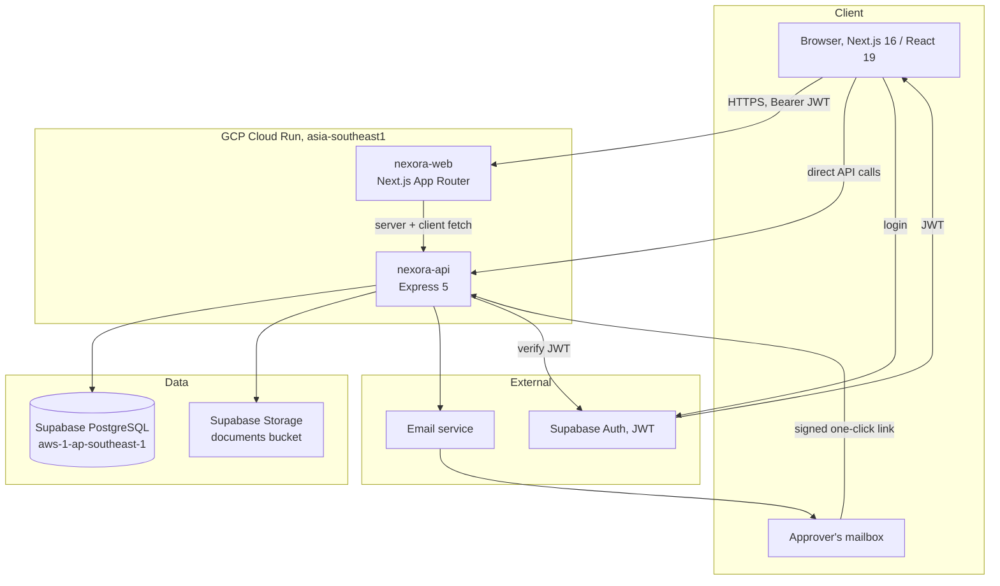
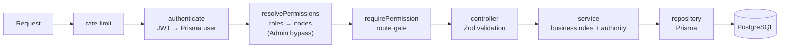
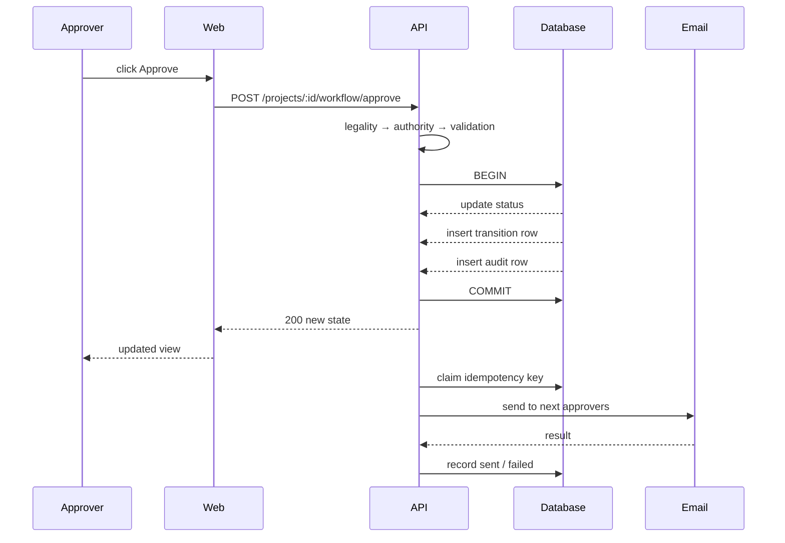

# Project CRM Architecture

How the module is put together and why the pieces sit where they do.

---

## 1. System context



Two Cloud Run services. The browser talks to both: Next.js for pages, the API directly for data. Supabase provides auth and the database; storage is a private bucket reached through signed URLs.

---

## 2. Request path



The split matters:

- **Route gate** (`requirePermission`) answers *"may this user touch this module at all?"*
- **Service** answers *"may this user take this action, on this record, in this state?"*

Anything state-dependent or ownership-dependent belongs in the service. A route gate cannot express "the approver for the stage this project is currently in," and trying to force it there is how IDOR bugs get written.

---

## 3. Module layout

```
apps/api/src/modules/projects/
├── projects.controller.ts        routes (literals before :param)
├── projects.service.ts           project business logic
├── projects.repository.ts        Prisma access
├── projects.validation.ts        Zod schemas + inferred *Input types
└── workflow/
    ├── workflow.types.ts             state machine, statuses, actions, TRANSITIONS
    ├── workflow-authority.ts         capabilities, role matrix, can()
    ├── workflow.service.ts           the engine, one transition() path
    ├── workflow-email.service.ts     idempotent send, retry, delivery log
    ├── workflow-token.ts             HMAC signed action tokens
    ├── workflow-public.controller.ts unauthenticated email-action endpoint
    └── workflow.validation.ts        Zod schemas
```

```
apps/web/src/
├── app/(dashboard)/projects/
│   ├── page.tsx                      project list
│   └── requests/
│       ├── page.tsx                  five-view queue
│       └── [id]/page.tsx             one-screen detail
├── components/projects/workflow/
│   ├── workflow-actions.tsx          approve / reject / return / reopen
│   └── workflow-timeline.tsx         history
└── services/workflow.service.ts      API client
```

---

## 4. Design decisions

**One transition path.** Every state change funnels through a single private `transition()`. Legality, authority, atomicity and logging are enforced in one place, so no action can quietly skip a step. Adding a new action means adding a row to `TRANSITIONS` and a capability mapping, not writing a new code path.

**Declarative state machine.** `TRANSITIONS` is a plain table. Routing is positional, never computed. This is the deliberate replacement for the previous engine's inferred routing: what happens next is readable at a glance and testable without mocking.

**Capabilities, not role names.** Authority resolves from permission codes. `isProjectManager()` inspects codes, not `role.name`. Role names are recorded in the audit log for humans, but nothing branches on them, so renaming a role cannot change who can approve.

**Two-gate authorization.** Permission first, then state/ownership. Each "Cannot" in the role matrix maps to a rule in gate 2, and every one has a test.

**Email outside the transaction.** Delivery is post-commit. A mail outage must never roll back an approval that already happened; failures are logged and retryable instead.

**Stage-bound tokens.** Action tokens carry the stage they were issued for. Once the project moves, the token no longer matches, single-use with no token table, no cleanup job, no revocation list.

**Read models over stored aggregates.** Tab counts come from one `groupBy` at request time rather than maintained counters. Nothing to drift, nothing to backfill.

---

## 5. Data flow: an approval



The response returns as soon as the transaction commits. Email happens after and cannot affect the outcome the user already saw.

---

## 6. Boundaries

The Project CRM owns projects, tasks, members, columns, milestones and the approval workflow. It does **not** reach into other CRMs. There is no broadcasting, no synchronization, and no cross-module task generation, the department label on a project is a string, not an integration.

Shared infrastructure it consumes: `authenticate` / `requirePermission`, `logAudit`, the email service and templates, `prisma`, Supabase storage helpers, and the shared UI components.
