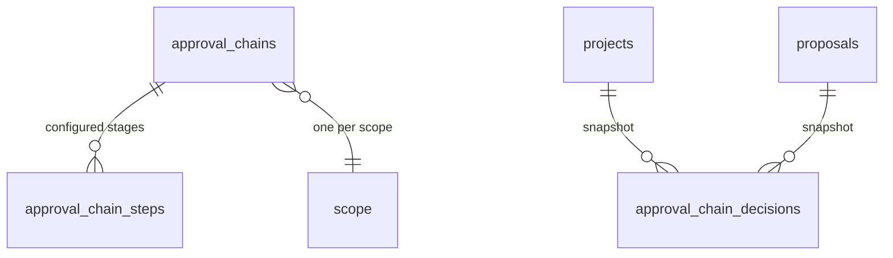

# Approval chains

Who approves what, in the Project CRM, configured rather than coded.

Source of truth: [`chain.types.ts`](../../apps/api/src/modules/approval-chains/chain.types.ts) for the scopes and states, [`chain.service.ts`](../../apps/api/src/modules/approval-chains/chain.service.ts) for the engine. This document describes those files. If they disagree, they win.

---

## 1. Scope, stated plainly

**Only the Project CRM has configurable chains.** Two of them:

| Scope | Gates |
|---|---|
| `project_request` | Stages a project request passes before development can start |
| `proposal` | Stages a proposal passes before it counts as approved |

Travel, leave, expenses, cash advance and payroll each keep their **own** `*_approval_steps` tables, their own settings screens, and their own HR/Finance permissions. They are deliberately **not** migrated onto this engine, and nothing here changes them.

The tables are named generically (`approval_chains`, not `project_crm_approval_chains`) because renaming later is worse than a general name now. That is not a claim that anything else uses them: the registered scopes are an explicit two-value union in code, and adopting this elsewhere would be its own decision with its own data migration.

---

## 2. What a chain owns, and what it does not

A chain is **an ordered list of stages, each naming one person**, covering the approval segment of a record's life:

```
submitted ──> stage 1 ──> stage 2 ──> … ──> stage N ──> approved
```

That part is genuinely linear, so it is data.

**The rest of the project request lifecycle stays coded**, in [`workflow.types.ts`](../../apps/api/src/modules/projects/workflow/workflow.types.ts):

| Action | Why it is not a chain stage |
|---|---|
| `escalate` | Routes to somebody the PM names **per request**. That target is data on the row, not configuration. |
| `return` | Goes backwards. |
| `reopen` | Revives a rejected record. |
| `complete` | Happens after approval, not during it. |

None of those is "the next step in an order". A chain that tried to express them would be a graph pretending to be a list, so the boundary is drawn here deliberately.

**Escalation is a detour on a stage, not a way past the rest of the chain.** When the escalatee approves, the request returns to awaiting the next configured stage. Landing it straight in development would have turned escalation into a bypass for every remaining approver.

---

## 3. The snapshot, and why it exists

A record **copies the chain onto itself when it is submitted**, into `approval_chain_decisions`. Everything after that reads the copy.

This is the single most important property of the design: **editing a chain never moves a record already in flight.** An administrator adding a stage does not reshuffle who owes a decision on something half decided, and a request keeps the same next approver it had that morning. The admin UI says so, because it is the first thing anybody worries about.

Two consequences worth knowing:

- A **returned or reopened** request has its snapshot **discarded**. Resubmission takes a fresh copy, so it follows today's chain rather than one captured weeks ago.
- A record whose snapshot says stage 2 notifies **the person the snapshot names**, even if the live chain now names somebody else.

---

## 4. Who may decide: identity, not permission

Being the person the current stage names **is** the authority. There is no role that grants "can approve proposals" any more, because that stopped being expressible the moment the number of stages became an administrator's choice.

| Who | May decide a stage |
|---|---|
| The person the stage names | Yes |
| `projects:manage` holder | Yes — somebody must be able to unstick a chain whose approver has left |
| System admin, **stage names nobody** | Yes |
| Anyone else | No, and the refusal says who it is waiting on |

For project requests, the chain **narrows** authority rather than replacing it: `workflow:pm-approve` still has to pass first, and then the stage has to be yours.

`proposals:review` and `proposals:approve` remain registered codes for continuity with roles that already hold them, but they no longer confer stage authority on their own. They are still honoured on a record with **no** snapshot — see §6.

---

## 5. Who may configure: the system Admin role only

Every write is gated by `requireSystemAdmin()`, an **identity** check on the built-in Admin role.

Deliberately not a permission code, and this is the trap worth understanding: a super admin is granted **every** permission code, so no code can ever be exclusive to them — including `admin:manage`, which any custom role can also hold. Only the role assignment distinguishes a super admin. There is a test that grants a user every code in the system and still refuses them.

Reads are open to `projects:read`, so anyone who can see the Project CRM can see who approves next. Hiding that would make the queue unreadable.

Administrators edit from **Projects → Requests → Approval chain** and **Projects → Proposals → Approval chain**.

---

## 6. What happens when configuration is wrong

Misconfiguration must never silently approve something. Each case has a deliberate answer:

| Situation | Behaviour |
|---|---|
| Stage names nobody, or a deactivated user | Falls back to **system admins**, with a logged warning. A request that stalls visibly beats one routed into silence. |
| Chain has no active stages | The record is submitted with **no snapshot** and follows the module's coded default. It is **not** treated as approved. |
| Deleting or deactivating the last stage | **Refused.** An empty chain would mean "submitted equals approved". |
| Deleting or deactivating a stage of the decided flow | **Refused.** See below. |
| Record predates chains | No snapshot, so the original permission codes decide it. Nothing in flight was stranded when this shipped. |
| Two people decide at once | The conditional update lets one win; the loser gets a `409` telling them to reload. |

The UI distinguishes **"nobody assigned"** from **"the person set here is deactivated"** — both leave the stage unowned, but an administrator needs different things from each.

### Fixed stages

Each chain shipped with the stages the flow was decided with: **one** for project requests (PM approval), **two** for proposals (first review, final approval). Those carry `is_system` and are **add-only** — an administrator can rename them and change who approves at them, but cannot delete or deactivate them. Stages added afterwards are ordinary and can be removed freely.

The split is between *who performs an approval*, which is configuration, and *what the approval is*, which is not. Both refusals are enforced in `chain.service.ts`; the editor shows a lock instead of a remove control for the same reason rather than instead of it.

The migration identifies them by timestamp: the seed inserted each chain and its stages in one statement block, so a seeded stage's `created_at` equals its chain's exactly, while anything added later is strictly newer. Marking "everything that exists" would have frozen a stage an administrator had already added, leaving them unable to remove their own work.

---

## 7. Data model



| Table | Holds |
|---|---|
| `approval_chains` | One row per scope, `scope` UNIQUE so routing can never be ambiguous |
| `approval_chain_steps` | Ordered stages, `(chain_id, order)` UNIQUE, `approver_user_id` nullable |
| `approval_chain_decisions` | Per-record snapshot: order, name, approver, status, who decided, when |

`projects.current_step_order` and `proposals.current_step_order` say **where** in the chain a record sits; the existing `workflow_status` / `status` still say **what** it is doing. Both nullable, so every row that predates chains reads as the coded default.

A decision belongs to a project **or** a proposal, never both and never neither — two nullable foreign keys plus a check constraint, rather than a polymorphic pair, because cascade-on-delete is worth more than the tidier column.

Reordering is a **two-phase write**: park every row in a high range, then renumber to 1..N. A single pass trips the unique index the moment two stages swap.

---

## 8. API

Base path `/api/approval-chains`.

| Method | Path | Gate |
|---|---|---|
| `GET` | `/approval-chains` | `projects:read` |
| `GET` | `/approval-chains/:scope` | `projects:read` |
| `PUT` | `/approval-chains/:scope` | **system admin** |
| `POST` | `/approval-chains/:scope/steps` | **system admin** |
| `PUT` | `/approval-chains/:scope/steps/reorder` | **system admin** |
| `PUT` | `/approval-chains/:scope/steps/:stepId` | **system admin** |
| `DELETE` | `/approval-chains/:scope/steps/:stepId` | **system admin** |

`reorder` is declared before `/steps/:stepId`, because Express matches in order and would otherwise read "reorder" as a step id. A reorder must list every stage exactly once; a partial list is refused rather than renumbering some rows and stranding others.

Chains cap at 20 stages, so a runaway configuration cannot make a record unapprovable.

---

## 9. Known gaps

- **Named people only.** Role-based approvers and "any one of these three" were considered and left out, so authority at a stage is always exactly one identity. Cover during leave means an administrator reassigns the stage, or the super-grant holder steps in.
- **One chain per scope, org-wide.** No conditional routing — no amount bands, no per-department variants. Travel has those; this does not, because nobody asked for them here yet.
- **No audit of chain edits.** Decisions are logged in full; changes to the configuration itself are not. Worth adding before the chains carry anything contentious.
- **The other five chains still have their own tables.** That duplication is real and deliberate, and consolidating it is a separate decision.
