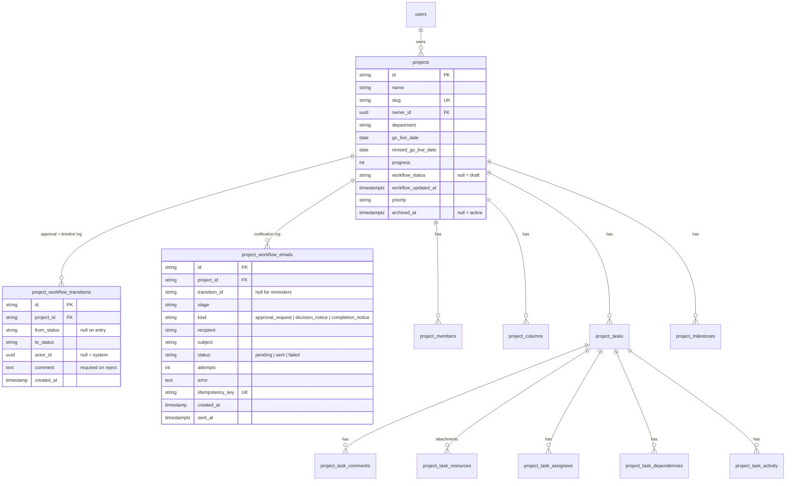

# Project CRM Database

Schema for projects and the approval workflow. Source of truth is [`operations.prisma`](../../packages/database/prisma/schema/operations.prisma).

---

## 1. Entity relationships

---

## 2. Workflow columns on `projects`

Four columns, all nullable and all added additively, no existing row needed a backfill.

| Column | Type | Notes |
|---|---|---|
| `workflow_status` | `text` | `NULL` means draft. Never an enum, statuses are validated in code so adding one needs no migration. |
| `workflow_updated_at` | `timestamptz` | Stamped **only** when the status actually changes, so stage-aging is exact rather than inferred from `updated_at`. |
| `priority` | `text` | Surfaced to approvers in email. |
| `archived_at` | `timestamptz` | `NULL` means active. An archived project is read-only for everyone. |

`revised_go_live_date` and `progress` predate this work and are reused by the timeline and progress capabilities rather than duplicated.

---

## 3. The three logs

The workflow requirement called for an approval log, a timeline log and a notification log. Two tables cover all three, the approval and timeline logs are the same append-only stream, differing only in which columns you read.

**`project_workflow_transitions`**, one row per state change. `from_status` is `NULL` on the first transition. `actor_id` is a plain scalar rather than a relation, avoiding a second `Project → User` relation alongside `owner`. Indexed on `(project_id, created_at)`, which is exactly how history is read.

**`project_workflow_emails`**, one row per recipient per notification. `idempotency_key` is `UNIQUE` and claimed *before* sending; that constraint, not application logic, is what makes duplicate delivery impossible under concurrency. Indexed on `(project_id, created_at)` and on `status` so the failed-email sweep is cheap.

Both cascade on project delete. Neither is ever updated or deleted by application code.

---

## 4. Migrations

| Migration | Effect |
|---|---|
| `20261109000000_project_workflow_engine` | Workflow columns + `project_workflow_transitions` |
| `20261110000000_project_workflow_emails` | `project_workflow_emails` |
| `20261111000000_drop_orchestrator_schema` | Archive-then-drop of the previous engine's columns and tables |
| `20261112000000_project_archive` | `archived_at` |
| `20261113000000_drop_orchestrator_residue` | Drops the two tables the earlier cleanup missed |

All are idempotent (`IF NOT EXISTS` / `IF EXISTS`, guarded `DO $$` blocks) and safe to re-run after a partial apply.

### Archived data

The two drop migrations preserve rather than destroy. Nothing was deleted:

| Archive table | Rows |
|---|---|
| `_archive_orchestrator_project_data` | 2 |
| `_archive_orchestrator_department_reviews` | 8 |
| `_archive_orchestrator_task_broadcasts` | 0 |
| `_archive_orchestrator_reviewers` | 9 |

Each holds a JSONB snapshot, so the archive does not depend on the source column layout. Retain or drop these once you are satisfied the data is no longer needed, nothing in the application reads them.

---

## 5. Operational notes

**Migration ledger.** Confirm `_prisma_migrations` exists on any database you deploy to. The development database has no ledger, it was built with `db push`, so `prisma migrate deploy` would try to replay every migration from scratch. Baseline with `prisma migrate resolve --applied <name>` before deploying. See the [QA report](../QA_REGRESSION_REPORT.md).

**Staging does not run migrations.** `deploy-staging.yml` syncs with `db push`. Schema changes reach staging; **data-migration SQL inside a migration file does not run there.** Anything depending on a backfill stays empty on staging until seeded by hand.

**Permission grants are not seeded.** No role currently holds any `workflow:*` code, so the workflow is Admin-only until a seed migration provisions the five roles and their grants.

**Demo rows.** Seven `Demo N, …` projects from UAT are still present. [`scripts/cleanup-demo-projects.sql`](../../packages/database/scripts/cleanup-demo-projects.sql) removes them, deliberately a reviewed script rather than a migration, since it deletes rows from a shared database.

**Region.** Supabase is `aws-1-ap-southeast-1` (Singapore). CI runners are usually US-based; transient `P1001` during pooler restarts is expected and normally resolves on retry.
