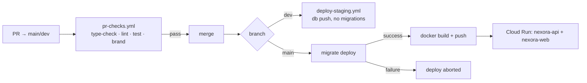

# Project CRM Deployment Guide

---

## 1. Before you deploy anything

Three items block a working production release. All are provisioning, not code, the code is green.

### 1.1 Seed the roles and permission grants, **required**

No role holds any `workflow:*` code, so the workflow is Admin-only. The five business roles (Sales & Marketing, Project Manager, Business Head, Product Admin, Development Team) do not exist in the database.

`ROLE_PERMISSION_MATRIX` in [`workflow-authority.ts`](../../apps/api/src/modules/projects/workflow/workflow-authority.ts) documents the intended grants and is asserted by tests, but nothing provisions it. Write an idempotent seed migration that creates the roles and grants the codes per that matrix. Until then everyone except Admin is refused.

### 1.2 Baseline the migration ledger, **required**

Confirm `_prisma_migrations` exists on the target database:

```bash
psql "$DATABASE_URL" -c "SELECT count(*) FROM _prisma_migrations"
```

If it errors, the database was built with `db push` and has no ledger. `deploy.yml` runs `prisma migrate deploy` **before** the Docker build and aborts the deploy on failure, so it would try to replay every migration from scratch. Baseline first:

```bash
pnpm --filter @nexora/database exec prisma migrate resolve --applied <migration_name>
```

The development database is in this state. Check production independently rather than assuming it matches.

### 1.3 Decide on one-click email approval

`GET /api/project-workflow/email-action` mutates state. Mail scanners that pre-fetch links (Microsoft Defender Safe Links and similar) can trigger an approval unattended.

- **Leave `WORKFLOW_EMAIL_TOKEN_SECRET` unset** and the feature fails closed, emails carry a plain "Review Request" button instead. This is the safe default.
- **Set it** only once you have accepted the risk in writing, or after the endpoint becomes a confirmation interstitial.

---

## 2. Environment variables

| Variable | Where | Notes |
|---|---|---|
| `PORTAL_URL` | API runtime | Deep-link base in emails. Already wired in both workflows. |
| `WORKFLOW_EMAIL_TOKEN_SECRET` | API runtime | Enables one-click approval. **Absent = disabled**, which is safe. |
| `EMAIL_SERVICE_URL` / `EMAIL_SERVICE_API_KEY` | API runtime | Existing; no change. |
| `DATABASE_URL` / `DIRECT_URL` | API + migrations | Existing. |

`WORKFLOW_EMAIL_TOKEN_SECRET` is now declared in `turbo.json` `globalEnv` and passed in both `deploy.yml` (`secrets.WORKFLOW_EMAIL_TOKEN_SECRET`) and `deploy-staging.yml` (`secrets.STAGING_WORKFLOW_EMAIL_TOKEN_SECRET`).

**You must still create those GitHub Secrets**, the plumbing is in place but the values are not. Generate one with:

```bash
openssl rand -hex 32
```

Use a different value per environment. A staging secret that also works in production means a staging link approves production records.

For local development add it to the root `.env.development`. Being an API-runtime value it needs no `apps/web` mirror and no rebuild, unlike `NEXT_PUBLIC_*`, which is inlined at build time.

---

## 3. Pipeline



**Staging syncs schema with `db push`, not `migrate deploy`.** Schema changes arrive; **data-migration SQL inside migration files never runs there.** Anything that depends on a backfill, including the role/permission seed, must be applied by hand on staging. Do not report a backfill-dependent feature as "working on staging" without checking.

---

## 4. Checklist

**Pre-deploy**

- [ ] Role + permission seed migration written, reviewed, tested locally
- [ ] `_prisma_migrations` confirmed or baselined on the target database
- [ ] Database backup taken, or Supabase PITR confirmed to cover the window
- [ ] `WORKFLOW_EMAIL_TOKEN_SECRET` decision made; GitHub Secrets created if enabling
- [ ] `PORTAL_URL` correct per environment
- [ ] `pnpm type-check && pnpm lint && pnpm test` green locally
- [ ] PR base is `main` or `dev`, otherwise `pr-checks.yml` does not run at all

**Staging**

- [ ] Merge to `dev`, confirm both services come up
- [ ] Apply the role/permission seed **by hand** (`db push` will not run it)
- [ ] Walk the full chain as each of the five roles
- [ ] Confirm approval emails arrive and render
- [ ] Confirm rows land in `project_workflow_transitions` and `audit_log`

**Production**

- [ ] Merge to `main`
- [ ] Watch the migration step, it precedes the build and aborts on failure
- [ ] Smoke-test one project end to end
- [ ] Check `project_workflow_emails` for sent rows and no duplicates
- [ ] Run [`cleanup-demo-projects.sql`](../../packages/database/scripts/cleanup-demo-projects.sql) if the demo rows exist in this environment

**Watch for**

| Symptom | Cause | Action |
|---|---|---|
| `P3009` | A migration is marked failed | `prisma migrate resolve --rolled-back <name>`; the resolve step in `deploy.yml` handles known names |
| `P1001` | Singapore pooler blip from a US runner | Usually transient; re-run |
| Approvals refused for everyone but Admin | Permission grants not seeded | Apply §1.1 |
| Emails show `disabled` | `WORKFLOW_EMAIL_TOKEN_SECRET` unset | Expected unless you enabled it |

---

## 5. Rollback

Four levels, cheapest first.

**1, Revoke grants (seconds, no deploy).**

```sql
DELETE FROM role_permissions WHERE permission_code LIKE 'workflow:%';
```

The workflow returns to Admin-only. Everything else is untouched. This is the fastest kill switch and the right first move for a behavioural problem.

**2, Disable email actions (seconds).** Unset `WORKFLOW_EMAIL_TOKEN_SECRET`. Links fail closed; emails fall back to a review button.

**3, Revert the application (one deploy).** Revert the workflow commits and deploy. **Leave the migrations applied**, every column is additive and nullable, and reverted code simply ignores them. Do not drop columns to roll back application code.

**4, Schema rollback (last resort, maintenance window).** Only if a column genuinely must go:

```sql
ALTER TABLE projects DROP COLUMN IF EXISTS workflow_status;
ALTER TABLE projects DROP COLUMN IF EXISTS workflow_updated_at;
ALTER TABLE projects DROP COLUMN IF EXISTS priority;
ALTER TABLE projects DROP COLUMN IF EXISTS archived_at;
DROP TABLE IF EXISTS project_workflow_emails;
DROP TABLE IF EXISTS project_workflow_transitions;
```

This **destroys approval and notification history** and is irreversible without a backup. Take a fresh backup immediately beforehand.

No level touches projects, tasks, members, columns, comments, attachments, users or roles.
