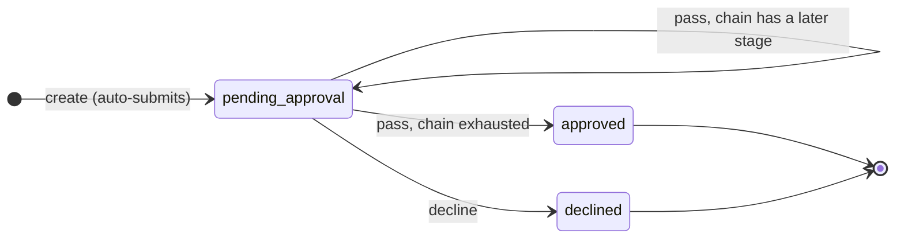
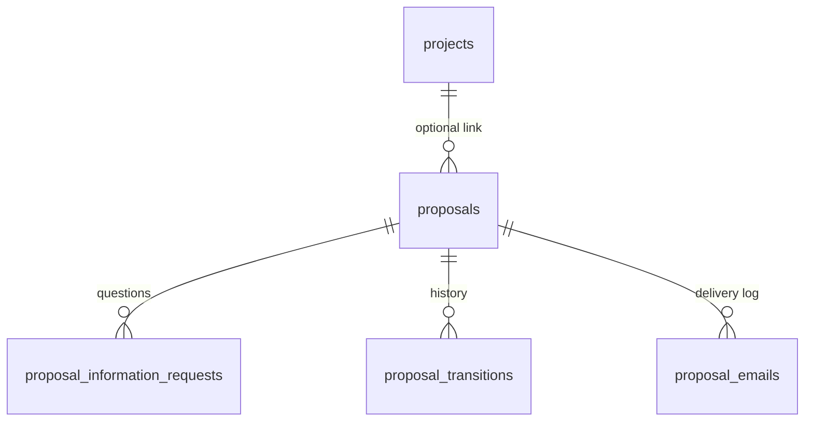

# Proposals

Ideas, change requests, and anything else product-related that needs a decision. A two-tier flow: the first reviewer, then the final approver.

Source of truth: [`proposal.types.ts`](../../apps/api/src/modules/proposals/proposal.types.ts) for the state machine, [`proposal-authority.ts`](../../apps/api/src/modules/proposals/proposal-authority.ts) for who may do what. This document describes those files. If they disagree, they win.

Distinct from the [project request workflow](WORKFLOW.md): that chain gates *a project* on its way to development, this one records *a decision on an idea*. Different approvers, different shape, separate permission codes. Sharing codes would mean granting one flow to get the other.

---

## 1. The flow

Anyone may raise a proposal. It then passes through the stages of the **configurable approval chain** — see [Approval chains](CHAINS.md) — each naming one person. Passing the last stage is the approval.

| Status | Meaning | Who acts next |
|---|---|---|
| `pending_approval` | Awaiting a stage of the chain. | The person that stage names |
| `approved` | Every stage approved. Terminal. | Nobody |
| `declined` | Declined at some stage. Terminal. | Nobody |

**Which stage** a proposal sits at is `current_step_order` plus its snapshot, not a status. There used to be a status per tier — `pending_pm_review` and `pending_ceo_approval` — which stopped working the moment the number of tiers became an administrator's choice: a fixed enum cannot name stage 4 of 6. Both values are still **recognised as in flight**, so a proposal raised before chains carries on being decided rather than stranding.

Both terminal statuses are **fully** terminal. A declined proposal is not reopenable: the requester raises a fresh one, which keeps each decision attached to what was actually decided on. That differs deliberately from the project workflow, where `rejected` accepts `reopen`.

### Creating a proposal submits it

There is no draft. A draft with no reachable Submit button is how the project workflow ended up with nothing able to enter the chain at all, so this flow does not have one.

The requester keeps edit rights until the **first stage decides**. After that the version that was reviewed stays fixed. Tied to the chain rather than to a status, because with a configurable number of stages there is no single status that means "nothing has decided yet".

---

## 2. The three choices

A reviewer records one of three things. They are one control in the UI because they are one decision, and they are separated in the code because only two of them move anything.

| Choice | Effect | Requires |
|---|---|---|
| **Pass** | Moves to the next tier, or approves if this is the final one | Optional note |
| **Decline** | Terminal | A reason, always |
| **Question** | **Moves nothing.** Records what is missing and asks named people for it | The question, and at least one person |

A decline reason is mandatory because it is the only thing the requester has to work with. "No" on its own is not acceptable.

Two people deciding at once is settled by the database, not by whoever's request arrives second. The status update is conditional on the proposal still being where the request read it (`updateMany where { id, status: from }`), so the loser gets a `409` telling them to reload rather than silently recording a second decision, a second history row and a second round of email. The UI reloads on that `409`, because what is on screen is already stale.

At the **last stage** the Pass control is labelled **Approve**, because that is what passing there does. Which stage is last comes from the chain, not from the status.

---

## 3. Why asking a question does not move the proposal

The original design had an `awaiting_information` status: the proposal moved there while a question was outstanding and moved back once answered. That was built out and then dropped, for two reasons.

**The return target could not be expressed declaratively.** Both tiers can ask, so `pass` from `awaiting_information` would have to resolve to either the final-approval stage or `approved` depending on who asked. That is computed routing, which is exactly what a positional state machine exists to avoid.

**It hid where the proposal actually was.** "Awaiting Information" does not say whether it sits with the first reviewer or the final approver, which is the thing a queue most needs to convey.

So a question leaves the status alone. Open questions live in `proposal_information_requests`, and "waiting on 2 answers" is derived from that table — strictly more informative than a status would be. It also means a reviewer is never blocked: they can decide while questions are still open if they already have enough to go on.

Questions are **parallel**. Asking three people creates three rows, each answerable independently, and none of them gates the others.

---

## 4. Who may do what

Two gates, in order. The permission gate first, then a state or identity gate. Passing the first is never sufficient.

| Capability | Permission | Second gate |
|---|---|---|
| Raise | `proposals:create` | none |
| View | `proposals:read` | none |
| Edit | `proposals:create` | requester, and no stage has decided yet |
| Decide a stage | *none* | **must be the person the current stage of the chain names** |
| Ask for information | *stage-dependent* | whichever tier the proposal is at, and the caller can decide there |
| Answer a question | *none* | **must be the person the question was assigned to** |

Three of these map to a `null` permission code, and all three are identity rather than permission. Deciding belongs to whoever the current stage names; asking belongs to whoever can decide it; answering belongs to the person the question was assigned to. No permission code grants any of them, which is the point — `proposals:review` and `proposals:approve` remain registered for continuity but no longer confer stage authority on their own.

A proposal with **no snapshot** (raised before chains, or submitted while none was configured) falls back to those two codes, so nothing in flight was stranded when chains shipped.

`projects:manage` is the Project CRM super-grant and satisfies every *permission* gate here. It does not satisfy identity: a `projects:manage` holder still cannot answer a question that was asked of somebody else. The web UI mirrors the super-grant everywhere the API honours it, so it never hides a control the server would have allowed.

Route middleware carries the **read gate only**. Which permission is actually required depends on the proposal's current status, and `requirePermission` cannot express that, so the real decision lives in the service. Gating the action routes would look stricter and be wrong.

### What to grant

| Role | Codes |
|---|---|
| Employee (everyone) | `proposals:read`, `proposals:create` |
| First reviewer | the above, plus `proposals:review` |
| Final approver | the above, plus `proposals:approve` |

`ROLE_PERMISSION_MATRIX` in `proposal-authority.ts` records this. It is documentation and a test fixture, not a runtime check — access is always decided by the caller's actual codes.

---

## 5. Who reviews, and who approves

The stages of the `proposal` approval chain, edited from **Projects → Proposals → Approval chain** by a **system administrator only**. Full detail in [Approval chains](CHAINS.md).

This replaced two `SystemSetting` rows (`proposals.first_reviewer`, `proposals.final_approver`) and the pair of `/proposals/settings` routes that read them. Both are **gone**, not deprecated: a second way to configure approvers that no longer affects routing is worse than none. The migration carried whoever those rows named into stages 1 and 2 of the chain, so behaviour did not change on deploy.

A stage naming somebody who has left resolves to nobody rather than to a stale name, and falls back to system admins so a proposal never sits with nobody notified.

---

## 6. Notifications

Four events email: a proposal is submitted, questions are asked, an answer comes back, a decision is recorded.

**The first stage's approver is copied on all four.** They own the flow and were asked to stay in the loop end to end. That is one rule in `withReviewerCopied()` rather than a special case per call site, so a new notification cannot forget it, and it de-duplicates by lower-cased email so they are never mailed twice when they are also the direct recipient. There are tests for that rule specifically, because it is the kind of thing a later change breaks quietly.

Routing on a decision depends on where it went: passing to a later stage notifies **that stage's** approver, read from the record's snapshot rather than the live chain, so a proposal in flight tells whoever it was actually routed to even after an admin rewrites the chain. Approving or declining notifies the requester, because it is their proposal that finished.

Delivery reuses the project workflow's contract. `proposal_emails.idempotency_key` is UNIQUE and **claimed before the send is attempted**, so a duplicate is prevented by the database rather than by an application check that would lose under concurrency. The key is `proposalId:kind:scope:recipient`, where `scope` is the question id or the transition id — so asking two people produces two notifications, and asking again later is a new one rather than a suppressed duplicate. Retries are transient-only, three attempts, exponential backoff.

Every notification runs **after** the transaction commits and swallows its own failures. A mail outage must never roll back an approval that already happened.

Templates are `proposalActionEmail` (something needs you) and `proposalUpdateEmail` (something was recorded), both in [`templates.ts`](../../apps/api/src/infrastructure/email/templates.ts). Every caller-supplied value goes through `escapeHtml`: titles, questions, answers and decline reasons all reach inboxes.

There is **no cron and no new environment variable**. Everything is event-driven and inline.

### The bell

Nothing is written to a notification store. Proposals are surfaced by the read-model, consistent with the rest of the platform — see the notification-bell note in [CLAUDE.md](../../CLAUDE.md). Email is the push channel.

---

## 7. Data model

Four tables, in [`proposals.prisma`](../../packages/database/prisma/schema/proposals.prisma).

| Table | Holds |
|---|---|
| `proposals` | Title, description, type, priority, optional `project_id`, `raised_by_id`, status, `status_changed_at`, `current_step_order` |
| `proposal_information_requests` | One row per question: who asked, who must answer, the question, the response, `responded_at` |
| `proposal_transitions` | Append-only. `from_status`, `to_status`, actor, choice, comment |
| `proposal_emails` | Delivery log. UNIQUE `idempotency_key` |

User references are plain `@db.Uuid` scalars, audit-style pointers rather than foreign keys, so deactivating a user never cascades into decision history. Names are resolved by one batched lookup per request, never one query per row.

`project_id` is nullable with `ON DELETE SET NULL`: a proposal may concern no project, and deleting a project must not delete the decision that was recorded about it. It is a **cuid**, not a uuid, so it is validated as a bounded string — getting that wrong rejects every valid project link.

`status_changed_at` is stamped only when the status actually changes, never on an edit. Stamping it on an edit would corrupt time-in-stage.

---

## 8. API

Base path `/api/proposals`. Every endpoint needs a Supabase JWT. Responses are `{ "data": ... }`.

Literal paths are declared **before** `/:id`, because Express matches in order and `/:id` would otherwise swallow `my-questions` and `questions`.

Who approves is configured at `/api/approval-chains/proposal`, not here.

| Method | Path | Gate | Does |
|---|---|---|---|
| `GET` | `/proposals` | `proposals:read` | Queue: rows for one view plus counts for all six. Query: `view`, `search`, `type` |
| `POST` | `/proposals` | `proposals:create` | Raise one. Submits it. `201` |
| `GET` | `/proposals/:id` | `proposals:read` | Detail, permissions, questions and history in one round trip |
| `PUT` | `/proposals/:id` | `proposals:create` | Correct one. Requester only, tier 1 only |
| `POST` | `/proposals/:id/pass` | `proposals:read` † | Pass, or approve at the final tier. Body: `comment?` |
| `POST` | `/proposals/:id/decline` | `proposals:read` † | Decline. Body: `reason` (required, min 5) |
| `POST` | `/proposals/:id/ask` | `proposals:read` † | Ask for information. Body: `assigneeIds[]` (1–10), `question` |
| `POST` | `/proposals/questions/:requestId/respond` | `proposals:read` † | Answer. Body: `response` |
| `GET` | `/proposals/my-questions` | `proposals:read` | Open questions waiting on the caller, across every proposal |

† The read gate is deliberate. Real authority is checked in the service, per §4.

The six queue views: `list`, `mine`, `pending` (stages the caller can decide at), `answering` (questions assigned to them), `approved`, `declined`. `pending` is derived from the caller's permissions, never from a client-supplied filter — a client cannot ask to see somebody else's queue.

---

## 9. Web

| Route | Page |
|---|---|
| `/projects/proposals` | Queue. Six tabs with counts, server-side search and type filter |
| `/projects/proposals/:id` | Detail. Progress, details, decision control, questions, history |

The queue also carries the **Approvers** dialog for `admin:manage` holders, and says so when it is showing a capped page rather than the whole set.

Reached from the sidebar: **Project CRM → Proposals**, alongside Projects and Requests.

The decision control is one radio group of three cards, each stating its consequence in a line. The people picker loads only once Question is chosen, so the common path costs nothing. Text floors mirror the API schema so the button disables rather than round-tripping to a `400`.

The page never re-derives authority. `permissions` comes from the detail payload and decides only what is drawn. The answer box appears on a question because the API said `isMine`, not because the page compared ids.

---

## 10. Known gaps

- **No email actually sends yet.** `deliverEmail` posts `{templateId, to, variables}` and the email service renders from its OWN stored template, so the HTML built in `templates.ts` never travels. Neither `proposal-action` nor `proposal-update` exists on the service, so every notification returns `404 TEMPLATE_NOT_FOUND`, is recorded as `failed` in `proposal_emails`, and is never delivered. Decisions themselves are unaffected. This is not specific to proposals: `project-approval-request`, `project-workflow-decision`, `it-crm-task-update-2` and `it-crm-deadline-reminder` are all missing too, so the Project CRM email path is in the same state. Either create the two templates on the email service or rebind to one that exists.
- **Nobody holds `proposals:review` or `proposals:approve`.** Until an administrator grants them, only Admin accounts (which resolve every code) can decide. Provision before announcing the module.
- **No `Executive Approver` role exists.** Either create one or grant `proposals:approve` to an existing role.
- **`proposal_emails` has no retry sweep.** A notification that fails all three attempts stays `failed` and is not retried later. The `status` index exists for a sweep that has not been written; the delivery log is the record in the meantime.
- **An approved proposal does nothing downstream.** It records a decision. Turning one into a project is a manual step, deliberately, until somebody asks for the link.
