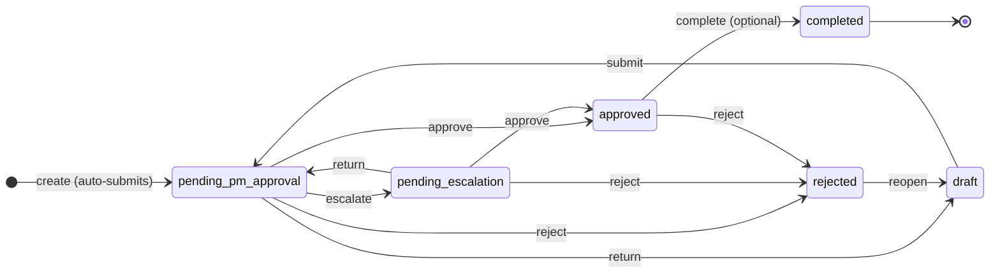
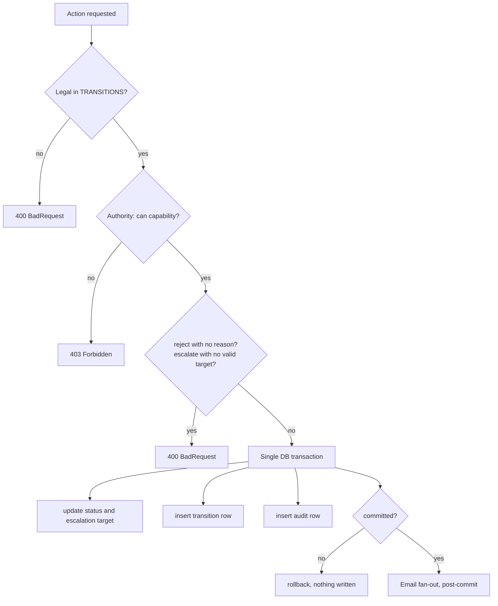

# Project Request Workflow

The approval chain, its states, and the rules that govern movement between them.

Source of truth: [`workflow.types.ts`](../../apps/api/src/modules/projects/workflow/workflow.types.ts) for the state machine, [`workflow-authority.ts`](../../apps/api/src/modules/projects/workflow/workflow-authority.ts) for who may do what. This document describes those files. If they disagree, they win.

---

## 1. The chain

The Project Manager is the single gate. Most requests they approve outright and the work starts. When something genuinely needs another owner's sign-off, usually budget or another team's commitment, the PM escalates to a named person, and that person's approval releases it.

This replaced a fixed four-stage chain that routed every request through a Business Head and a Product Admin regardless of size, which made a small request as expensive as a large one. There is one escalation stage rather than a stage per role, because who needs to sign off varies per request. The escalation target is data on the row, so the shape of the state machine never changes.

| Status                | Meaning                                                                                                              | Who acts next                                   |
| --------------------- | -------------------------------------------------------------------------------------------------------------------- | ----------------------------------------------- |
| `draft`               | Returned or reopened, editable. Nothing is created here.                                                             | Requester                                       |
| `pending_pm_approval` | Awaiting the Project Manager                                                                                         | Project Manager                                 |
| `pending_escalation`  | Awaiting the person the PM named                                                                                     | That person                                     |
| `approved`            | Approved. Work may start, and the board is unblocked. Completing is optional, so this is where most requests finish. | Nobody, unless somebody chooses to close it out |
| `completed`           | Delivered. Terminal.                                                                                                 | Nobody                                          |
| `rejected`            | Declined. Reopenable by the PM.                                                                                      | Project Manager                                 |

`approved` is where most requests end. `complete` stays available on it but nothing requires it, so a request nobody closes out is not stuck — it is simply approved.

That status used to be called `pending_development`, which asserted something not always true: that every approved request has a development phase. It was only ever the signal that work may begin, and it is now named after that. The old value is still recognised, so nothing approved before the rename lost its unblocked board.

`completed` is the only fully terminal state. `rejected` accepts exactly one action, `reopen`, and only from the PM.

A project with `workflow_status = NULL` predates the workflow. It reads as a draft and is never blocked, so no existing board freezes.

---

## 2. Creating a request

**Creating a project submits it.** There is no separate Submit step on the happy path.

Before this, a new project sat as a draft with no reachable Submit button, so nothing could enter the chain at all. Auto-submitting removes that failure mode: if a request arrives thin, the PM returns it with a note rather than it going unnoticed.

The submit runs through the workflow service rather than setting the column directly, so the transition log, the audit row and the approver email all happen on the same path every other transition uses. It is best effort, because the project row is already committed and a mail or logging failure must not fail the create. In that case the project stays a draft and can be submitted by hand.

The requester keeps edit rights while the request is still at `pending_pm_approval`. Auto-submit would otherwise give them no window at all. Once the PM has acted, the version they reviewed stays fixed.

---

## 3. Actions

| Action     | From                  | To                    | Requires                               |
| ---------- | --------------------- | --------------------- | -------------------------------------- |
| `submit`   | `draft`               | `pending_pm_approval` | `workflow:submit`                      |
| `approve`  | `pending_pm_approval` | `approved`            | `workflow:pm-approve`                  |
| `escalate` | `pending_pm_approval` | `pending_escalation`  | `workflow:escalate` and a named target |
| `approve`  | `pending_escalation`  | `approved`            | being the named target                 |
| `return`   | `pending_pm_approval` | `draft`               | `workflow:return`                      |
| `return`   | `pending_escalation`  | `pending_pm_approval` | being the named target                 |
| `reject`   | any pending stage     | `rejected`            | that stage's authority and a reason    |
| `complete` | `approved`            | `completed`           | `workflow:complete`, and **optional**  |
| `reopen`   | `rejected`            | `draft`               | `workflow:reopen`                      |

`reject` will not proceed without a reason of at least five characters. The reason is written into the transition log and shown in the requester's email, so it is the record of why and is mandatory rather than encouraged.

An escalation must name an active user who is not the escalating PM. Escalating to yourself would let the PM manufacture a second approval, which defeats the point.

---

## 4. How a transition executes

Every state change goes through one private method, `transition()`. There is exactly one code path, so legality, authority, atomicity and logging cannot diverge between actions.

**Atomicity.** The status update, the transition-log row and the audit row are written in one `prisma.$transaction`. Either all three land or none do, so a project can never move without a corresponding log entry.

**Email is post-commit and deliberately outside the transaction.** A mail failure must not roll back an approval that already happened. Failed sends are recorded and retryable instead.

---

## 5. Authority

Two gates, both in `can()`:

1. **Permission gate.** Does the caller hold the code this capability requires? Admin bypasses via the standard resolver.
2. **State and ownership gate.** The "cannot" rules: approvals only at their own stage, no editing a closed request, an archived project is read-only for everyone.

This lives in the service rather than route middleware because `requirePermission` cannot express "the approver for the stage this project is currently in". Routes gate read access. The service decides the action.

### Escalation authority is not a permission

This is the one place in the workflow where a permission code is not the gate. `ESCALATED_DECIDE` maps to `null` and the rule checks `isEscalationTarget` instead, because authority here is "the PM named you".

Two consequences follow, and both have tests:

- **A PM holding every workflow code cannot decide their own escalation.** They escalated precisely because they did not want to be the only approver.
- **`projects:manage` does not override it either.** The super-grant covers permission gates, not identity. An approval recorded against someone who was never asked is worse than a stuck request, and a stuck one already has an exit: the PM returns it and re-aims it.

### Role summary

| Role                                 | Can                                                                                               | Cannot                                                                            |
| ------------------------------------ | ------------------------------------------------------------------------------------------------- | --------------------------------------------------------------------------------- |
| Sales & Marketing                    | create, edit while with the PM, comment, attach, view history                                     | approve anything, set timelines, complete, archive                                |
| **Project Manager** (workflow owner) | approve, escalate, return, reopen, edit details, timelines, progress, reassign, archive, complete | decide an escalation they raised                                                  |
| Escalation target (any named person) | approve or reject the escalation aimed at them, return it to the PM                               | edit details, set timelines, complete, decide an escalation aimed at someone else |
| Development Team                     | assign and modify timelines, update progress, upload deliverables                                 | approve any stage, edit request details, archive                                  |

Escalation targets need no workflow permission at all. What they need is to see the request, which means `projects:read-all`. The Business Head and Product Admin roles still exist because they are real org roles and the likely targets, but nothing in the state machine is bound to either name.

---

## 6. The Kanban board is gated on approval

Task work is blocked until the request reaches `approved` or `completed`. Creating, editing, reordering and deleting tasks all refuse otherwise.

Every gate meaning "work may start" goes through one `isApproved()` helper, which accepts both `approved` and the name it carried before, `pending_development`. Without that, a request approved before the rename would have had its board locked.

The board and the chain were previously independent, so a team could start building something that had not been signed off, or something later rejected. The gate reads the workflow status, not the board status, because they answer different questions.

The project page shows a banner explaining why the board is read-only, so nobody has to discover the rule by getting an error.

Projects with a null workflow status pass through untouched.

---

## 7. What gets logged

Every permission-sensitive transition writes two rows:

- **`project_workflow_transitions`**, the approval and timeline log: from-status, to-status, actor, comment, timestamp.
- **`audit_log`**, the compliance record: acting user, their resolved role names, the capability exercised, whether they were the workflow owner, the escalation target where relevant, timestamp and comment.

Both are append-only. Nothing in the application updates or deletes either table.

---

## 8. Email

| Transition                 | Who is notified                                                                                             |
| -------------------------- | ----------------------------------------------------------------------------------------------------------- |
| Into `pending_pm_approval` | The admin-configured recipient. If unset, every `workflow:pm-approve` holder, falling back to system Admins |
| Into `pending_escalation`  | The named target, and only them                                                                             |
| Decision recorded          | The requester and project owner                                                                             |

The configured recipient is one `SystemSetting` row, re-resolved on every read so a setting written months ago cannot keep naming someone who has left the company.

Each message carries project name, requester, priority, status, comments and a deep link. When `WORKFLOW_EMAIL_TOKEN_SECRET` is set it also carries one-click Approve.

- **Duplicates** are prevented by a unique `idempotency_key` claimed before sending. The database constraint is what holds under concurrency, not an `if (alreadySent)` check.
- **Retries** run three attempts with exponential backoff, for retryable failures only.
- **Every send is logged** to `project_workflow_emails` with status, attempt count and error.
- **Rejection is never one-click**, because it needs a reason.

Action tokens are HMAC-SHA256 signed and bound to a stage, which makes them single-use without a token table: once the project moves on, the link is spent. Permissions are re-resolved at click time, so revoking a role invalidates outstanding links.

> **Known risk.** The action link is a `GET` that mutates state. Mail-security scanners that pre-fetch links, such as Microsoft Defender Safe Links, can trigger an approval with no human involved. Until this becomes a confirmation interstitial, consider leaving `WORKFLOW_EMAIL_TOKEN_SECRET` unset. The feature fails closed and emails fall back to a plain "Review Request" button. See the [QA report](../QA_REGRESSION_REPORT.md).

---

## 9. Views

Five views, all served by one endpoint that also returns every tab's count:

| View        | Contents                      |
| ----------- | ----------------------------- |
| `list`      | Every project in the workflow |
| `mine`      | Requests I own                |
| `pending`   | Awaiting my decision          |
| `completed` | Delivered                     |
| `rejected`  | Declined                      |

`pending` has two sources, because there are two ways something can be waiting on you: you hold the permission for its stage, or the PM escalated it to you personally. The second is not permission-based, so it is ORed in explicitly. Without that, an escalation target would never see their own queue.
